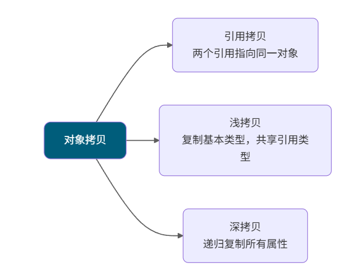
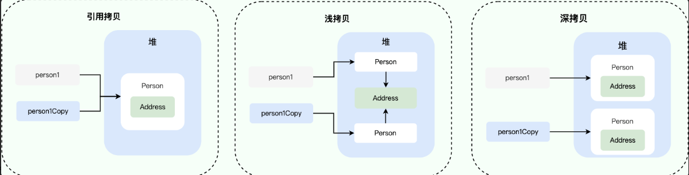

# JAVA 基础

## 一、概念

### 1.1 Java 特点

- **平台无关性：**将.java 代码文件翻译为字节码 .class ,任何安装了虚拟机的系统上都能够运行
- **面向对象：**OOP，面向对象编程使代码更易维护和重复使用
- **内存管理：**垃圾回收机制，自动管理内存和回收不再使用的对象。

### 1.2 Java优势和劣势

优势：跨平台；面向对象；生态强大；内存管理；

劣势：性能比起原生编译语言较差，比如C++，Go语言等；内存消耗大

### 1.3 Java 跨平台

Java代码被编译为字节码文件，再由JVM将字节码文件翻译为机器语言，从而达到运行Java程序的目的。


### 1.4 JVM、JDK、JRE的关系

- **JVM（Java虚拟机）：**是Java程序运行的环境，负责将Java字节码解释/编译为机器码，并执行程序。JVM 提供了内存管理、垃圾回收、安全性等功能，使得Java程序具备跨平台性。
- **JRE（Java 运行时环境）：**Java运行所需的最小环境，JVM + 一组Java类库
- **JDK（Java 程序开发工具包）：**JRE + 开发工具

### 1.5 Java 的解释和编译

Java经过编译后生成字节码文件，进入JVM后

编译：Java源代码会先被 javac 编译为平台无关的.class文件，程序运行之前

解释：JVM 启动后由解释器逐条解释为字节码

### 1.6 值传递和引用传递

在Java中，不存在真正的引用传递

- 值传递：

  适用于基础数据类型，修改方法内部的参数副本，不会改变原变量的值

  ```java
  public static void main(String[] args){
      int num = 10;
      changValue(num);
      System.out.println(num); // 输出10，也就是原本变量的值未改变
  }
  
  public static void changValue(int num){
      num = 20; //仅仅修改到副本
  }
  ```

- 引用传递：

  对于对象类型，传递的是对象引用的副本，而不是对象本身

  ```java
  public static void main(String args[]){
      Person p = new Person("A");
      changName(p);
      System.out.println(p.name); //输出 B，对象内部被修改
      changeReference(p);
      System.out.println(p.name); //输出 B, 原引用指向没有改变
  }
  
  //修改对象内部数据
  public static void changName(Person p){
      p.name = "B"; //副本和原引用指向同一个对象
  }
  
  //修改副本的指向
  public static void changeReference(Person p){
      p = new Person("C"); //副本指向新对象，原引用仍然指向旧对象
  }
  ```

总结：

- 基本类型传递“值的副本”，修改副本不影响原值。
- 引用类型传递“引用的副本”，通过副本引用可以修改对象内容，但是无法改变原引用的指向。

### 1.7 标识符与关键字

标识符：我们编写程序的时候，需要大量地为程序、类、变量、方法等取名字，于是就有了 **标识符** 。简单来说， **标识符就是一个名字**

关键字：private、protected等特殊含义的关键字

### 1.8 运算符

#### 1.8.1 自增与自减

```java
int a = 9;		
int b = a++; 	// b = 9， a = 10
int c = ++a;	// c = 11 , a = 11
int d = c--;	// d = 11 , c = 10
int e = --d;	// e = 10 , d = 10
```

## 二、数据类型

### 2.1 基础数据类型

| 基本类型  | 位数 | 字节 | 默认值  | 取值范围                                                     |
| :-------- | :--- | :--- | :------ | ------------------------------------------------------------ |
| `byte`    | 8    | 1    | 0       | -128 ~ 127                                                   |
| `short`   | 16   | 2    | 0       | -32768（-2^15） ~ 32767（2^15 - 1）                          |
| `int`     | 32   | 4    | 0       | -2147483648 ~ 2147483647                                     |
| `long`    | 64   | 8    | 0L      | -9223372036854775808（-2^63） ~ 9223372036854775807（2^63 -1） |
| `char`    | 16   | 2    | 'u0000' | 0 ~ 65535（2^16 - 1）                                        |
| `float`   | 32   | 4    | 0f      | 1.4E-45 ~ 3.4028235E38                                       |
| `double`  | 64   | 8    | 0d      | 4.9E-324 ~ 1.7976931348623157E308                            |
| `boolean` | 1    |      | false   | true、false                                                  |

注意：

浮点数默认类型为double类型，整数默认为int类型

除了char是Character , int 是Integer, 其他都是首字母大写

char类型是无符号的，所以是从 0 开始的

### 2.2 基本数据类型的转换

自动类型转换（隐式转换）：

当目标类型的范围大于源类型时，Java会自动将原类型转换为目标类型，例如：int 转换为long，float转换为double

```java
int intValue = 10;
long longValue  = intValue ; //发生了自动类型转换，安全
```

强制类型转换（显示转换）：

当目标类型的范围小于原类型时，需要使用强制转换

- 数据溢出：目标类型无法容纳原数据，丢弃高位字节，只保留低位
- 精度损失：浮点数转换，可能发生精度丢失，例如double转为int，double转为float

```java
long longValue = 100L;
int intValue  = (int) longValue; //强制类型转换，可能造成数据丢失或者溢出
```

### 2.3 对象引用转换

向上转型

```java
class Animal{}
class Dog extends Animal{}

Dog dog = new Dog();
Animal animal = dog ; //自动向上转型
```

向下转型

```java
Animal animal = new Animal();
Person person = (Person) animal; //如果Dog类不是Animal类的子类，会抛出异常ClassCastException

if(animal instanceof Dog){
    Dog dog = (Dog) animal; // 通过instanceof 检查之后才进行向下转型
}
```

### 2.4 浮点数运算的精度丢失问题

```java
float a = 2.0f - 1.9f ;
float b = 1.8f - 1.7f ;
System.out.println(a == b); //输出flase
```

二进制的计算机在表示一个数字时，宽度是有限的，无限循环的小数在存储时只能被截断，导致了精度丢失的情况。

解决办法：使用BigDecimal 可以实现浮点数的运算且不会造成精度丢失

```java
BigDecimal a = new BigDecimal("1.0");
BigDecimal b = new BigDecimal("0.2");
BigDecimal sum = a.add(b); // 1.3
BigDecimal product = a.multiply(b);//0.2
```

### 2.5 装箱和拆箱

- **装箱：**将基本类型用它们对应的引用类型包装起来
- **拆箱：**将包装类型转换为基本数据类型


```java
Integer i = 10 ; //自动装箱，等价于Integer i = Integer.valueOf(10)
int n = i; //拆箱,等价于 int i = i.intValue();
```

**自动装箱的弊端：**

循环中自动装箱的情况下，性能会极具下降

包装类是引用类型，不管读写效率还是存储效率，基本类型比包装类型高效

### 2.6 包装类

#### 2.6.1 包装类的缓存机制

Byte,Short,Long,Integer 这4种包装类型创建了数值[-127, 128] 的缓存数据，Character创建了[0,127]的缓存数据，Boolean 直接返回 TRUE / FALSE，Float 和 Double 没有实现缓存机制

如果没有命中缓存，那么会去创建新的对象

各个类是通过valueOf()方法去使用缓存机制的，也就是说自动装箱会使用缓存机制，而直接new Integer类是不会的

```java
Integer i = 40 ; //自动装箱，直接使用的是缓存池中的对象
Integer i1 = new Integer(40); //直接创建新的对象
System.out.println(i == i1); //false
```

注意： 所有的整型包装类对象之间的比较都要使用 equals 比较，因为Integer对象会复用已有对象，区间内的可以使用==，但是区间外的会在堆上产生，并不会复用已有对象

### 2.7 超过long 的整型应该怎么表示

BigInteger 内部使用数据int[] 数组来存储任意的整型数据

### 2.8 变量

#### 2.8.1 成员变量与局部变量的区别


#### 2.8.2 静态变量

被 static 关键字修饰的变量，可以被类的所有实例共享，无论类创建了多少个对象，都共享一份静态变量。即，静态变量只会被分配一次内存


静态变量通过类名访问的，如果被private修饰就无法访问了

#### 2.8.3 字符串常量和字符型常量的区别

```java
// 字符型常量
public static final char LETTER_A = 'A';

// 字符串常量
public static final String GREETING_MESSAGE = "Hello, world!";
public static void main(String[] args) {
    System.out.println("字符型常量占用的字节数为："+Character.BYTES); // 2 
    System.out.println("字符串常量占用的字节数为："+GREETING_MESSAGE.getBytes().length); // 13
}
```

### 2.9 方法

#### 2.9.1 静态方法为什么不能调用非静态成员？

静态方法是属于类的，在类加载的时候就会分配内存，而非静态成员属于实例对象，在实例化后才存在，也就是说在类的非静态成员不存在的时候静态方法就已经存在了，此时调用内存中不存在的非静态成员，属于非法操作

#### 2.9.2 重载和重写的区别

- **重写就是子类对父类方法的重新改造，外部样子不能改变，内部逻辑可以改变。**
- 重载就是同一个类中多个同名方法根据不同的传参来执行不同的逻辑处理

| 区别点         | 重载 (Overloading)                                           | 重写 (Overriding)                                            |
| -------------- | ------------------------------------------------------------ | ------------------------------------------------------------ |
| **发生范围**   | 同一个类中。                                                 | 父类与子类之间（存在继承关系）。                             |
| **方法签名**   | 方法名**必须相同**，但**参数列表必须不同**（参数的类型、个数或顺序至少有一项不同）。 | 方法名、参数列表**必须完全相同**。                           |
| **返回类型**   | 与返回值类型**无关**，可以任意修改。                         | 子类方法的返回类型必须与父类方法的返回类型**相同**，或者是其**子类**。 |
| **访问修饰符** | 与访问修饰符**无关**，可以任意修改。                         | 子类方法的访问权限**不能低于**父类方法的访问权限。（public > protected > default > private） |
| **绑定时期**   | 编译时绑定或称静态绑定                                       | 运行时绑定 (Run-time Binding) 或称动态绑定                   |

#### 2.9.3 方法的可变参数

可变长参数就是允许在调用方法时传入不定长度的参数。就比如下面这个方法就可以接受 0 个或者多个参数。

```java
public static void method2(String arg1, String... args) {
   //......
}
//可变参数只能作为函数的最后一个参数，但其前面可以有也可以没有任何其他参数
public static void method1(String... args) {
   //......
}
```

**遇到方法重载的情况怎么办呢？会优先匹配固定参数还是可变参数的方法呢？**

会优先匹配固定参数的方法，因为固定参数的方法匹配度更高。

## 三、面向对象基础

### 3.1 面向对象

#### 3.1.1 面向过程比面向对象的性能高？

类的调用需要实例化，开销比较大

面向过程也需要分配内存，Java性能差是因为Java是半编译语言，最终执行代码并不是可以直接被CPU执行的二进制机械码

#### 3.1.2 创建一个对象用什么运算符

new 运算符，new 创建对象实例（对象实例在**堆内存**中），对象引用指向对象实例（对象引用存放在**栈内存**）

#### 3.1.3 对象相等和引用相等的区别

- 对象相等：内存中存放的内容是否相等
- 引用相等：内存地址是否相等

```java
String str1 = "hello";
String str2 = new String("hello");
String str3 = "hello";
// 使用 == 比较字符串的引用是否相等
System.out.println(str1 == str2); //false
System.out.println(str1 == str3); //true
// 使用 equals 方法比较字符串的相等
System.out.println(str1.equals(str2)); //true
System.out.println(str1.equals(str3)); // true
```

#### 3.1.4 面向对象和面向过程的区别

- 面向对象编程(POP)：面向对象会先抽象出对象，然后用对象的执行方法的方式解决问题
- 面向过程编程(OOP)：面向过程把解决问题的过程拆解为一个个方法，通过一个个方法的执行解决问题

#### 3.1.5 如果一个类没有声明构造方法，程序能正确执行吗

可以，一个类没用声明构造方法会调用默认的不带参数构造方法

#### 3.1.6 构造方法可以被 override吗

不能被重写，但是能够被重载。一个类可以提供多个构造方法，不同的参数列表去初始化

### 3.2 面向对象三大特征


#### 3.2.1 封装

封装是指将对象的属性和行为结合一起，对外隐藏对象的内部细节，仅通过对象的接口与外界交互。增强安全性和简化编程

```java
public class Student {
    private int id;//id属性私有化
    //获取id的方法
    public int getId() {
        return id;
    }
    //设置id的方法
    public void setId(int id) {
        this.id = id;
    }
}
```

#### 3.2.2 继承

继承是一种可以使得子类共享父类数据结构和方法的机制。是代码复用的主要手段

- 子类拥有父类对象的所有属性和方法（包括私有属性和私有方法），但是父类中的私有属性和方法子类是无法访问的。
- 子类可以拥有自己的属性和方法，即子类对父类进行扩展
- 子类可以用自己的方式实现父类的方法

#### 3.2.3 多态

多态是指允许不同类的对象对同一消息做出响应。即同一个接口，使用不同的实例而执行不同操作。多态性可以分为编译时多态（重载）和运行时多态（重写）

**多态的特点:**

- 对象类型和引用类型之间具有继承（类）/实现（接口）的关系；
- 引用类型变量发出的方法调用的到底是哪个类中的方法，必须在程序运行期间才能确定；
- 多态不能调用“只在子类存在但在父类不存在”的方法；
- 如果子类重写了父类的方法，真正执行的是子类重写的方法，如果子类没有重写父类的方法，执行的是父类的方法。

### 3.3 接口和抽象类

#### 3.3.1 共同点

- **实例化**：接口和抽象类都不能直接实例化，只能被实现（接口）或继承（抽象类）后才能创建具体的对象。
- **抽象方法**：接口和抽象类都可以包含抽象方法。抽象方法没有方法体，必须在子类或实现类中实现。

#### 3.3.2 区别

- **设计目的**：接口主要用于对类的行为进行约束，你实现了某个接口就具有了对应的行为。抽象类主要用于代码复用，强调的是所属关系。

- **继承和实现**：一个类只能继承一个类（包括抽象类），因为 Java 不支持多继承。但一个类可以实现多个接口，一个接口也可以继承多个其他接口。

- **成员变量**：接口中的成员变量只能是 `public static final` 类型的，不能被修改且必须有初始值。抽象类的成员变量可以有任何修饰符（`private`, `protected`, `public`），可以在子类中被重新定义或赋值。

- 方法

  - Java 8 之前，接口中的方法默认是 `public abstract` ，也就是只能有方法声明。自 Java 8 起，可以在接口中定义 `default`（默认） 方法和 `static` （静态）方法。 自 Java 9 起，接口可以包含 `private` 方法。
  - 抽象类可以包含抽象方法和非抽象方法。抽象方法没有方法体，必须在子类中实现。非抽象方法有具体实现，可以直接在抽象类中使用或在子类中重写。

  在 Java 8 及以上版本中，接口引入了新的方法类型：`default` 方法、`static` 方法；Java 9 允许在接口中使用 `private` 方法，用于在接口内部共享代码，不对外暴露。

  ```java
  public interface MyInterface {
      // default 方法，用于提供接口方法的默认实现，可以在实现类中被覆盖。
      default void defaultMethod() {
          commonMethod();
      }
  
      // static 方法，无法在实现类中被覆盖，只能通过接口名直接调用
      static void staticMethod() {
          commonMethod();
      }
  
      // 私有静态方法，可以被 static 和 default 方法调用
      private static void commonMethod() {
          System.out.println("This is a private method used internally.");
      }
  
        // 实例私有方法，只能被 default 方法调用。
      private void instanceCommonMethod() {
          System.out.println("This is a private instance method used internally.");
      }
  }
  ```

### 3.4 深拷贝和浅拷贝





#### 3.4.1 浅拷贝

浅拷贝会在堆上创建一个新的对象，不过如果原对象内部的属性是引用类型的话，浅拷贝会直接复制内部对象的引用地址，也就是拷贝对象和原对象共享一个内部对象

```java
public class Address implements Cloneable{
    private String name;
    // 省略构造函数、Getter&Setter方法
    @Override
    public Address clone() {
        try {
            return (Address) super.clone();
        } catch (CloneNotSupportedException e) {
            throw new AssertionError();
        }
    }
}

public class Person implements Cloneable {
    private Address address;
    // 省略构造函数、Getter&Setter方法
    @Override
    public Person clone() {
        try {
            Person person = (Person) super.clone();
            return person;
        } catch (CloneNotSupportedException e) {
            throw new AssertionError();
        }
    }
}

Person person1 = new Person(new Address("武汉"));
Person person1Copy = person1.clone();
System.out.println(person1.getAddress() == person1Copy.getAddress());// true
```

#### 3.4.2 深拷贝

```java
@Override
public Person clone() {
    try {
        Person person = (Person) super.clone();
        person.setAddress(person.getAddress().clone());
        return person;
    } catch (CloneNotSupportedException e) {
        throw new AssertionError();
    }
}

Person person1 = new Person(new Address("武汉"));
Person person1Copy = person1.clone();
System.out.println(person1.getAddress() == person1Copy.getAddress());// false
```

### 3.5 Object类

#### 3.5.1 常见方法

```java
/**
 * native 方法，用于返回当前运行时对象的 Class 对象，使用了 final 关键字修饰，故不允许子类重写。
 */
public final native Class<?> getClass()
/**
 * native 方法，用于返回对象的哈希码，主要使用在哈希表中，比如 JDK 中的HashMap。
 */
public native int hashCode()
/**
 * 用于比较 2 个对象的内存地址是否相等，String 类对该方法进行了重写以用于比较字符串的值是否相等。
 */
public boolean equals(Object obj)
/**
 * native 方法，用于创建并返回当前对象的一份拷贝。
 */
protected native Object clone() throws CloneNotSupportedException
/**
 * 返回类的名字实例的哈希码的 16 进制的字符串。建议 Object 所有的子类都重写这个方法。
 */
public String toString()
/**
 * native 方法，并且不能重写。唤醒一个在此对象监视器上等待的线程(监视器相当于就是锁的概念)。如果有多个线程在等待只会任意唤醒一个。
 */
public final native void notify()
/**
 * native 方法，并且不能重写。跟 notify 一样，唯一的区别就是会唤醒在此对象监视器上等待的所有线程，而不是一个线程。
 */
public final native void notifyAll()
/**
 * native方法，并且不能重写。暂停线程的执行。注意：sleep 方法没有释放锁，而 wait 方法释放了锁 ，timeout 是等待时间。
 */
public final native void wait(long timeout) throws InterruptedException
/**
 * 多了 nanos 参数，这个参数表示额外时间（以纳秒为单位，范围是 0-999999）。 所以超时的时间还需要加上 nanos 纳秒。。
 */
public final void wait(long timeout, int nanos) throws InterruptedException
/**
 * 跟之前的2个wait方法一样，只不过该方法一直等待，没有超时时间这个概念
 */
public final void wait() throws InterruptedException
/**
 * 实例被垃圾回收器回收的时候触发的操作
 */
protected void finalize() throws Throwable { }
```

#### 3.5.2 == 和 equals 的区别

**`==`** 对于基本类型和引用类型的作用效果是不同的：

- 对于基本数据类型来说，`==` 比较的是值。
- 对于引用数据类型来说，`==` 比较的是对象的内存地址。

**`equals()`** 不能用于判断基本数据类型的变量，只能用来判断两个对象是否相等。

- **类没有重写 `equals()`方法**：通过`equals()`比较该类的两个对象时，等价于通过“==”比较这两个对象，使用的默认是 `Object`类`equals()`方法。
- **类重写了 `equals()`方法**：一般我们都重写 `equals()`方法来比较两个对象中的属性是否相等；若它们的属性相等，则返回 true(即，认为这两个对象相等)。

**`String`** 中的 `equals` 方法是被重写过的，因为 `Object` 的 `equals` 方法是比较的对象的内存地址，而 `String` 的 `equals` 方法比较的是对象的值。

```java
//虚拟机会在常量池中查找有没有已经存在的值和要创建的值相同的对象，如果有就把它赋给当前引用；如果没有，就在常量池中创建一个 String 对象并赋给当前引用
String aa = "ab"; 
//虚拟机总是会在堆内存中创建一个新的对象并使用常量池中的值（如果没有，会先在字符串常量池中创建字符串对象 "ab"）进行初始化，然后赋给当前引用。
String a = new String("ab");
```

#### 3.5.3 为什么重写 equals() 时必须重写 hashCode() 方法

因为两个相等的对象的 `hashCode` 值必须是相等。也就是说如果 `equals` 方法判断两个对象是相等的，那这两个对象的 `hashCode` 值也要相等。

如果重写 `equals()` 时没有重写 `hashCode()` 方法的话就可能会导致 `equals` 方法判断是相等的两个对象，`hashCode` 值却不相等。

**总结**：

- `equals` 方法判断两个对象是相等的，那这两个对象的 `hashCode` 值也要相等。
- 两个对象有相同的 `hashCode` 值，他们也不一定是相等的（哈希碰撞）。

### 3.6 String类

#### 3.6.1 String 、StringBuffer、StringBuilder的区别

**可变性：**

`String` 是不可变的（后面会详细分析原因），每次修改都会生成新的对象，并将引用指向新的实例，而 `StringBuffer` 和 `StringBuilder` 都是可变的，它们在修改字符串时不会创建新对象，而是直接在原有字符数组上进行操作

**线程安全性：**

- `String` 中的对象是不可变的，也就可以理解为常量，线程安全。
- `StringBuffer` 对方法加了同步锁，所以是线程安全的。
- `StringBuilder` 并没有对方法进行加同步锁，所以是非线程安全的。

**性能：**

- `StringBuffer` 的方法通常是同步的（线程安全），因此会带来一定的性能开销；
- `StringBuilder` 没有同步开销（非线程安全），在单线程场景下通常具有更好的性能表现。

#### 3.6.2 字符串的拼接

“+”和“+=”是专门为 String 类重载过的运算符，也是 Java 中仅有的两个重载过的运算符。

+号实际上是通过 `StringBuilder` 调用 `append()` 方法实现的，拼接完成之后调用 `toString()` 得到一个 `String` 对象

```java
//编译器不会创建单个 StringBuilder 以复用，会导致创建过多的 StringBuilder 对象。
String[] arr = {"he", "llo", "world"};
String s = "";
for (int i = 0; i < arr.length; i++) {
    s += arr[i];
}
System.out.println(s);
//改进：使用 StringBuilder 对象进行字符串拼接
String[] arr = {"he", "llo", "world"};
StringBuilder s = new StringBuilder();
for (String value : arr) {
    s.append(value);
}
System.out.println(s);
```

#### 3.6.3 字符串常量池的作用了解吗？

**字符串常量池** 是 JVM 为了提升性能和减少内存消耗针对字符串（String 类）专门开辟的一块区域，主要目的是为了避免字符串的重复创建。

```java
// 1.在字符串常量池中查询字符串对象 "ab"，如果没有则创建"ab"并放入字符串常量池
// 2.将字符串对象 "ab" 的引用赋值给 aa
String aa = "ab";
// 直接返回字符串常量池中字符串对象 "ab"，赋值给引用 bb
String bb = "ab";
System.out.println(aa==bb); // true

String s1 = new String("abc")
1. 字符串常量池中不存在 "abc"：会创建 2 个 字符串对象。一个在字符串常量池中，由 `ldc` 指令触发创建。一个在堆中，由 `new String()` 创建，并使用常量池中的 "abc" 进行初始化。
2. 字符串常量池中已存在 "abc"：会创建 1 个 字符串对象。该对象在堆中，由 `new String()` 创建，并使用常量池中的 "abc" 进行初始化。
```

#### 3.6.4 String 的intern方法

- `intern()` 方法的主要作用是确保字符串引用在常量池中的唯一性。
- 当调用 `intern()` 时，如果常量池中已经存在相同内容的字符串，则返回常量池中已有对象的引用；否则，将该字符串添加到常量池并返回其引用。
