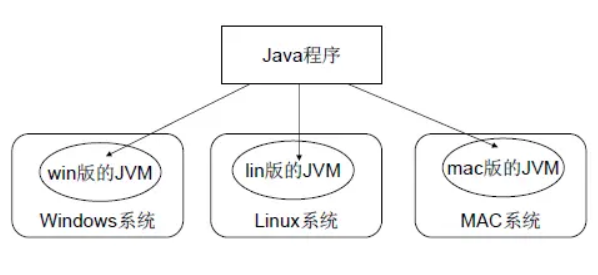
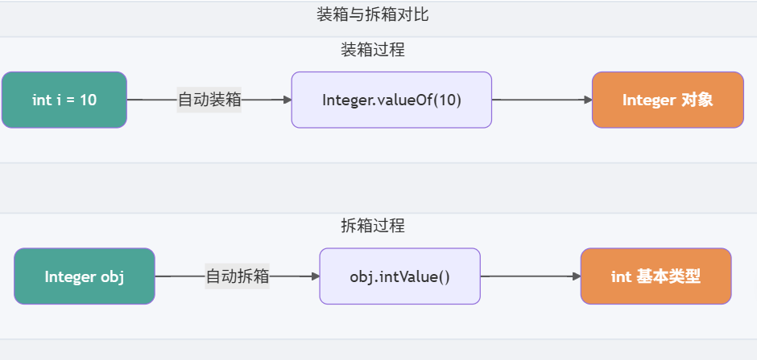
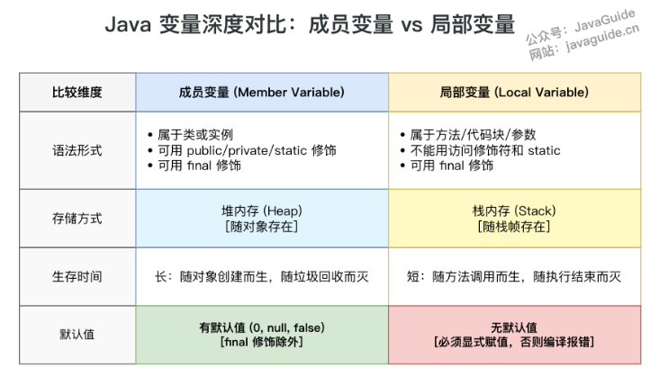
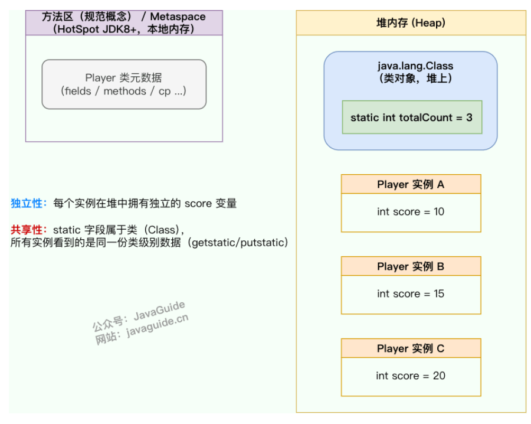
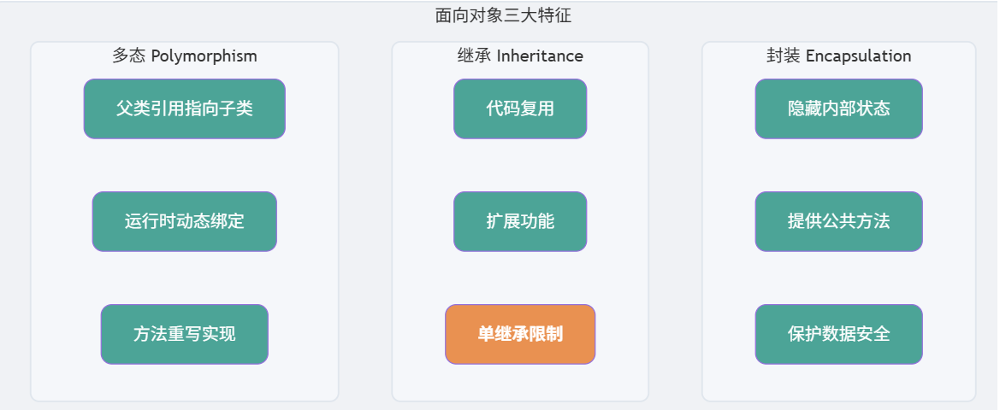

# JAVA 基础

## 一、概念

### 1.1 Java 特点

- **平台无关性：**将.java 代码文件翻译为字节码 .class ,任何安装了虚拟机的系统上都能够运行
- **面向对象：**OOP，面向对象编程使代码更易维护和重复使用
- **内存管理：**垃圾回收机制，自动管理内存和回收不再使用的对象。

### 1.2 Java优势和劣势

优势：跨平台；面向对象；生态强大；内存管理；

劣势：性能比起原生编译语言较差，比如C++，Go语言等；内存消耗大

### 1.3 Java 跨平台

Java代码被编译为字节码文件，再由JVM将字节码文件翻译为机器语言，从而达到运行Java程序的目的。



### 1.4 JVM、JDK、JRE的关系

- **JVM（Java虚拟机）：**是Java程序运行的环境，负责将Java字节码解释/编译为机器码，并执行程序。JVM 提供了内存管理、垃圾回收、安全性等功能，使得Java程序具备跨平台性。
- **JRE（Java 运行时环境）：**Java运行所需的最小环境，JVM + 一组Java类库
- **JDK（Java 程序开发工具包）：**JRE + 开发工具

### 1.5 Java 的解释和编译

Java经过编译后生成字节码文件，进入JVM后

编译：Java源代码会先被 javac 编译为平台无关的.class文件，程序运行之前

解释：JVM 启动后由解释器逐条解释为字节码

### 1.6 值传递和引用传递

在Java中，不存在真正的引用传递

- 值传递：

  适用于基础数据类型，修改方法内部的参数副本，不会改变原变量的值

  ```java
  public static void main(String[] args){
      int num = 10;
      changValue(num);
      System.out.println(num); // 输出10，也就是原本变量的值未改变
  }
  
  public static void changValue(int num){
      num = 20; //仅仅修改到副本
  }
  ```

- 引用传递：

  对于对象类型，传递的是对象引用的副本，而不是对象本身

  ```java
  public static void main(String args[]){
      Person p = new Person("A");
      changName(p);
      System.out.println(p.name); //输出 B，对象内部被修改
      changeReference(p);
      System.out.println(p.name); //输出 B, 原引用指向没有改变
  }
  
  //修改对象内部数据
  public static void changName(Person p){
      p.name = "B"; //副本和原引用指向同一个对象
  }
  
  //修改副本的指向
  public static void changeReference(Person p){
      p = new Person("C"); //副本指向新对象，原引用仍然指向旧对象
  }
  ```

总结：

- 基本类型传递“值的副本”，修改副本不影响原值。
- 引用类型传递“引用的副本”，通过副本引用可以修改对象内容，但是无法改变原引用的指向。

### 1.7 标识符与关键字

标识符：我们编写程序的时候，需要大量地为程序、类、变量、方法等取名字，于是就有了 **标识符** 。简单来说， **标识符就是一个名字**

关键字：private、protected等特殊含义的关键字

### 1.8 运算符

#### 1.8.1 自增与自减

```java
int a = 9;		
int b = a++; 	// b = 9， a = 10
int c = ++a;	// c = 11 , a = 11
int d = c--;	// d = 11 , c = 10
int e = --d;	// e = 10 , d = 10
```

## 二、数据类型

### 2.1 基础数据类型

| 基本类型  | 位数 | 字节 | 默认值  | 取值范围                                                     |
| :-------- | :--- | :--- | :------ | ------------------------------------------------------------ |
| `byte`    | 8    | 1    | 0       | -128 ~ 127                                                   |
| `short`   | 16   | 2    | 0       | -32768（-2^15） ~ 32767（2^15 - 1）                          |
| `int`     | 32   | 4    | 0       | -2147483648 ~ 2147483647                                     |
| `long`    | 64   | 8    | 0L      | -9223372036854775808（-2^63） ~ 9223372036854775807（2^63 -1） |
| `char`    | 16   | 2    | 'u0000' | 0 ~ 65535（2^16 - 1）                                        |
| `float`   | 32   | 4    | 0f      | 1.4E-45 ~ 3.4028235E38                                       |
| `double`  | 64   | 8    | 0d      | 4.9E-324 ~ 1.7976931348623157E308                            |
| `boolean` | 1    |      | false   | true、false                                                  |

注意：

浮点数默认类型为double类型，整数默认为int类型

除了char是Character , int 是Integer, 其他都是首字母大写

char类型是无符号的，所以是从 0 开始的

### 2.2 基本数据类型的转换

自动类型转换（隐式转换）：

当目标类型的范围大于源类型时，Java会自动将原类型转换为目标类型，例如：int 转换为long，float转换为double

```java
int intValue = 10;
long longValue  = intValue ; //发生了自动类型转换，安全
```

强制类型转换（显示转换）：

当目标类型的范围小于原类型时，需要使用强制转换

- 数据溢出：目标类型无法容纳原数据，丢弃高位字节，只保留低位
- 精度损失：浮点数转换，可能发生精度丢失，例如double转为int，double转为float

```java
long longValue = 100L;
int intValue  = (int) longValue; //强制类型转换，可能造成数据丢失或者溢出
```

### 2.3 对象引用转换

向上转型

```java
class Animal{}
class Dog extends Animal{}

Dog dog = new Dog();
Animal animal = dog ; //自动向上转型
```

向下转型

```java
Animal animal = new Animal();
Person person = (Person) animal; //如果Dog类不是Animal类的子类，会抛出异常ClassCastException

if(animal instanceof Dog){
    Dog dog = (Dog) animal; // 通过instanceof 检查之后才进行向下转型
}
```

### 2.4 浮点数运算的精度丢失问题

```java
float a = 2.0f - 1.9f ;
float b = 1.8f - 1.7f ;
System.out.println(a == b); //输出flase
```

二进制的计算机在表示一个数字时，宽度是有限的，无限循环的小数在存储时只能被截断，导致了精度丢失的情况。

解决办法：使用BigDecimal 可以实现浮点数的运算且不会造成精度丢失

```java
BigDecimal a = new BigDecimal("1.0");
BigDecimal b = new BigDecimal("0.2");
BigDecimal sum = a.add(b); // 1.3
BigDecimal product = a.multiply(b);//0.2
```

### 2.5 装箱和拆箱

- **装箱：**将基本类型用它们对应的引用类型包装起来
- **拆箱：**将包装类型转换为基本数据类型



```java
Integer i = 10 ; //自动装箱，等价于Integer i = Integer.valueOf(10)
int n = i; //拆箱,等价于 int i = i.intValue();
```

**自动装箱的弊端：**

循环中自动装箱的情况下，性能会极具下降

包装类是引用类型，不管读写效率还是存储效率，基本类型比包装类型高效

### 2.6 包装类

#### 2.6.1 包装类的缓存机制

Byte,Short,Long,Integer 这4种包装类型创建了数值[-127, 128] 的缓存数据，Character创建了[0,127]的缓存数据，Boolean 直接返回 TRUE / FALSE，Float 和 Double 没有实现缓存机制

如果没有命中缓存，那么会去创建新的对象

各个类是通过valueOf()方法去使用缓存机制的，也就是说自动装箱会使用缓存机制，而直接new Integer类是不会的

```java
Integer i = 40 ; //自动装箱，直接使用的是缓存池中的对象
Integer i1 = new Integer(40); //直接创建新的对象
System.out.println(i == i1); //false
```

注意： 所有的整型包装类对象之间的比较都要使用 equals 比较，因为Integer对象会复用已有对象，区间内的可以使用==，但是区间外的会在堆上产生，并不会复用已有对象

### 2.7 超过long 的整型应该怎么表示

BigInteger 内部使用数据int[] 数组来存储任意的整型数据

### 2.8 变量

#### 2.8.1 成员变量与局部变量的区别



#### 2.8.2 静态变量

被 static 关键字修饰的变量，可以被类的所有实例共享，无论类创建了多少个对象，都共享一份静态变量。即，静态变量只会被分配一次内存



静态变量通过类名访问的，如果被private修饰就无法访问了

#### 2.8.3 字符串常量和字符型常量的区别

```java
// 字符型常量
public static final char LETTER_A = 'A';

// 字符串常量
public static final String GREETING_MESSAGE = "Hello, world!";
public static void main(String[] args) {
    System.out.println("字符型常量占用的字节数为："+Character.BYTES); // 2 
    System.out.println("字符串常量占用的字节数为："+GREETING_MESSAGE.getBytes().length); // 13
}
```

### 2.9 方法

#### 2.9.1 静态方法为什么不能调用非静态成员？

静态方法是属于类的，在类加载的时候就会分配内存，而非静态成员属于实例对象，在实例化后才存在，也就是说在类的非静态成员不存在的时候静态方法就已经存在了，此时调用内存中不存在的非静态成员，属于非法操作

#### 2.9.2 重载和重写的区别

- **重写就是子类对父类方法的重新改造，外部样子不能改变，内部逻辑可以改变。**
- 重载就是同一个类中多个同名方法根据不同的传参来执行不同的逻辑处理

| 区别点         | 重载 (Overloading)                                           | 重写 (Overriding)                                            |
| -------------- | ------------------------------------------------------------ | ------------------------------------------------------------ |
| **发生范围**   | 同一个类中。                                                 | 父类与子类之间（存在继承关系）。                             |
| **方法签名**   | 方法名**必须相同**，但**参数列表必须不同**（参数的类型、个数或顺序至少有一项不同）。 | 方法名、参数列表**必须完全相同**。                           |
| **返回类型**   | 与返回值类型**无关**，可以任意修改。                         | 子类方法的返回类型必须与父类方法的返回类型**相同**，或者是其**子类**。 |
| **访问修饰符** | 与访问修饰符**无关**，可以任意修改。                         | 子类方法的访问权限**不能低于**父类方法的访问权限。（public > protected > default > private） |
| **绑定时期**   | 编译时绑定或称静态绑定                                       | 运行时绑定 (Run-time Binding) 或称动态绑定                   |

#### 2.9.3 方法的可变参数

可变长参数就是允许在调用方法时传入不定长度的参数。就比如下面这个方法就可以接受 0 个或者多个参数。

```java
public static void method2(String arg1, String... args) {
   //......
}
//可变参数只能作为函数的最后一个参数，但其前面可以有也可以没有任何其他参数
public static void method1(String... args) {
   //......
}
```

**遇到方法重载的情况怎么办呢？会优先匹配固定参数还是可变参数的方法呢？**

会优先匹配固定参数的方法，因为固定参数的方法匹配度更高。

## 三、面向对象

### 3.1 封装、继承和多态

- **封装：**封装是指将对象的属性和行为结合一起，对外隐藏对象的内部细节，仅通过对象的接口与外界交互。增强安全性和简化编程

  ```java
  public class Student {
      private int id;//id属性私有化
      //获取id的方法
      public int getId() {
          return id;
      }
      //设置id的方法
      public void setId(int id) {
          this.id = id;
      }
  }
  ```

  

- **继承：**继承是一种可以使得子类共享父类数据结构和方法的机制。是代码复用的主要手段

- **多态：**多态是指允许不同类的对象对同一消息做出响应。即同一个接口，使用不同的实例而执行不同操作。多态性可以分为编译时多态（重载）和运行时多态（重写）



### 3.2 多态详解

方法重载：同一个类中可以有多个同名方法，但是有不同的参数列表（参数类型，数量或顺序不同）

方法重写：子类能够重写父类中同名方法的具体实现

接口与实现：多个类可以实现同一个接口，并且使用接口类型的引用来调用这些类的方法


