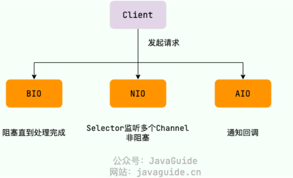
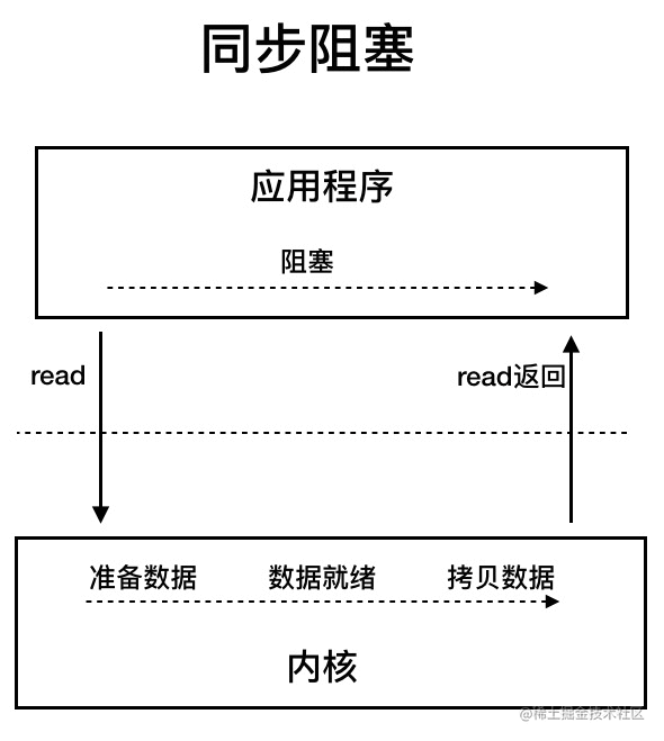
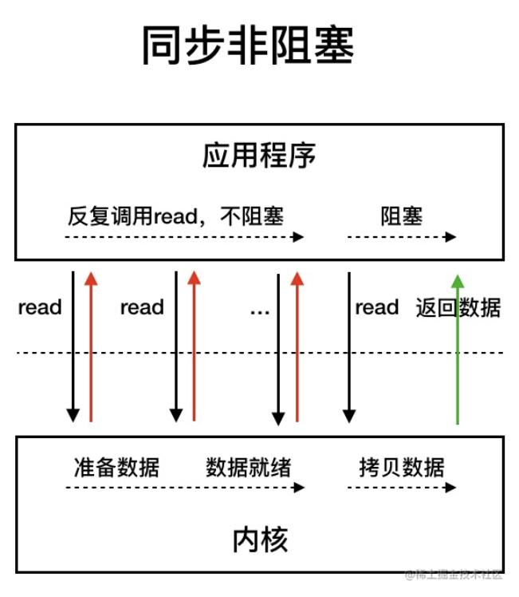
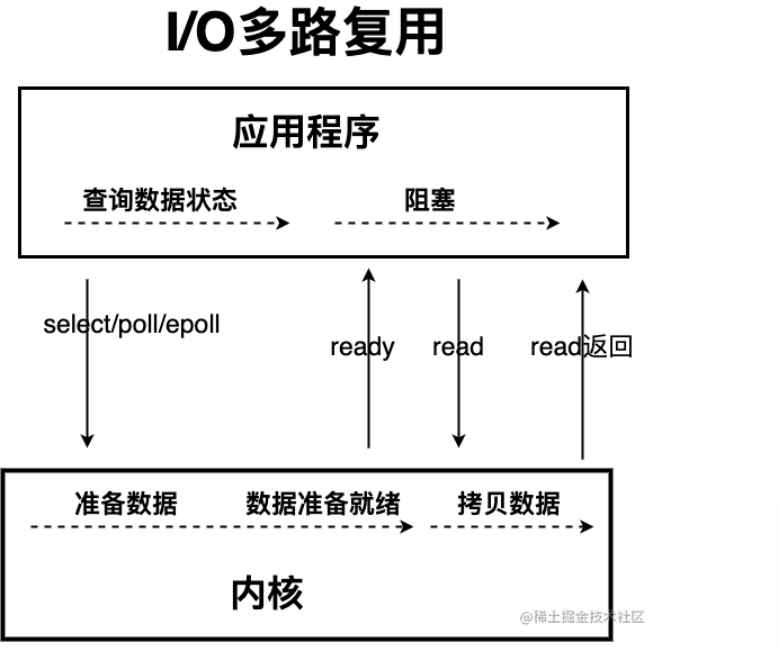
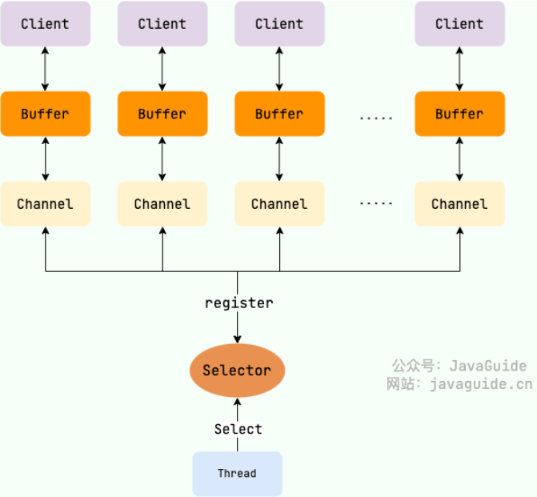
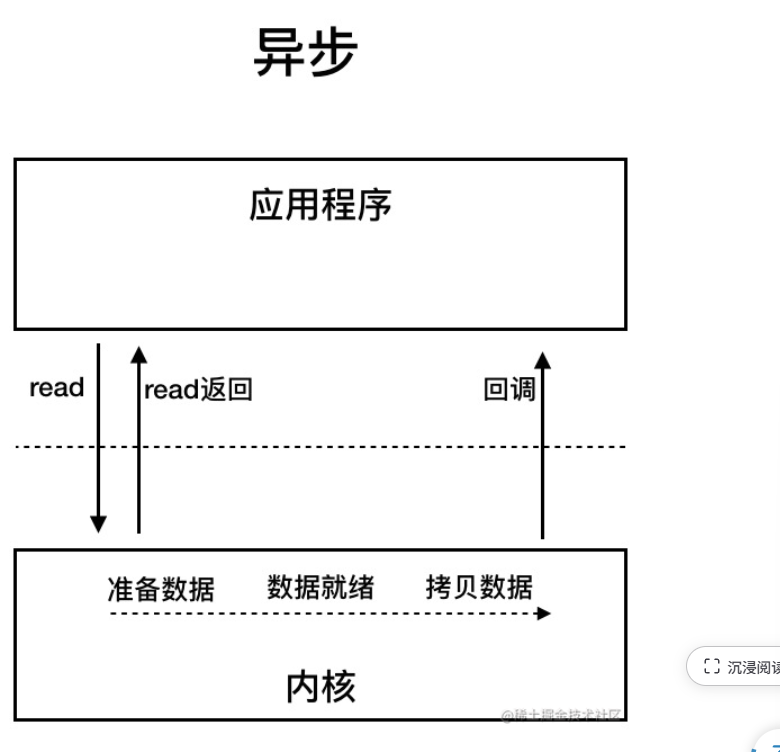

# Java IO 

## 一、IO 流的概念

IO ，即Input / Output ，输入和输出/

数据输入到计算机内存的过程即输入，反正输出到外部存储的过程叫输出。

IO流在Java中分为输入流 和输出流，数据处理的方式又分为字节流和字符流。

- `InputStream`/`Reader`: 所有的输入流的基类，前者是字节输入流，后者是字符输入流。
- `OutputStream`/`Writer`: 所有输出流的基类，前者是字节输出流，后者是字符输出流

## 二、字节流

### 2.1 InputStream ( 字节输入流 )

#### 2.1.1 InputStream 常用方法

- `read()`：返回输入流中下一个字节的数据。返回的值介于 0 到 255 之间。如果未读取任何字节，则代码返回 `-1` ，表示文件结束。
- `read(byte b[ ])` : 从输入流中读取一些字节存储到数组 `b` 中。如果数组 `b` 的长度为零，则不读取。如果没有可用字节读取，返回 `-1`。如果有可用字节读取，则最多读取的字节数最多等于 `b.length` ， 返回读取的字节数。这个方法等价于 `read(b, 0, b.length)`。
- `read(byte b[], int off, int len)`：在`read(byte b[ ])` 方法的基础上增加了 `off` 参数（偏移量）和 `len` 参数（要读取的最大字节数）。
- `skip(long n)`：忽略输入流中的 n 个字节 ,返回实际忽略的字节数。
- `available()`：返回输入流中可以读取的字节数。
- `close()`：关闭输入流释放相关的系统资源。

从 Java 9 开始，`InputStream` 新增加了多个实用的方法：

- `readAllBytes()`：读取输入流中的所有字节，返回字节数组。
- `readNBytes(byte[] b, int off, int len)`：阻塞直到读取 `len` 个字节。
- `transferTo(OutputStream out)`：将所有字节从一个输入流传递到一个输出流。

#### 2.1.2 FileInputStream

`FileInputStream` 是一个比较常用的字节输入流对象，可直接指定文件路径，可以直接读取单字节数据，也可以读取至字节数组中。

```java
try(InputStream fis = new FileInputStream("input.txt")){
    System.out.println("文件可读取字节数: " + fis.available());
    int content;
    long skip = fis.skip(2);
    System.out.println("跳过的字节数：" + skip);
    System.out.println("从文件中读取到的内容：");
    while((content = fis.read() != -1)){
        System.out.println( (char)content );
    }
}catch(IOException e){
    throw e;
}
```

#### 2.1.3 DataInputStream

`DataInputStream` 用于读取指定类型数据，不能单独使用，必须结合其它流。

```java
FileInputStream fileInputStream = new FileInputStream("input.txt");
//必须将fileInputStream作为构造参数才能使用
DataInputStream dataInputStream = new DataInputStream(fileInputStream);
//可以读取任意具体的类型数据
dataInputStream.readBoolean();
dataInputStream.readInt();
dataInputStream.readUTF();
```

#### 2.1.4 ObjectInputStream

`ObjectInputStream` 用于从输入流中读取 Java 对象（反序列化），`ObjectOutputStream` 用于将对象写入到输出流(序列化)。

```java
ObjectInputStream input = new ObjectInputStream(new FileInputStream("object.data"));
MyClass object = (MyClass) input.readObject();
input.close();
```

### 2.2 OutputStream( 字节输出流 ) 

#### 2.2.1 `OutputStream` 常用方法

- `write(int b)`：将特定字节写入输出流。
- `write(byte b[ ])` : 将数组`b` 写入到输出流，等价于 `write(b, 0, b.length)` 。
- `write(byte[] b, int off, int len)` : 在`write(byte b[ ])` 方法的基础上增加了 `off` 参数（偏移量）和 `len` 参数（要读取的最大字节数）。
- `flush()`：刷新此输出流并强制写出所有缓冲的输出字节。
- `close()`：关闭输出流释放相关的系统资源。

#### 2.2.2 FileOutputStream

```java
try (FileOutputStream output = new FileOutputStream("output.txt")) {
    byte[] array = "JavaGuide".getBytes();
    output.write(array);
} catch (IOException e) {
    e.printStackTrace();
}
```

#### 2.2.3 DataOutputStream

`DataOutStream` 用于写入指定类型数据，不能单独使用，必须结合其它流。

```java
// 输出流
FileOutputStream fileOutputStream = new FileOutputStream("out.txt");
DataOutputStream dataOutputStream = new DataOutputStream(fileOutputStream);
// 输出任意数据类型
dataOutputStream.writeBoolean(true);
dataOutputStream.writeByte(1);
```

#### 2.2.4 ObjectOutputStream

`ObjectOutputStream` 用于将对象写入到输出流(序列化)。

```java
ObjectOutputStream output = new ObjectOutputStream(new FileOutputStream("file.txt")
Person person = new Person("yuan", "程序员");
output.writeObject(person);
```

## 三、字符流

不管是文件读写还是网络发送接收，信息的最小存储单元都是字节。 **那为什么 I/O 流操作要分为字节流操作和字符流操作呢？**

字符流是由JVM将字节转换得到的，过程相对耗时

不清楚编码类型，容易出现乱码问题

字符流默认使用Unicode编码，可以通过构造方法自定义编码

### 3.1 Reader ( 字符输入流 )

#### 3.1.1 Reader 常用方法

- `read()` : 从输入流读取一个字符。
- `read(char[] cbuf)` : 从输入流中读取一些字符，并将它们存储到字符数组 `cbuf`中，等价于 `read(cbuf, 0, cbuf.length)` 。
- `read(char[] cbuf, int off, int len)`：在`read(char[] cbuf)` 方法的基础上增加了 `off` 参数（偏移量）和 `len` 参数（要读取的最大字符数）。
- `skip(long n)`：忽略输入流中的 n 个字符 ,返回实际忽略的字符数。
- `close()` : 关闭输入流并释放相关的系统资源。

#### 3.1.2 FileReader 

```java
try (FileReader fileReader = new FileReader("input.txt");) {
    int content;
    long skip = fileReader.skip(3);
    System.out.println("跳过字符数量：" + skip);
    System.out.print("从文件中读取到的内容:");
    while ((content = fileReader.read()) != -1) {
        System.out.print((char) content);
    }
} catch (IOException e) {
    e.printStackTrace();
}
```

### 3.2 Writer ( 字符输出流 )

#### 3.2.1 `Writer` 常用方法：

- `write(int c)` : 写入单个字符。
- `write(char[] cbuf)`：写入字符数组 `cbuf`，等价于`write(cbuf, 0, cbuf.length)`。
- `write(char[] cbuf, int off, int len)`：在`write(char[] cbuf)` 方法的基础上增加了 `off` 参数（偏移量）和 `len` 参数（要读取的最大字符数）。
- `write(String str)`：写入字符串，等价于 `write(str, 0, str.length())` 。
- `write(String str, int off, int len)`：在`write(String str)` 方法的基础上增加了 `off` 参数（偏移量）和 `len` 参数（要读取的最大字符数）。
- `append(CharSequence csq)`：将指定的字符序列附加到指定的 `Writer` 对象并返回该 `Writer` 对象。
- `append(char c)`：将指定的字符附加到指定的 `Writer` 对象并返回该 `Writer` 对象。
- `flush()`：刷新此输出流并强制写出所有缓冲的输出字符。
- `close()`:关闭输出流释放相关的系统资源。

`OutputStreamWriter` 是字符流转换为字节流的桥梁，其子类 `FileWriter` 是基于该基础上的封装，可以直接将字符写入到文件。

```java
// 字符流转换为字节流的桥梁
public class OutputStreamWriter extends Writer {
}
// 用于写入字符到文件
public class FileWriter extends OutputStreamWriter {
}
```

#### 3.2.2 `FileWriter`

```java
try (Writer output = new FileWriter("output.txt")) {
    output.write("你好，读者");
} catch (IOException e) {
    e.printStackTrace();
}
```

### 四、字节缓冲流

IO 操作很消耗性能，缓冲流将数据加载至缓冲区，一次读取/写入多个字节，避免频繁的IO操作，提高流的传输效率

### 4.1 BufferedInputStream ( 字节缓冲输入流 )

```java
try(BufferedInputStream bis = new BudderedInputStream(new FileInputStream("hello.txt"))){
    int content;
    while((content = bis.read())!= -1){
        ...
    }
}

```

### 4.2 BufferedOutputStream ( 字节缓存输出流 )

```java
try (BufferedOutputStream bos = new BufferedOutputStream(new FileOutputStream("output.txt"))) {
    byte[] array = "JavaGuide".getBytes();
    bos.write(array);
} catch (IOException e) {
    e.printStackTrace();
}
```

## 五、 字符缓存流

`BufferedReader` （字符缓冲输入流）和 `BufferedWriter`（字符缓冲输出流）类似于 `BufferedInputStream`（字节缓冲输入流）和`BufferedOutputStream`（字节缓冲输入流），内部都维护了一个字节数组作为缓冲区。不过，前者主要是用来操作字符信息。

## 六、Java 的IO 模型



### 6.1 BIO 同步阻塞 Blocking I/O



 `java.io` 包下都属于BIO 。它的特点是**面向流（Stream）**、**同步且阻塞**。

- **分类**：主要分为**字节流**（`InputStream`/`OutputStream`，处理图片、视频等二进制文件）和**字符流**（`Reader`/`Writer`，处理纯文本，自带字符编码转换）。
- **致命缺点**：一个连接一个线程。如果客户端连接上来了却不发数据，这个线程就只能干等。当并发量达到成千上万时，服务器会因为创建太多线程而直接崩溃（OOM）。
- **适用场景**：并发量小、架构固定的简单项目。

### 6.2 NIO Non-Blocking I/O 同步非阻塞



同步非阻塞 IO 模型中，应用程序会一直发起 read 调用，等待数据从内核空间拷贝到用户空间的这段时间里，线程依然是阻塞的，直到在内核把数据拷贝到用户空间。

NIO 有三大核心组件，理解了它们就理解了 NIO 的精髓：

1. **Buffer (缓冲区)**：一个内存块，数据的读写都必须通过它。这就像传统 I/O 是用水管一滴一滴运水，而 NIO 是用一辆卡车（Buffer）一车一车运水。
2. **Channel (通道)**：双向的数据传输通道。传统流只能单向（只能读或只能写），而通道既可以读也可以写。
3. **Selector (选择器)**：大名鼎鼎的 **I/O 多路复用** 核心。它允许**一个线程去监听多个通道**的事件（如：连接、数据就绪）。哪个通道有数据了，它才去处理，这就完美解决了 BIO 一个连接卡死一个线程的问题。

### 6.3 I/O 多路复用

NIO中轮询的模型依旧存在问题，应用程序不断进行I/O系统调用轮询数据是否已经准备好的过程是十分消耗CPU资源的。此时就使用了 I/O多路复用模型



IO 多路复用模型中，线程首先发起 select 调用，询问内核数据是否准备就绪，等内核把数据准备好了，用户线程再发起 read 调用。read 调用的过程（数据从内核空间 -> 用户空间）还是阻塞的。

**IO 多路复用模型，通过减少无效的系统调用，减少了对 CPU 资源的消耗。**

Java 中的 NIO ，有一个非常重要的**选择器 ( Selector )** 的概念，也可以被称为 **多路复用器**。通过它，只需要一个线程便可以管理多个客户端连接。当客户端数据到了之后，才会为其服务。



### 6.3 AIO Asynchronous I/O 异步I/O



JDK 1.7 引入了 NIO.2，其中包含了 AIO。它引入了异步通道（如 `AsynchronousServerSocketChannel`）。

- **机制**：你只需要给操作系统一个 `CompletionHandler`（回调接口），或者拿回一个 `Future`。具体的读写全由操作系统内核搞定，完成后它会主动通知你的线程。
- **现状**：听起来很完美，但在 Linux 系统上，AIO 的底层实现（AIO 信号机制）相比于成熟的 `epoll`（NIO 的底层支持）并没有带来显著的性能提升。因此，目前市面上绝大多数高并发框架（包括 Netty）依然首选 **NIO**。