# Java 集合

## 一、集合基础

Java 集合，由两大接口派生，Collection 接口（List，Set，Queue） 和 Map 接口

### 1.1 Collecttions 和 Collection 的区别

- Collection 是Java 集合框架的一个接口，是所有集合类的基础接口
- Collections是Java提供的工具类，位于java.util 包下，提供了一系列对集合操作的方法，用于对集合进行操作和算法。

### 1.2 集合遍历的方法

```java
List<String> list = new ArrayList<>();

//1. 普通for循环
for(int i =0 ; i < list.size() ; i ++){
    String element = list.get(i);
    System.out.println(element);
}

//2.增强for（for-each）
for(String element : list){
    System.out.println(element);
}

//3.iterator 迭代器
ListIterator<String> listIterator = list.listIterator();
while(listIterator.hashNext()){
    String element = listIterator.next();
    System.out.println(element);
}

//4.使用forEach方法
list.forEach(element -> System.out.println(element));

//5.使用StreamAPI
list.steam().forEach(element -> System.out.println(element));
```

### 1.3 **快速失败（Fail-Fast）** 和 **安全失败（Fail-Safe）**

**快速失败（Fail-Fast）** 和 **安全失败（Fail-Safe）**是两种面对“并发修改”时的不同应对策略

#### 1.3.1 快速失败(Fail-Fast)

一旦发现异常，立刻抛异常;

底层原理：依靠modCount修改器（modifation count，修改次数）的内部变量

1. **初始化：**当获取到集合的迭代器，迭代器内部会记录当前修改次数，expectedModCount = modCount 
2. **遍历中检查：**在每次调用 iterator.next()获取下一个元素前，迭代器会做一次检查，if(modCount != expectedModCount)
3. **触发异常：**如果在此期间有其他线程修改了集合，导致modCount发生变化，检查就会失败，程序立刻抛出异常ConcurrentModifationExpection

#### 1.3.2 安全失败(Fail-Safe)

java.util.concurrent 并发包下的集合CopyOnWriteArrayList`, `ConcurrentHashMap等采用了此机制

读写互不干扰

底层原理(以 `CopyOnWriteArrayList` 为例)：

1. **快照（Snapshot）**：当你对它进行遍历时，迭代器直接引用了创建那一刻的数组（即当时的一个“快照”）。

2. **读写分离**：如果遍历期间有其他线程执行了 `add()` 或 `remove()`，它不会直接修改原数组，而是**把原数组复制一份，在新的副本数组上进行修改**，改完后再把原数组的引用指向新数组。

3. **相安无事**：迭代器手里的“旧数组”自始至终都没有被改变过，所以它会把旧数据遍历完。

### 1.4 循环中的删除

在普通的正序for循环remove() 操作，会导致元素漏删，具体如图

```java
List<String> list = new ArrayList<>(Arrays.asList("A", "B", "C"));
for (int i = 0; i < list.size(); i++) {
    list.remove(i);
}
System.out.println(list); // 期望是空，实际输出：["B"]
```

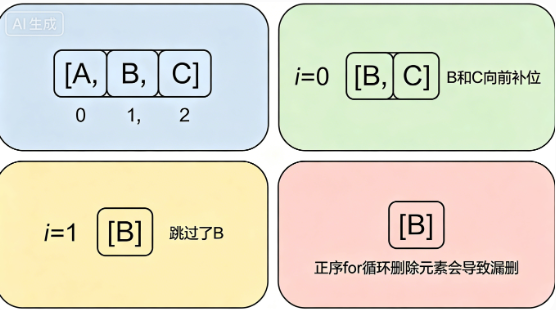

在for-each 循环，删除元素会抛出异常

```java
for (String s : list) {
    if ("B".equals(s)) {
        list.remove(s); // 运行到这里直接抛出 ConcurrentModificationException
    }
}
```

for-each本质是调用了 ArrayList 的Iterator 迭代器

迭代器内部有一个计数器 expectedModCount, 而 ArrayList 内存也有一个修改计数器 modCount

当我们调用list.remove() 时，只更新了list的modCount

下一次循环迭代器会发现 expectedModCount != modCount, 会认为有其他线程修改了数据，抛出异常（快速失败）

**处理方式**

```java
/*
* 1. 使用迭代器的remove方法
* 它会自动把迭代器内部的游标（cursor）往回挪移一位，抵消掉数组补位的影响
* 它会自动同步：expectedModCount = modCount，骗过检查，因此不会抛出并发修改异常。
*/
List<String> list = new ArrayList<>(Arrays.asList("A", "B", "C"));
Iterator<String> iterator = list.iterator();
while (iterator.hasNext()) {
    String s = iterator.next();
    if ("B".equals(s)) {
        iterator.remove(); // 注意：使用的是迭代器的 remove，而不是 list 的 remove
    }
}
/*
* 2. list.removeIf(filter) (现代 Java 最推荐)
* 它首先会通过一个 BitSet（位图）遍历一遍数组，仅仅记录哪些位置的元素需要被删除，此时绝不挪动数组。
* 遍历完后，它会一步到位地把不需要删除的元素“原地左移”覆盖掉需要删除的元素。
* 最后一次性调整 size，并将尾部多余的坑位赋值为 null 让 GC 回收。
* 优点：这种“先标记、后集中移动”的算法，时间复杂度是稳定的 O(n)，比在循环里频繁引发数组补位（每次补位* 都是 O(n) 的性能要高得多。
*/
List<String> list = new ArrayList<>(Arrays.asList("A", "B", "C"));
// 意思是：如果元素等于 "B" 或者符合某种条件，就执行删除
list.removeIf(s -> "B".equals(s));
```

## 二、List

### 2.1 ArrayList

#### 2.1.1 底层数据结构

底层本质上是一个普通的元素数组 Object[] 

核心的成员变量：

`transient Object[] elementData` ： 真正存储数据的数组

`private int size :` 记录当前数组中实际存放了多少个元素，小于elementData.length

由于底层基于数组实现，所以支持随机访问（实现了RandomAccess接口），通过索引获取数据，速度极快

#### 2.1.2 常用方法

| **操作**              | **时间复杂度** |                                                     |
| --------------------- | -------------- | --------------------------------------------------- |
| `get(int index)`      | O(1)           | 直接通过内存偏移量定位，极快。                      |
| `add(E e)` (尾部插入) | 均摊 O(1)      | 直接挂在 `size` 位置。若触发扩容则变为 O(n)。       |
| `add(int index, E e)` | O(n)           | 需要把 `index` 之后的所有元素往后挪一位，腾出位置。 |
| `remove(int index)`   | O(n)           | 需要把 `index` 之后的所有元素往前挪一位，填补空缺。 |
| `contains(Object o)`  | O(n)           | 需要从头到尾遍历数组进行 `equals` 比较。            |

#### 2.1.3 自动扩容机制

**初始容量**

Java 8 以前，使用 `new ArrayList<>()`初始化，会立刻创建一个默认初始容量为10的数组；

Java 8 之后，则是赋予了一个空数组{}，源码如下

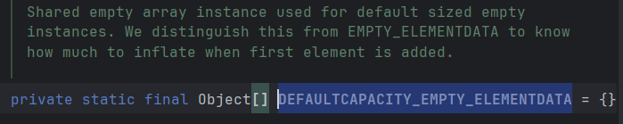

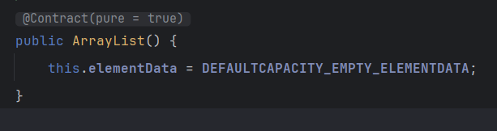

真正的分配内存在第一次调用add() 方法，此时数组会直接扩容到默认初始容量10

**扩容机制**

首先计算add后的最小所需容量 minCapacity 

如果最小所需容量 大于 当前容量，那么触发grow方法进行扩容

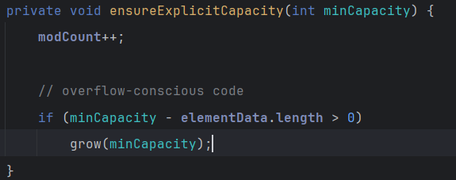

扩容后的容量，是**原来数组的1.5倍**，通过位运算 `int newCapacity = oldCapacity + (oldCapacity >> 1);`

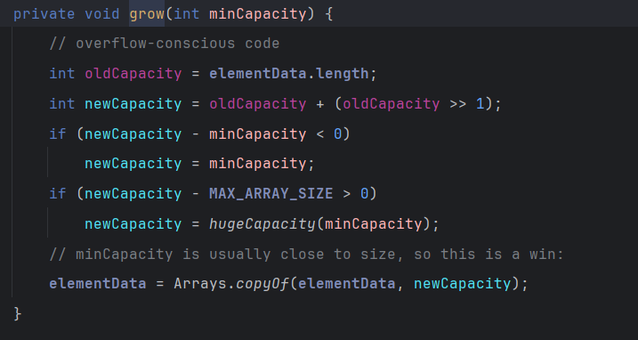

并通过Arrays.copyOf() 把旧数据原封不懂复制到新数组中，旧数据失去引用，等待GC回收

**注意：内存复制是一个比较耗时的操作 O(N) ，如果预先知道长度，可以先使用 new ArrayList(容量) 去进行初始化，避免频繁扩容**

#### 2.1.4 线程安全

ArrayList 所有方法没有加锁，如果一个线程在遍历的时候，另一个线程进行了修改，会抛出异常ConcurrentModificationException 异常

底层原理是 ，内部有一个 modCount 变量记录修改次数，迭代器初始化会保存这个值，遍历时如果发现modCount变了，就会报错（快速失败Fail-Fast）

并发场景下，使用`CopyOnWriteArrayList` ，或者使用`Collections.synchronizedList()` 包装

#### 2.1.5 用 `Arrays.asList()` 转出来的 List 是个“冒牌货”

它返回的是 `Arrays` 的一个**内部类**，这个内部类没有实现 `add()` 和 `remove()` 方法。

如果你对它调用 `add()`，直接抛出 `UnsupportedOperationException`。

**药方**：如果需要增删，这样写：`List<String> list = new ArrayList<>(Arrays.asList("A", "B"));`

#### 2.1.6 ArrayList与数组的区别

- ArrayList 是动态数组Object[] 数组，会根据实际存储的元素动态扩容/缩容；而Array 是静态数组，被创建之后不能改变长度
- ArrayList 允许通过泛型确保类型安全，而Array 不行
- ArrayList 只能存储对象类型的数据，无法存储基本数据类型，而Array两者皆可

在现代计算机架构中，由于 CPU 缓存行（Cache Line）的存在，**ArrayList 的遍历性能通常完爆 LinkedList**。因为 ArrayList 内存连续，CPU 一次性会把整段数据加载到缓存中；而 LinkedList 内存散落各处，会导致频繁的缓存失效（Cache Miss）。因此，绝大多数业务场景，首选 `ArrayList`。

### 2.2 LinkedList 

#### 2.2.1 底层数据结构

LinkedList 底层是一个双向链表，每个数据保存在Node节点中

```java
private static class Node<E> {
    E item;       // 真正存储的数据
    Node<E> next; // 指向下一个节点的指针（引用）
    Node<E> prev; // 指向前一个节点的指针（引用）

    Node(Node<E> prev, E element, Node<E> next) {
        this.item = element;
        this.next = next;
        this.prev = prev;
    }
}
```

同时，`LinkedList` 自身维护了两个指针：

- `transient Node<E> first;` 指向链表的**头节点**。
- `transient Node<E> last;` 指向链表的**尾节点**。
- 在内存中是散落的，不连续的。每个节点除了保存自己的数据，还要保存两个指针

#### 2.2.2 常用方法

| **操作**                     | **时间复杂度** |                                                              |
| ---------------------------- | -------------- | ------------------------------------------------------------ |
| `get(int index)`             | O(n)           | 链表没有索引下标，必须从头到尾遍历，在源码做了优化，判断index是前半段还是后半段，快了一倍，但是在大 O 表示下，依旧是O(n) |
| `add(E e)` (尾部插入)        | O(1)           | 因为有 `last` 指针直连尾部，直接把新节点挂在 `last` 后面即可，不需要挪动任何数据。 |
| addFirst()` / `removeFirst() | O(1)           | 同理，有 `first` 指针直连，极快                              |
| add(int index, E element)    | O(n)           | 需要把 `index` 之后的所有元素往前挪一位，填补空缺。          |

#### 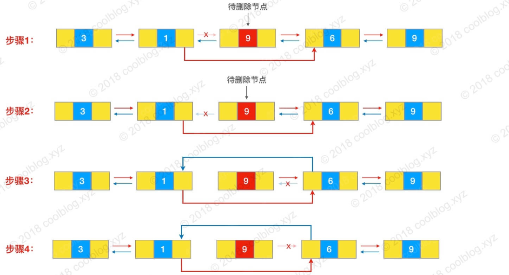

### 2.3 CopyOnWriteArrayList

#### 2.3.1 写时复制

读操作：所有线程都在同一个内存操作，不需要加任何锁，性能极高

写操作：不直接在原来的数组上修改，把原数组完整复制一份新的出来，在新的数组上进行修改，改完之后，再把指向原数组的指针，指向这个新数组

以此，是安全失败，且保证了线程安全

#### 2.3.2 源码解析

存储数组使用了volatile关键字，保证了线程之间的可见性，由此保证了写线程更改引用后，其他线程能够立刻读取到最新的数组

```java
private transient volatile Object[] array;
```

add方法

```java
public boolean add(E e) {
    // 1. 独占锁！保证同一时间只有一个线程在执行“写”操作
    final ReentrantLock lock = this.lock; 
    lock.lock();
    try {
        // 2. 获取老数组的引用
        Object[] elements = getArray();
        int len = elements.length;
        
        // 3. 关键点：复制一个长度 +1 的新数组出来
        Object[] newElements = Arrays.copyOf(elements, len + 1);
        
        // 4. 把新元素塞到新数组的尾部
        newElements[len] = e;
        
        // 5. 将内部的 array 引用指向这个新数组（挥一挥衣袖，完成替换）
        setArray(newElements);
        return true;
    } finally {
        // 6. 释放锁
        lock.unlock();
    }
}
```

#### 2.3.3 COW的弊端和适用场景

内存占用：每次写操作都复制一个新数组

只保证最终一致性，无法保证强一致性：因为读写分离，当写线程正在复制新数组并修改时，读线程依旧在老数组上读数据，实时性不高

适用场景：读极多写极少的并发场景

## 三、Map

### 3.1 Map的遍历方法

```java
Map<String,Integer> map = new HashMap<>();

//1. 使用for-each 和 entrySet()方法
for(Map.Entry<String,Integer> entry : map.entrySet()){
    sout("key:" + entry.getKey() + "value: " + entry.getValue());
}

//2. 使用for-each 和 keySet()
for(String key : map.keySet()){
    sout("key:" + key + "value:" + map.get(key));
}

//3.通过获取Map的entrySet()或keySet()的迭代器
Iterator<Entry<String,Integer>> iterator = map.entrySet().iterator();
while(iterator.hasNext()){
    Entry<String,Integer> entry = iterator.next();
    sout("key:" + entry.getKey() + "value: " + entry.getValue());
}

//4.使用Lambda 表达式 和 forEach()方法
map.forEach((key,value) -> sout("key:" + key + "value: " + value));

//5.使用Stream API
map.entrySet().stream().forEach(entry -> sout("key:" + entry.getKey() + "value: " + entry.getValue());
```

### 3.2 HashMap

#### 3.2.1 底层数据结构

**Java 8 以前** 

数组 + 链表，HashMap通过哈希算法将元素的key映射到数组的Bucket，如果多个key映射到同一个，那么该Bucket转换为链表存储

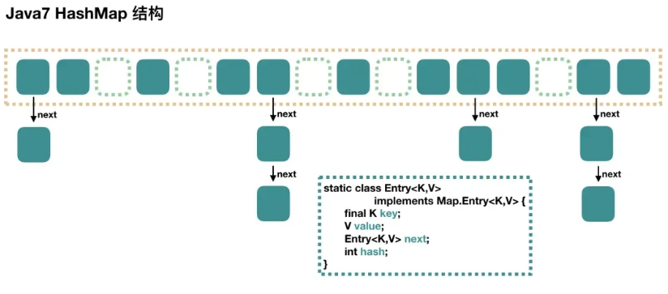

**Java 8** 

当某个Bucket 的链表长度 > 8 且哈希表数组长度>=64时，会把链表转换为红黑树，把Bucket的查询时间复杂度O(n) 降低到O(logn)，如果数组长度 < 64 ，则不会立刻树化。而当resize() 过程中，若某个桶的节点数 <=6 ，红黑树会退回链表

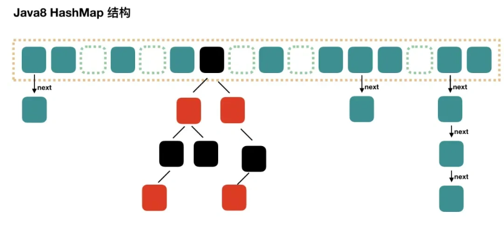

#### 3.2.2 为什么不使用平衡二叉树

- 二叉树是严格平衡的二叉树，要求任意节点的左右子树高度差不超过1。
- 插入/删除会触发大量的旋转操作（左旋、右旋、双旋）
- 红黑树仅仅保证黑色高度平衡，旋转次数远远少于AVl树，执行效率更高
- **红黑树的查找、插入、删除的时间都是O(log n)**，查找低于AVL 树，综合来说，红黑树更适合

#### 3.2.3 哈希冲突的解决办法

- **链接法**：使用链表或者其他数据结构来存储冲突的值，将他们链接到同一个哈希桶
- **开放寻址法**：在哈希表中找到另一个可用的位置来存储冲突的值，而不是存在链表中
- **再哈希法**：当发生冲突时，使用另一个哈希函数再次计算键的哈希值，直到找到一个空的来存储
- **哈希桶扩容**：当哈希冲突过多时，动态地扩大哈希桶的数量，重新分配键值对，减少冲突的概率

#### 3.2.4 如何让hashMap变线程安全

- Colelctions.syschronized(map)同步加锁
- 使用HashTable
- 使用ConcurrrentHashMap(推荐)

#### 3.2.5 HashMap的put 过程（Java 8）

1. 计算Key的哈希值在数组中的位置

2. 检查该位置是否为空

   - 如果为空，新建一个Node对象并存储键值对保存到数组对应位置，modCount + 1

   - 如果不为空，检查第一个键值对的哈希码和键是否与要添加的键值对相同

     如果相同，则说明找到相同的键，修改操作

     如果不相同，则需要使用键的哈希码和equals()方法比较遍历链表或红黑树来查找是否有相同的键，直到末尾，有相同则更新，无则新的键值对添加到链表末尾 / 红黑树

3. 检查链表长度是否达到阈值（默认为8），超过阈值且数组长度>=64, 转换为红黑树结构

4. 检查负载因子(0.75) ，负载因子为键值对的数量 / 数组的长度；如果大于0.75，进行扩容

5. 扩容：创建一个两倍大小的数组，遍历旧数据的每个键值对，根据 e.hash & oldCap 的结果重新分配到数组中的位置（要么原位置，要么原位置 + oldCap），无需重新计算hash

   ```text
   索引 = hash & (length - 1)
   ```

   因为使用的是2的次幂扩展，所以，元素的位置要么原位置，要么原位置 + oldCap

   比如，当我们从16扩展到32时

   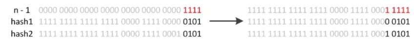

   所以只需要看新增的那个bit是1还是0就好了，是0的就没变化，是1就是原位置 + oldCap

   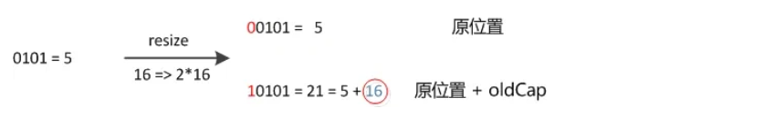

#### 3.2.6 为什么不使用平衡二叉树

平衡二叉树是完全平衡的，任何节点的左右子树的高度不会超过1，每次插入都会大量调整

红黑树不像二叉树一样，频繁破坏本身树的结构

#### 3.2.7 HashMap的key可以为null吗

可以，HashMap中使用hash()方法来计算key的哈希值，当key为空时会让key的哈希值为0，不走key.hashCode（）方法。

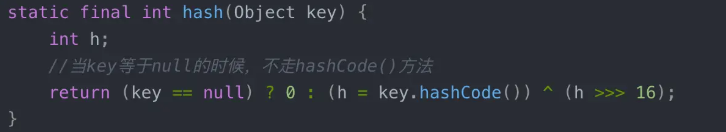

null作为key只能有一个，null作为value可以有多个。key值一样会覆盖相同的key对应的value。

#### 3.2.8 重写HashMap的equal和hashcode方法需要注意什么

遵循原则：如果o1.equal(o2), 那么o1.hashCode() == o2.hashCode() 

#### 3.2.9 HashMap多线程环境下的问题

Java 8以前，HashMap使用头插法插入元素，多线程环境下，扩容的说话有可能导致环形链表，导致死循环。

Java8之后，改为尾插法插入元素，扩容时会保证原链表元素的顺序

多线程同时put操作，有可能会造成前一个key被后一个key覆盖，导致元素的丢失

