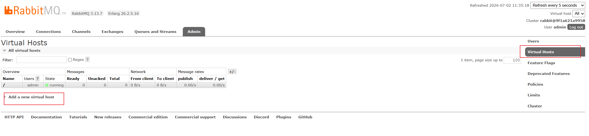

# RabbitMQ

## 一、基础概念

RabbitMQ遵循AMQP 0-9-1 协议，生产者不把消息直接投递到队列，而是投递到交换机；交换机则根据规则把消息投递到不同的队列中。

### 1.1 数据流转

```tex
[ 生产者 Producer ]

	↓ (发出的消息包含：Payload内容 + Routing Key路由键)
[ 交换机 Exchange ]

	↓ (根据 Binding 绑定关系进行分拣)
[ 队列 Queue ] (消息在此排队、持久化)

	↓
[ 消费者 Consumer ]
```

### 1.2 概念

#### 1.2.1 **Broker（消息代理）**

RabbitMQ 服务器本身，包含交换机、队列等所有组件，负责接收、存储、转发消息。

#### 1.2.2 **Virtual Host （虚拟主机）**

逻辑隔离区，在一个Broker中，可以有多个vhost，为各个项目建立不同的vhost，它们的队列、交换机互不干扰，权限也是隔离的。



#### 1.2.3 **Queue（队列）**

消息的终点站和容器。

内部唯一真正存储消息的组件。多个消费者可以订阅同一个队列，队列中的一条消息默认只能被其中一个消费者消费。有持久化、排他、自动删除等属性。

#### 1.2.4 **Exchange（交换机）**

消息的路由器/分拣员

一套路由算法，接收生产者的消息，如果没有匹配的队列，消息会直接丢失

- Fanout Exchange

  广播交换机，会把消息**直接转发到所有跟本交换机绑定的队列**

- Direct Exchange 

  直连交换机，**严格的等值匹配**，会根据消息的Routing Key 发送到 Binding Key == Routing Key的队列

- Topic Exchange

  主题交换机，**通配符模糊匹配**，规定Routing Key必须是以 . 隔开的一串单词。

  **通配符：** * （匹配一个单词）， #（匹配0到多个单词）

  **举例：**

  队列 A 绑定的键是：`*.orange.*`（中间必须是 orange，前后各有一个单词）。

  队列 B 绑定的键是：`lazy.#`（以 lazy 开头，后面有几个单词都行，没有也行）。

#### 1.2.5 **Binding 与 Routing Key（绑定关系 与 路由键）**

Routing Key：生产者发送消息时，附带在消息头的一个标签

Binding：队列和交换机之间建立的连接规则。在绑定时，通常会指定一个Binding Key

原理：交换机拿到消息的Routing Key，和交换机上绑定的各个队列的Binding Key 匹配，如果匹配上，那么消息就流入该队列

## 二、工作模式

### 2.1 简单模式（Simple Queue）

**架构**：`Producer` -> `Queue` -> `Consumer`

只有一个生产者，一个队列，一个消费者。

生产者把消息发送到队列，消费者连上队列消费消息

### 2.2 工作队列模式（Work Queue）

**架构**：`Producer` -> `Queue` -> `多个 Consumer (C1, C2...)`

多消费者协同消费。一个队列排了多个消费者，共同消费队列里的消息

在高并发任务下，一个消费者处理不过来，会启动多个消费者实例消费。RabbitMQ默认使用轮询分发，即按顺序分配，C1，C2，C3...C1,不断循环，每个消费者分配一条。

实际开发中，采用默认的轮询分发会出现问题（C1性能差，C2性能好的情况下，轮询会导致C1消息堆积，C2空闲），所以在实际开发中配置 Prefetch  = 1，预取数量为1，即RabbitMQ每次只给消费者发一条消息，直到消息处理完成返回ACK，才发下一条。

### 2.3 发布/订阅模式（Publish/Subscribe）

**架构**：`Producer` -> `Fanout Exchange` -> `多个不同的 Queue` -> `多个不同的 Consumer`

广播，一条消息，多方共享。

利用了 **Fanout（广播）交换机**。生产者把消息发给交换机，交换机把消息**复制**成多份，分发给所有绑定它的队列。每个队列背后的消费者都能拿到一条**一模一样**的消息。

### 2.4 路由模式（Routing）

**架构**：`Producer` -> `Direct Exchange` -> `根据精确 Routing Key 匹配的 Queue`

利用了 **Direct（直连）交换机**。生产者发送消息时必须带上一个具体的 `Routing Key`（比如 `error`）。交换机只会把这条消息递给那些 `Binding Key` 也是 `error` 的队列。

### 2.5 主题模式（Topics）

**架构**：`Producer` -> `Topic Exchange` -> `根据通配符匹配的 Queue`

利用了 **Topic（主题）交换机**。绑定键可以使用通配符（`*` 匹配一个单词，`#` 匹配零个或多个单词）。

## 三、消息丢失

### 3.1 消息确认机制

RabbitMQ 为了防止消息丢失，设计了 **消息确认机制（Message Acknowledgment）**。 当一条消息从队列投递给消费者时，RabbitMQ 会在内存中把这条消息标记为 `Unacked`（待确认）状态，但**绝不会**立刻把它从队列里删掉。

#### 3.1.1 生产端确认机制

生产者发送消息，确保到达Broker的交换机

1. Publisher Confirm（发布者确认机制）

   **方向**：生产者 -> 交换机（Exchange）

   **触发时机**: 只要消息成功到达交换机，MQ会异步回执给生产者一个Ack，如果交换机不存在或者宕机，回执一个Nack

   在 `application.yml` 开启 `publisher-confirm-type: correlated`，然后在代码中配置回调：

   ```java
   rabbitTemplate.setConfirmCallback((correlationData, ack, cause) -> {
       if (ack) {
           // 消息成功到达交换机
       } else {
           // 投递失败，进行补救（如记录日志、重试发送）
           System.err.println("消息未到达交换机，原因: " + cause);
       }
   });
   ```

2. Publisher Return（发布者退回机制）

   **方向**：交换机 -> 队列（Queue）

   **触发时机**：消息成功到了交换机，但是交换机根据 `Routing Key` 找不到任何匹配的队列（通常是路由键写错了，或者队列没绑定）。此时，如果开启了强制投递（`mandatory=true`），MQ 会把消息**退回**给生产者。

   在 `application.yml` 开启 `publisher-returns: true`：

   ```java
   rabbitTemplate.setReturnsCallback(returned -> {
       System.err.println("消息成功进入交换机，但没有匹配到队列！");
       System.err.println("被退回的消息内容: " + new String(returned.getMessage().getBody()));
       // 补救措施：告警、人工介入
   });
   ```

#### 3.1.2 消费端确认机制

消息到达队列，保证消费者消费到消息

RabbitMQ 提供了三种确认模式：

| **确认模式**                | **触发时机**                                                 | **优缺点与适用场景**                                         |
| --------------------------- | ------------------------------------------------------------ | ------------------------------------------------------------ |
| **None（自动确认）**        | 消息一旦发给消费者，MQ 立即删除消息。                        | **最不安全**。如果消费者在执行 `int i = 1/0` 或刚好断电，消息彻底丢失。仅用于对丢失不敏感的日志采集。 |
| **Auto（Spring 默认自动）** | 只要消费方法**没有抛出异常**，Spring 会自动在底层帮你发 `Ack`；抛出异常则发 `Nack`。 | **中等安全**。能防业务代码报错，但**防不住硬宕机**（如进程被 `kill -9` 或断电时，Spring 无法执行异常逻辑，消息在内存中可能已经丢失）。 |
| **Manual（手动确认）**      | **完全由程序员写代码控制**什么时候调 `Ack` 或 `Nack`。       | **最高安全**。企业级核心业务（扣款、考试落库、订单）的**唯一选择**。 |

**Java手动确认方法**

在手动确认模式下，你的代码里有且只有三种选择来回应 RabbitMQ：

### 1. `channel.basicAck(deliveryTag, multiple)` —— 成功放行

- **含义**：顺利处理，通知MQ可以把这条消息从队列里彻底删掉了。
- **参数说明**：
  - `deliveryTag`：消息的唯一标签。
  - `multiple`：是否批量确认。建议传 `false`，一条一条确认，更稳妥。

### 2. `channel.basicNack(deliveryTag, multiple, requeue)` —— 失败处理（多条）

- **含义**：处理失败
- **关键参数 `requeue`**：
  - `requeue = true`：消息会**重新回到队列头部**，立刻等待下一次重新投递。
  - `requeue = false`：消息会从当前队列移除。如果配置了**死信队列**，它会进入死信队列；没配就直接被销毁。

### 3. `channel.basicReject(deliveryTag, requeue)` —— 拒绝单条

- **含义**：和 `basicNack` 一模一样，唯一的区别是它是早期的 API，**不支持批量**，一次只能拒绝一条消息。同样可以用 `requeue` 控制去留。

#### 3.1.3 无限循环重试漏洞

在手动确认时，Catch到异常后抛出异常退回队列重试

```java
channel.basicNack(deliveryTag, false, true); // 失败就回队列重试
```

如果这个异常是**代码逻辑错误**（例如 `NullPointerException` 或数据格式错误导致无法落库），消息回到队列头部后，又立刻投递给这个消费者，接着报错，接着回队列…… 这会导致这一条坏消息在 MQ 和消费者之间**疯狂死循环**

### 3.2 持久化机制

如果 RabbitMQ 服务器自己没做持久化，数据全在内存里，那一旦重启那么消息会丢失

#### 3.2.1 交换机持久化（Exchange Persistence）

```java
@Bean
public TopicExchange examTopicExchange() {
    // durable(true) 就是开启持久化
    return ExchangeBuilder.topicExchange("ex.exam.topic").durable(true).build();
}
```

#### 3.2.2 队列持久化（Queue Persistence）

```java
@Bean
public Queue examLogQueue() {
    return QueueBuilder.durable("q.exam.log").build(); // 队列持久化
}
```

#### 3.2.3 消息持久化（Message Persistence）

Spring AMQP 的 `RabbitTemplate` 调用 `convertAndSend` 时，默认就会把消息的投递模式（Delivery Mode）设置为 `PERSISTENT`（持久化）。
