# Redis

# 基础知识

基于内存的键值型NoSQL数据库

## 通用命令

```
DEL    删除一个指定的key
EXISTS 判断key是否存在
EXPIPE 给key设置一个有效期，到期自动删除
TTL    查看key的剩余有效期
```

## String 类型

```
SET 添加或修改
GET 根据key获取String类型的键值对
MSET 批量添加多个
MGET 批量获取多个
INCR 自增
INCRBY 让整数key自增指定步长
INCRBYFLOAT 人浮点型key自增指定步长
SETNX 添加一个不存在的key
SETEX 添加并指定有效期
```

Redis的key允许多个单词形成层级结构

`项目名：业务名：类型：id`

## Hash 类型

将对象的每个字段独立存储，针对单个字段CRUD

```
HSET key field value 添加或修改
HGET key field 获取
HGETALL 获取key中所有field和value
HKEYS 获取key中所有field
HVALS 获取key中所有value
```

## LIST 类型

双向链表结构

有序，可重复，插入和删除快，查询慢

```
LPUSH 从左插入
LPOP 从左删除
RPUSH 从右插入
RPOP 从右删除
LRANGE key start end 获取角标范围内
BLPOP / BRPOP 没有元素时会等待一段时间
```

## SET类型

无序，不可重复，查询快，支持交集并集差集等

```
SADD key member 添加
SREM key member 移除
SCARD key 返回大小
SISMEMBER key member 判断是否存在于
SINITER key1 key2 交集
SDIFF key1 key2 差集
SUNION key1 key2 并集
```

## SortedSet类型

常用于排行榜

## Jedis

官网：： https://github.com/redis/jedis

引用依赖

```xml
<dependency>
   <groupId>redis.clients</groupId>
   <artifactId>jedis</artifactId>
   <version>3.7.0</version>
</dependency>
```

Jedis连接池

Jedis本身是线程不安全的，使用Jedis连接池代替Jedis的直接连接

```java
public class JedisConnectionFactory{
    private static final JedisPool jedisPool;
    static{
        JedisPoolConfig jedisPoolConfig = new JedisPoolConfig();
        // 最大连接
        jedisPoolConfig.setMaxTotal(8);
        // 最大空闲连接
        jedisPoolConfig.setMaxIdle(8); 
        // 最小空闲连接
        jedisPoolConfig.setMinIdle(0);
        // 设置最长等待时间， ms
        jedisPoolConfig.setMaxWaitMillis(200);
        jedisPool = new JedisPool(jedisPoolConfig, "192.168.150.101", 6379,                1000, "123321");
    }
    // 获取Jedis对象
    public static Jedis getJedis(){
        return jedisPool.getResource();
    }
}
```

建立连接

```java
private Jedis jedis;

@BeforeEach
void setUp(){
    //避免建立连接 jedis = new Jedis("192.168.26.131",6379);
    jedis = JedisConnectionFactory.getJedis();
    //设置密码
    jedis.auth("wsybr520");
    //选择库
    jedis.select(0);
}
```

测试

```java
String result = jedis.set("name","张三");
String name = jedis.get("name");
```

释放资源

```java
@AfterEach
void tearDown(){
	//释放资源
	if(jedis!=null){
		jedis.close();
	}
}
```

## SpringDataRedis

SpringData 是Spring 中数据操作的模块，对Redis的集成模块叫做SpringDataRedis

官网：https://spring.io/projects/spring-data-redis

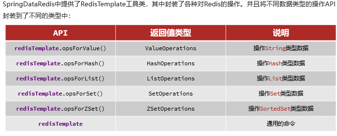

引入依赖

```xml
<!--Redis依赖-->
<dependency>
	<groupId>org.springframework.boot</groupId>
   	<artifactId>spring-boot-starter-data-redis</artifactId>
</dependency>
<!--连接池依赖-->
<dependency>   
 	<groupId>org.apache.commons</groupId> 
 	<artifactId>commons-pool2</artifactId>
</dependency>
```

配置文件

```yaml
spring:
	redis:
    	host: 192.168.150.101
        port: 6379    
        password: 123321   
        lettuce:      
        	pool:        
        		max-active: 8 #最大连接        
        		max-idle: 8 # 最大空闲连接        
        		min-idle: 0 # 最小空闲连接       
        		max-wait: 100 # 连接等待时间
```

### 使用方式一：

自动序列化

1. 自定义RedisTemplate
2. 修改RedisTemplate 的序列化器未GenericJackson2JsonRedisSerializer

```java
@Bean
public RedisTemplate<String, Object> redisTemplate(RedisConnectionFactory redisConnectionFactory)        throws UnknownHostException {    
    // 创建Template
    RedisTemplate<String, Object> redisTemplate = new RedisTemplate<>();
    // 设置连接工厂    
    redisTemplate.setConnectionFactory(redisConnectionFactory);
    // 设置序列化工具
    GenericJackson2JsonRedisSerializer jsonRedisSerializer = 
					new GenericJackson2JsonRedisSerializer();
    // key和 hashKey采用 string序列化
    redisTemplate.setKeySerializer(RedisSerializer.string());    				     redisTemplate.setHashKeySerializer(RedisSerializer.string());
    // value和 hashValue采用 JSON序列化
    redisTemplate.setValueSerializer(jsonRedisSerializer);
    redisTemplate.setHashValueSerializer(jsonRedisSerializer);
    return redisTemplate;
}
```

3. 注入使用即可

```java
@Autowired 
private RedisTemplate<String,Object> redisTemplate;
// 插入一条string类型数据
redisTemplate.opsForValue().set("name", "李四");
// 读取一条string类型数据
Object name = redisTemplate.opsForValue().get("name");       System.out.println("name = " + name);
```

此方式为了在反序列化时知道对象的类型，JSON序列化器会将类的class写入，带来额外开销

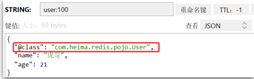

### 使用方式二：

Spring默认提供了一个SpringRedisTemplate类，它的key和value的序列化s方式默认是String方式

```java
@Autowired
private StringRedisTemplate stringRedisTemplate;
// JSON工具
private static final ObjectMapper mapper = new ObjectMapper();
@Test
void testStringTemplate() throws JsonProcessingException {
    // 准备对象
    User user = new User("虎哥", 18);
    // 手动序列化
    String json = mapper.writeValueAsString(user);
    // 写入一条数据到redis
    stringRedisTemplate.opsForValue().set("user:200", json); 
    // 读取数据
    String val = stringRedisTemplate.opsForValue().get("user:200");
    // 反序列化
    User user1 = mapper.readValue(val, User.class);
    System.out.println("user1 = " + user1);
}
```

# 基于Redis实现 共享session 短信登录

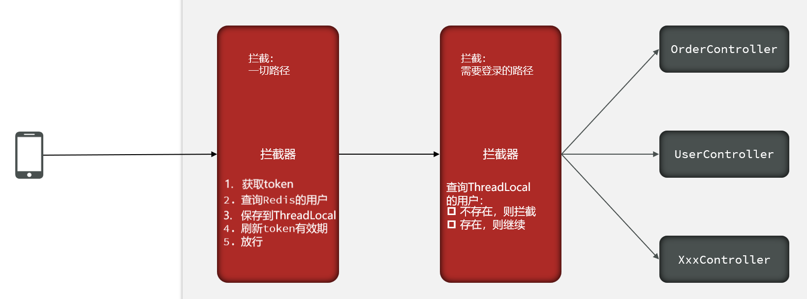


## 定义拦截器

定义两个拦截器，前置拦截器用于刷新用户Token有效期，后置的拦截器拦截需要登陆的访问路径

定义 **一切拦截器**

```java
/**
 * 一切拦截器
 * 每次用户访问任何路径时，刷新Token有效期
 */
public class ReflashTokenInterceptor implements HandlerInterceptor {

    //作为一个自己创建的类，不被Spring MVC 所管理，不能直接注入
    private StringRedisTemplate stringRedisTemplate;

    //从外部注入
    public ReflashTokenInterceptor(StringRedisTemplate stringRedisTemplate){
        this.stringRedisTemplate = stringRedisTemplate;
    }
    /**
     * 前置拦截器
     */
    @Override
    public boolean preHandle(HttpServletRequest request, HttpServletResponse response, Object handler) throws Exception {
        //1. 获取请求头中的token
        //这里需要结合前端，前端需要在每次请求之前，把"authorization" 存进携带的请求头中
        String token = request.getHeader("authorization");
        if (StringUtils.isBlank(token)) {
            //如果为空说明未登录,拦截
            return true;
        }
        //基于token从Redis中获取用户信息
        String key = RedisConstants.LOGIN_USER_KEY + token;
        Map<Object, Object> userMap = stringRedisTemplate.opsForHash()
                .entries(key);
        //判断是否存在
        if(CollectionUtils.isEmpty(userMap)){
            //不存在，拦截
            return true;
        }
        //将查询到的hash结构的userDTO转化为对象userDTO
        UserDTO userDTO = BeanUtil.fillBeanWithMap(userMap, new UserDTO(), false);
        //存在，保存用户到Threelocal
        UserHolder.saveUser(userDTO);
        //刷新token有效期
        stringRedisTemplate.expire(key,RedisConstants.LOGIN_USER_TTL, TimeUnit.MINUTES);
        //放行
        return true;
    }

    @Override
    public void afterCompletion(HttpServletRequest request, HttpServletResponse response, Object handler, Exception ex) throws Exception {
        //移除用户
        UserHolder.removeUser();
    }
}
```

定义 **登录拦截器**

```java
/**
 * 登录拦截器
 * 每此用户访问都需要验证登录，在拦截器里进行验证，省去很多麻烦
 */
public class LoginInterceptor implements HandlerInterceptor {

    /**
     * 前置拦截器
     */
    @Override
    public boolean preHandle(HttpServletRequest request, HttpServletResponse response, Object handler) throws Exception {
        //是否需要拦截 (ThreadLocal 中是否有用户)
        if(UserHolder.getUser() == null){
            //没有，执行拦截
            response.setStatus(401);
            return false;
        }
        //有用户放行
        return true;
    }
}
```

配置拦截器

```java
/**
 * 配置拦截器
 * @author yuanborong
 */
@Configuration
public class MvcConfig implements WebMvcConfigurer {

    @Resource
    private StringRedisTemplate stringRedisTemplate;

    //添加拦截器
    @Override
    public void addInterceptors(InterceptorRegistry registry) {
        //添加一切拦截器，所有的请求都需要通过此拦截器,order表示执行顺序，0，1...
        registry.addInterceptor(new ReflashTokenInterceptor(stringRedisTemplate))
                .addPathPatterns("/**").order(0);
        
        //添加登录拦截器，放行一些不需要拦截的请求
        registry.addInterceptor(new LoginInterceptor())
                .excludePathPatterns(
                        "/shop/**",
                        "/shop-type/**",
                        "/upload/**",
                        "/voucher/**",
                        "/user/code",
                        "/user/login",
                        "/blog/hot"
                ).order(1);
    }
}
```

## 发送短信及登录

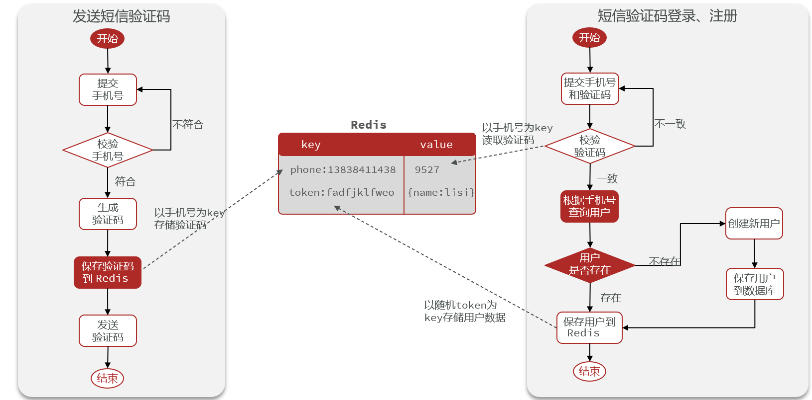

**发送短信**

```java
public Result sendCode(String phone, HttpSession session) {
    //校验手机号
    if(RegexUtils.isPhoneInvalid(phone)){
        //不符合，返回错误信息
        return Result.fail("手机号格式错误");
    }
    //符合，生成验证码
    String code = RandomUtil.randomNumbers(6);
    //保存验证码到redis，必须指定过期时间
    stringRedisTemplate.opsForValue().set(RedisConstants.LOGIN_CODE_KEY + 
                                          phone,code,RedisConstants.LOGIN_CODE_TTL, TimeUnit.MINUTES);
    //发送验证码
    log.debug("成功发送短信验证码,验证码为"+ code);
    //返回ok
    return Result.ok();
}
```

**短信验证码登录**

```java
public Result login(LoginFormDTO loginForm, HttpSession session) {
    //1. 校验手机号
    String phone = loginForm.getPhone();
    if(RegexUtils.isPhoneInvalid(phone)){
        //不符合，返回错误信息
        return Result.fail("手机号格式错误");
    }
    //2. 从Redis获取验证码并校验
    String catchCode = stringRedisTemplate.opsForValue().get(RedisConstants.LOGIN_CODE_KEY+phone);
    String code = loginForm.getCode();
    if(catchCode == null || !catchCode.equals(code)){
        //不一致或者为空，报错
        return Result.fail("验证码不一致");
    }
    //3.查询用户是否存在 select * from tb_user where phone = ?
    User user = this.query().eq("phone", phone).one();
    if(user == null){
        //不存在，创建用户并保存
        user = createUserWithPhone(phone);
    }

    //保存用户到Redis中，生成Token作为key
    //随机生成Token
    String token = UUID.randomUUID().toString();
    //将User对象转化为Hash存储
    UserDTO userDTO = BeanUtil.copyProperties(user, UserDTO.class);
    //stringRedisTemplate要求所有字段都为String类型，这里使用HuTool工具包手动转换
    Map<String, Object> userMap = BeanUtil.beanToMap(userDTO,new HashMap<>(),
                                                     CopyOptions.create()
                                                     .setIgnoreNullValue(true)
                                                     .setFieldValueEditor(
                                                    (fieldName,fieldValue)->fieldValue.toString()));
    //一次性所有字段
    stringRedisTemplate.opsForHash().putAll(RedisConstants.LOGIN_USER_KEY+token,userMap);
    //设置30分钟有效期
    //在一切拦截器不断更新有效期，只要用户在操作，就更新30分钟的有效期
    stringRedisTemplate.expire(RedisConstants.LOGIN_USER_KEY + token,
                               RedisConstants.LOGIN_USER_TTL,TimeUnit.MINUTES);
    return Result.ok(token);//将token返回给前端保存，让前端每次访问携带该token
}
```

# 基于Redis实现 查询缓存

缓存是数据交换缓冲区，读写性能高，但是存在数据一致性的问题

## 缓存的更新策略及写缓存

**低一致性的需求**：（即数据极少变化的数据） 使用Redis自带的内存淘汰机制即可

**高一致性的需求：**

**主动更新**（由缓存调用者，在更新数据库的同时更新缓存）

1. 删除缓存：主动更新数据时先让缓存失效，查询时再更新缓存
2. 单体系统下，为了保证缓存和数据库同时成功/失败，将缓存操作和数据库操作放在同一个事务
3. 先写数据库操作（慢），再删除缓存（快）

最后以**超时剔除**（设置失效时间）为兜底；

## 三大缓存问题

### **查询缓存及 缓存穿透**

客户端请求的数据在缓存和数据库都不存在，请求直接攻击到数据库

解决方法： **缓存空对象**

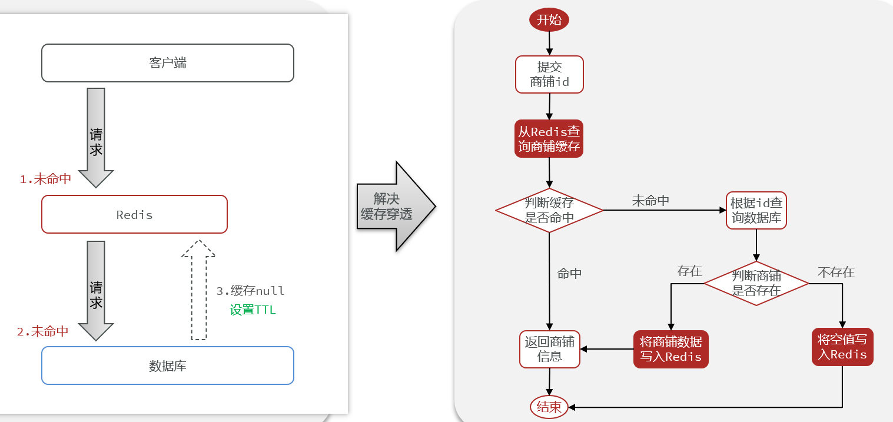

**代码实现（封装）**

写缓存

```java
@Resource
private StringRedisTemplate stringRedisTemplate;

public void set(String key, Object value, Long time, TimeUnit unit){
    stringRedisTemplate.opsForValue().set(key, JSONUtil.toJsonStr(value),time,unit);
}
```

存储空对象防止缓存穿透查询

```java
/**
    * 存储空对象解决缓存穿透
    * @param keyPrefix 键前缀
    * @param id 唯一Id
    * @param type 查询的对象类型
    * @param dbFallback 根据id查询数据库的操作函数
    * @param time 过期时间
    * @param unit 时间单位
*/
public <R,ID> R queryWithPassThrough(String keyPrefix, ID id, Class<R> type,
                                     Function<ID,R> dbFallback,Long time, TimeUnit unit){
    String key = keyPrefix + id;
    //从Redis查询商铺缓存
    String json = stringRedisTemplate.opsForValue().get(key);
    //判断存在
    if (StringUtils.isNotBlank(json)) {
        //存在，直接返回
        //转换为Json对象返回
        return JSONUtil.toBean(json, type);
    }
    //若 JsonShop 不为 null，但又不满足 StringUtils.isNotBlank 条件
    // 那就意味着之前已经把空值写入了 Redis（也就是存储的是空字符串），此时直接返回不存在的失败结果。
    if(json != null){
        return null;
    }
    //不存在，根据id查询数据库
    R r = dbFallback.apply(id);
    if(r == null){
        //将空值写入Redis,防止缓存穿透
        stringRedisTemplate.opsForValue().set(key,"",RedisConstants.CACHE_NULL_TTL,TimeUnit.MINUTES);
        return null;
    }
    //存在，写入Redis,设置过期时间
    this.set(key,r,time,unit);
    //返回
    return r;
}
```

### **缓存雪崩**

**缓存雪崩**是指在同一时段大量的缓存key同时失效或者Redis服务宕机，导致大量请求到达数据库，带来巨大压力

解决方法： **给不同的Key的TTL添加随机值**

### **缓存击穿**

**缓存击穿问题**也叫热点Key问题，就是一个被**高并发访问**并且**缓存重建业务较复杂**的key突然失效了，无数的请求访问会在瞬间给数据库带来巨大的冲击

解决方法：**设置逻辑过期**

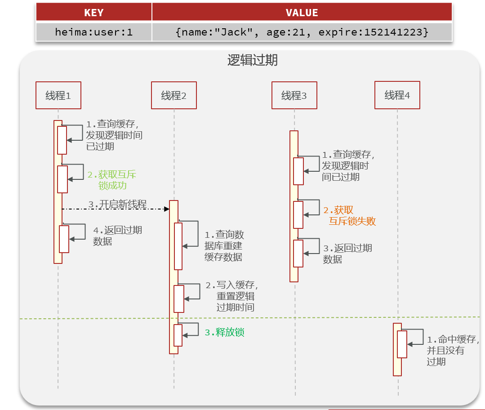

**定义RedisData类**

```java
@Data
public class RedisData {
    private LocalDateTime expireTime;
    private Object data;
}
```

**代码实现（封装）**

包含逻辑过期的写入缓存

```java
public void setWithLogicalExpire(String key, Object value, Long time, TimeUnit unit){
    //设置逻辑过期
    RedisData redisData = new RedisData();
    redisData.setData(value);
    redisData.setExpireTime(LocalDateTime.now().plusSeconds(unit.toSeconds(time)));
    //写入Redis
    stringRedisTemplate.opsForValue().set(key, JSONUtil.toJsonStr(redisData),time,unit);
}
```

逻辑过期防止缓存击穿 查询

```java
/**
     *  逻辑过期防止缓存击穿
     * @param keyPrefix key前缀
     * @param id  key后缀
     * @param type 数据的类型
     * @param dbFallback 数据库操作
     * @param time 过期时间数
     * @param unit 时间单位
     * @return
     * @param <R> 数据类型
     * @param <ID> 后缀的类型
 */
public  <R,ID> R  queryWithLogicalExpire(String keyPrefix, ID id, Class<R> type,
                                         Function<ID,R> dbFallback,Long time, TimeUnit unit){
    String key = keyPrefix + id;
    //从Redis查询商铺缓存
    String json = stringRedisTemplate.opsForValue().get(key);
    //判断存在
    if (StringUtils.isBlank(json)) {
        //未命中
        return null;
    }
    //命中
    RedisData redisData = JSONUtil.toBean(json, RedisData.class);
    //在定义RedisData时,声明了Data类型为Object,所以在反序列化时,不清楚是什么类型
    R r = JSONUtil.toBean((JSONObject) redisData.getData(), type);
    LocalDateTime expireTime = redisData.getExpireTime();

    //判断是否过期
    if(expireTime.isAfter(LocalDateTime.now())){
        //在当前时间之后,还没有过期
        return r;
    }
    //过期,缓存重建
    String lockKey = RedisConstants.CACHE_SHOP_KEY + id;
    //获取互斥锁
    boolean isLock = tryLock(lockKey);
    //判断是否成功获取到互斥锁
    if(isLock){
        //获取锁成功,开启独立线程执行缓存重建
        //TODO 再次检查redis缓存是否过期,DoubleCheck
        CACHE_REBUID_EXECUTOR.submit(()->{
            //缓存重建
            try {
                //先查数据库
                R r1 = dbFallback.apply(id);
                //写入Redis
                this.setWithLogicalExpire(key,r1,time,unit);
            } catch (Exception e) {
                throw new RuntimeException(e);
            }finally {
                //释放锁
                unLock(lockKey);
            }
        });
    }
    //成功失败都返回旧信息
    return r;
}

//获取锁
private boolean tryLock(String key){
    Boolean b = stringRedisTemplate.opsForValue().setIfAbsent(key, "1", 10, TimeUnit.SECONDS);
    return BooleanUtil.isTrue(b);
}
//删除锁
private void unLock(String key){
    stringRedisTemplate.delete(key);
}
```

## 缓存的读写

缓存更新策略示例：

```java
//先更新数据库，再删除缓存
@Transactional //事务，保证原子性
public Result update(Shop shop) {
    Long id = shop.getId();
    if(id == null ){
        return Result.fail("商店id为空");
    }
    //更新数据库
    updateById(shop);
    //删除缓存
    stringRedisTemplate.delete(RedisConstants.CACHE_SHOP_KEY  + id);
    return Result.ok();
}
```

读取：

```java
public Result queryById(Long id) {
    //调用对应封装即可
    Shop shop = cacheClient.queryWithPassThrough(RedisConstants.CACHE_SHOP_KEY,id, Shop.class,
    
                                                 this::getById,RedisConstants.CACHE_SHOP_TTL,TimeUnit.MINUTES);
    if(shop == null){
    	return Result.fail("店铺不存在！");
    }
    return Result.ok(shop);
}
```

# 基于Redis实现 全局唯一ID

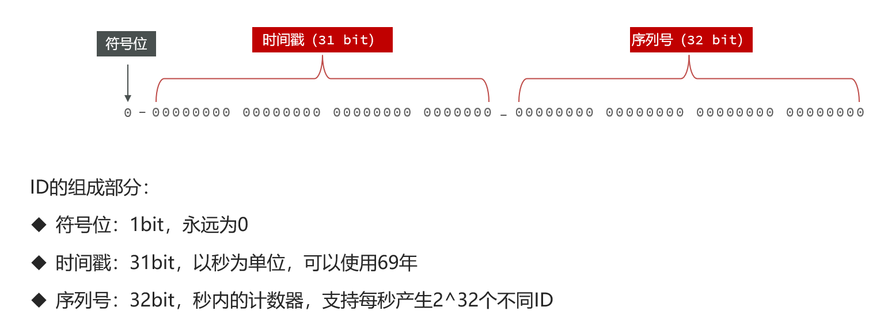

```java
/**
 * 全局唯一Id生成器
 */
@Component
public class RedisIDWorker {
    /**
     * 开始的时间戳
     */
    private static final long BEGIN_TIMESTAMP = 1773619200L;
    /**
     * 序列号的位数
     */
    private static  final int COUNT_BIT = 32;

    @Resource
    private StringRedisTemplate stringRedisTemplate;

    /**
     * @param keyPrefix 业务前缀
     * @return 生成订单唯一ID
     */
    public long nextId(String keyPrefix){
        //1. 生成时间戳: 当前时间戳减去开始的时间戳
        LocalDateTime now = LocalDateTime.now(); //获取当前时间
        long nowSecond = now.toEpochSecond(ZoneOffset.UTC); //当前描述
        long timeStamp = nowSecond - BEGIN_TIMESTAMP;

        //2. 生成序列号:Redis的自增长
        //2.1 获取当前日期，精确到天
        String dateKey = now.format(DateTimeFormatter.ofPattern("yyyyMMdd"));
        //2.2 自增长，
        //Key的设计： 拼接时间戳，让每一天下的单归不同的Key； icr : 业务 : 当天时间戳
        long count = stringRedisTemplate.opsForValue().increment("icr:" + keyPrefix + ":"+ dateKey);

        //3. 拼接并返回
        return (timeStamp<<COUNT_BIT) | count;
    }
}
```

# **超卖问题**

超卖问题是典型的线程安全问题，解决办法就是加锁

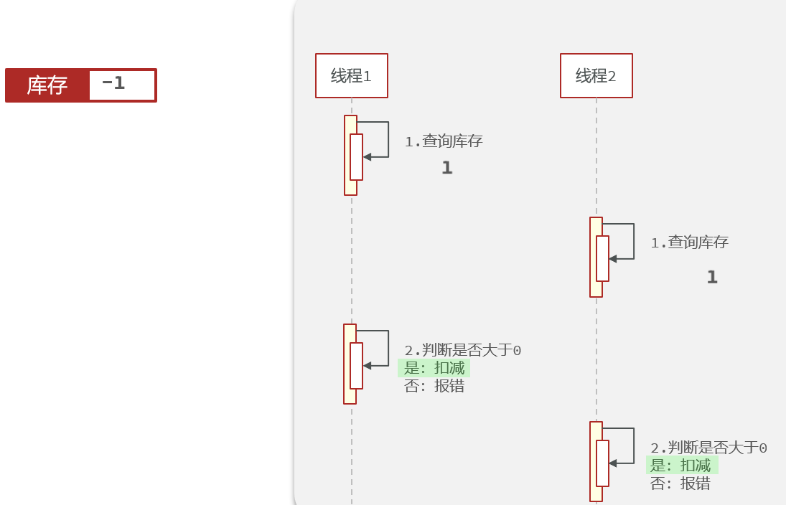

## 悲观锁和乐观锁

悲观锁： 认为线程安全问题一定会发生，使用Synchronized 属于悲观锁

乐观锁： 认为线程安全不一定发生，不加锁，只是在更新数据时判断有没有其他线程对数据做了修改

## CAS 法（乐观锁）解决超卖问题

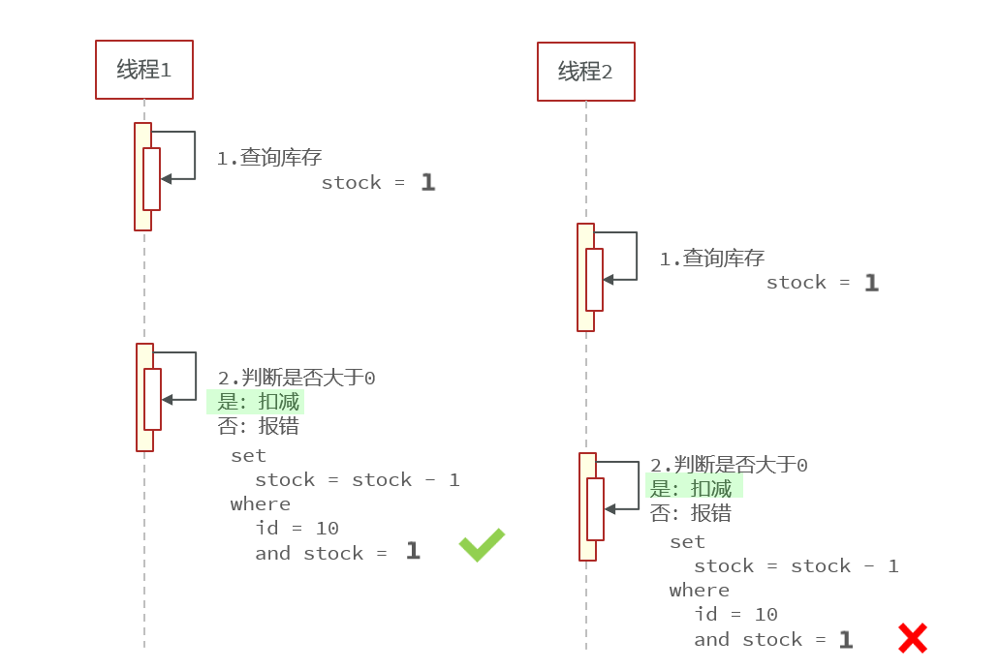

代码示例：

```java
boolean success = seckillVoucherService.update()
                .setSql("stock = stock-1")
                .eq("voucher_id", voucherId)
                //乐观锁，只要在更新的时候发现与我查询到的不一致，那么说明在查询后与更新前这段时间里数据被做了修改
                //那么不执行，修改失败
                .gt("stock",0) // 使用 >0 的方式去判断，而不是==查询到的数
                .update();
        if(!success){
            return Result.fail("库存不足");
        }
```

# 分布式锁

分布式锁是满足分布式系统或集群模式下多进程可见且互斥的锁

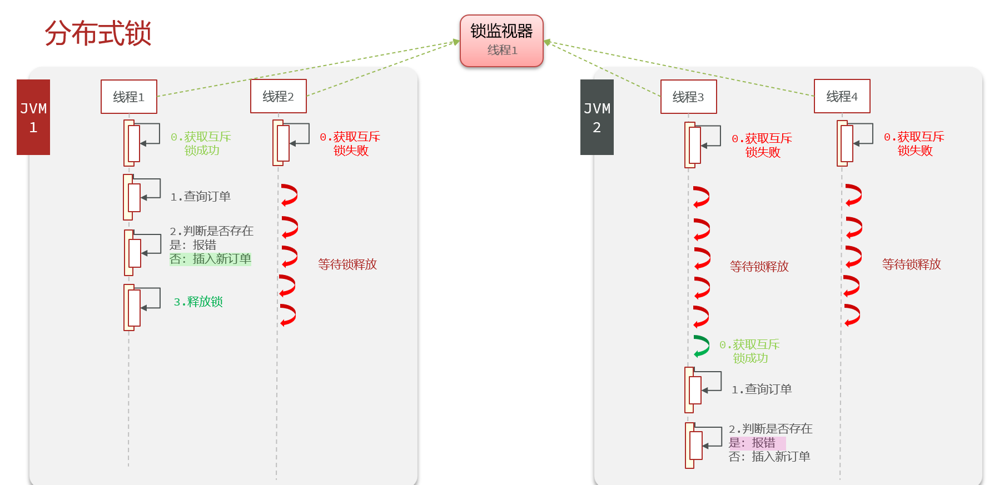

## 基于Redis实现分布式锁

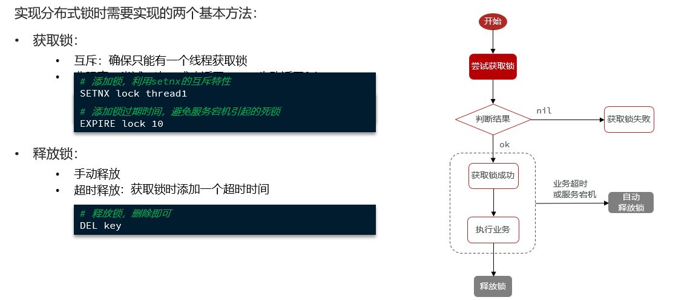

### **超时释放锁问题：**

线程1获取锁之后，业务还没完成，锁到期释放掉了，此时线程2获取锁成功，但此时线程1业务完成，把线程2的锁释放了

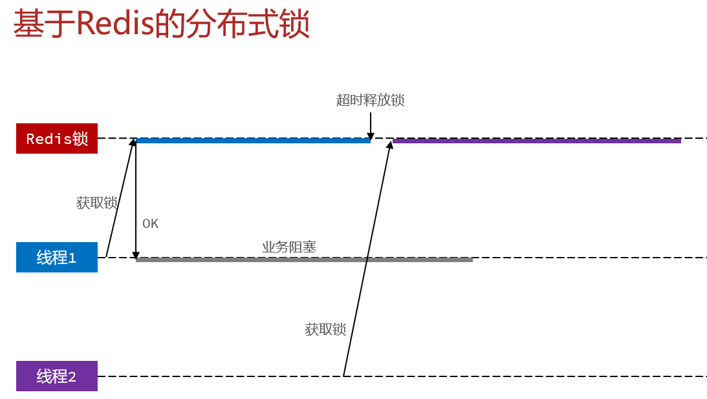

此时，我们需要给释放锁添加标识，让谁调用谁释放

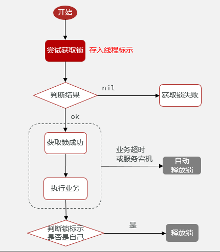

### **判断锁与释放锁的原子性问题**

在线程1判断锁是自己之后，还没来得及释放锁，锁超时过期了，此时线程2获取到锁，但线程1依旧释放掉了线程2的锁

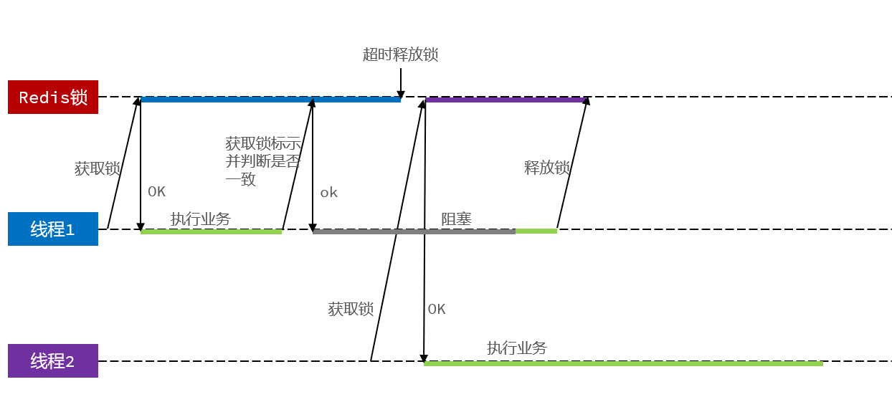

为此，我们需要保证判断和释放锁的原子性，即同时完成，使用Redis 调用 lua 脚本来完成

Redis提供了Lua脚本功能，在一个脚本中编写多条Redis命令，确保多条命令执行时的原子性

代码实现：

lua**脚本**

```lua
-- 比较线程中的标识是否一致
if(redis.call('get',KEYS[1]) == ARGV[1]) then
    -- 释放锁
    return redis.call('del',KEYS[1])
end
return 0
```

创建 **锁对象**

```java
public class SimpleRedisLock implements ILock{

    private String name;
    private StringRedisTemplate stringRedisTemplate;
    private static final String KEY_PREFIX = "lock:";
    private static  final  String ID_PREFIX = UUID.randomUUID().toString(true)+"-";
    private static final DefaultRedisScript<Long> UNLOCK_SCRIPT;
	
    //静态代码块，初始化
    static {
        UNLOCK_SCRIPT = new DefaultRedisScript<>();
        UNLOCK_SCRIPT.setLocation(new ClassPathResource("unLock.lua"));
        UNLOCK_SCRIPT.setResultType(Long.class);
    }

    public SimpleRedisLock(String name, StringRedisTemplate stringRedisTemplate) {
        this.name = name;
        this.stringRedisTemplate = stringRedisTemplate;
    }

    //尝试获取锁
    @Override
    public boolean tryLock(long timeoutSec) {
        //获取线程ID
        String ThreadID = ID_PREFIX + Thread.currentThread().getId();
        //获取锁
        Boolean success = stringRedisTemplate.opsForValue().setIfAbsent(
                KEY_PREFIX + name,
                ThreadID,
                timeoutSec,
                TimeUnit.SECONDS
        );
        return Boolean.TRUE.equals(success);//装箱和拆箱
    }
    //释放锁
    @Override
    public void unLock() {
        //调用Lua脚本，存放在Resouce目录下
        stringRedisTemplate.execute(
                UNLOCK_SCRIPT,
                Collections.singletonList(KEY_PREFIX + name),
                ID_PREFIX + Thread.currentThread().getId()
        );
    }
}
```

**优惠卷秒杀**

```java
@Resource
private RedisIDWorker redisIDWorker;

@Resource
private StringRedisTemplate stringRedisTemplate;
@Override
public Result seckillVoucher(Long voucherId) {
    //1. 查询优惠卷
    SeckillVoucher voucher= seckillVoucherService.getById(voucherId);
    //2. 判断秒杀是否开始
    LocalDateTime beginTime = voucher.getBeginTime();
    if (beginTime.isAfter(LocalDateTime.now())) {
        return Result.fail("秒杀未开始");
    }
    //3. 判断秒杀是否结束
    if (voucher.getEndTime().isBefore(LocalDateTime.now())) {
        return Result.fail("秒杀已经结束！");
    }
    //4. 判断库存是否充足
    Integer stock = voucher.getStock();
    if(stock < 1){
        return Result.fail("库存不足");
    }
    Long userId = UserHolder.getUser().getId();
    //创建锁对象
    SimpleRedisLock lock = new SimpleRedisLock("order:" + userId, stringRedisTemplate);
    //获取锁
    boolean isLock = lock.tryLock();
    if(!isLock){
        //获取锁失败, 返回错误或重试
        return Result.fail("不允许重复下单！");
    }
    //获取代理对象
    try {
        IVoucherOrderService proxy = (IVoucherOrderService)AopContext.currentProxy();
        return proxy.createVoucherOrder(voucherId);
    }finally {
        //释放锁
        lock.unlock();
    }
}

@Transactional //Spring 代理对象处理的事务
public Result createVoucherOrder(Long voucherId) {
    //一人一单
    Long userId = UserHolder.getUser().getId();
    //查询当前用户是否已经购买过此订单
    int count = query().eq("user_id", userId).eq("voucher_id", voucherId).count();
    //判断
    if(count>0){
        //用户已经购买过了
        return Result.fail("请勿重复购买！");
    }
    //5. 扣减库存
    boolean success = seckillVoucherService.update()
        .setSql("stock = stock-1")
        .eq("voucher_id", voucherId)
        //乐观锁，只要在更新的时候发现与我查询到的不一致，那么说明在查询后与更新前这段时间里数据被做了修改
        //那么不执行，修改失败
        .gt("stock",0)
        .update();
    if(!success){
        return Result.fail("库存不足");
    }
    //6. 创建订单
    VoucherOrder voucherOrder = new VoucherOrder();
    long orderId = redisIDWorker.nextId("order");
    //6.1. 设置订单 Id
    voucherOrder.setId(orderId);
    //6.2 设置用户Id
    voucherOrder.setUserId(userId);
    //6.3设置代金卷Id
    voucherOrder.setVoucherId(voucherId);
    save(voucherOrder);
    //7. 返回订单id
    return Result.ok(orderId);
}
```

## 依然存在的问题

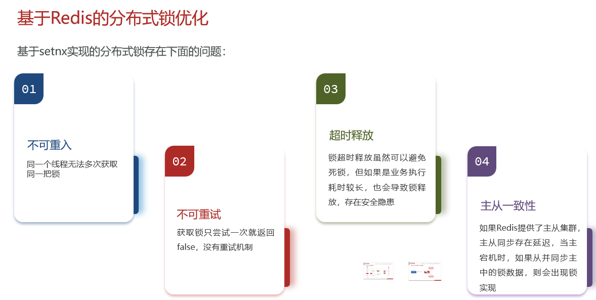

### Redission 的可重入锁原理

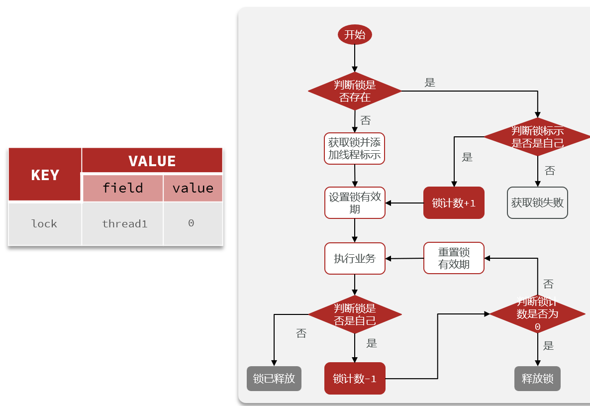

原本redis的释放锁是直接删除del，所以同一个线程没办法拿到同一把锁

Redission使用了Hash结果来处理

获取锁时，如果不存在任何线程，那么加上当前线程的标识，让value+1

同一个线程再次获取时，让value+1

释放锁时，检查是否属于自己，如果是，那么 value-1，如果value 为0 ，释放锁

### 不可重试

利用信号量和PubSub实现等待，唤醒，获取锁失败的重试机制

### 超时释放

利用watchDog，每隔一段时间(releaseTime/3),重置超时时间

## Redission

官网地址： [https://redisson.org](https://redisson.org/)

Redisson是一个在Redis的基础上实现的Java驻内存数据网格（In-Memory Data Grid）。它不仅提供了一系列的分布式的Java常用对象，还提供了许多分布式服务，其中就包含了各种分布式锁的实现

**引入依赖**

```xml
<dependency>
    <groupId>org.redisson</groupId>
    <artifactId>redisson</artifactId>
    <version>3.13.6</version>
</dependency>
```

**配置**

```java
@Configuration
public class RedissonConfig {

    @Bean
    public RedissonClient redissonClient(){
        // 配置
        Config config = new Config();
        // 添加redis地址，这里添加了单点的地址，也可以使用config.useClusterServers()添加集群地址 
        config.useSingleServer().setAddress("redis://192.168.26.132:6379")
            .setPassword("wsybr520");
        // 创建RedissonClient对象
        return Redisson.create(config);
    }
}
```

**调用**

```java
@Resource
private RedissonClient redissonClient;

@Test
void testRedisson() throws InterruptedException {
    // 获取锁（可重入），指定锁的名称
    RLock lock = redissonClient.getLock("anyLock"); 
    // 尝试获取锁，参数分别是：获取锁的最大等待时间（期间会重试），锁自动释放时间，时间单位
    boolean isLock = lock.tryLock(1, 10, TimeUnit.SECONDS);
    // 判断释放获取成功
    if(isLock){        
        try {
            System.out.println("执行业务");
        }finally {
            // 释放锁
            lock.unlock();
        }    
    }
}
```

# Reids消息队列实现异步秒杀

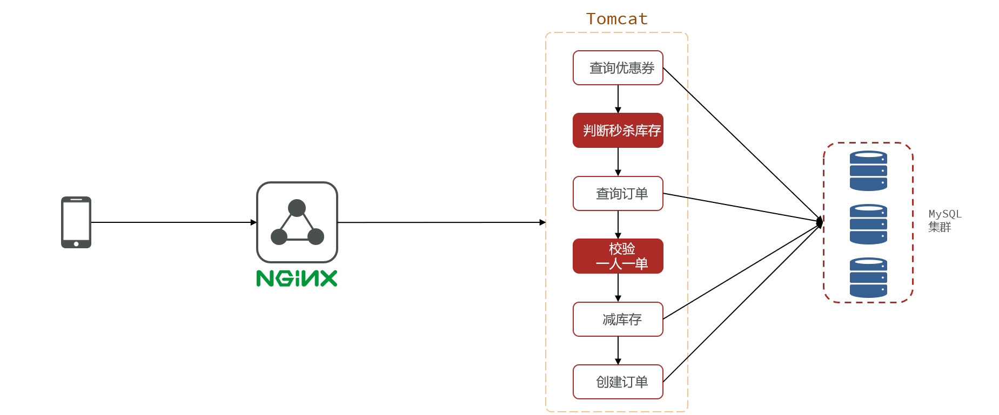

原本的同步操作较慢，用异步来实现

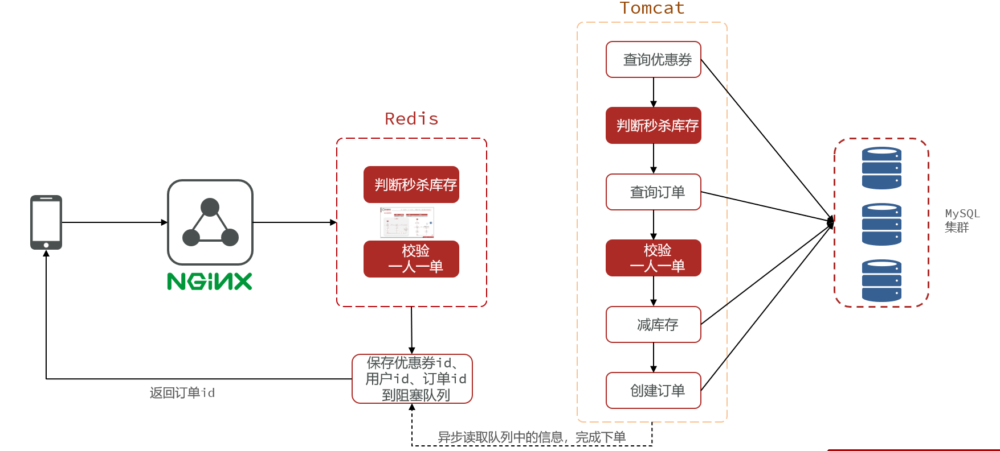

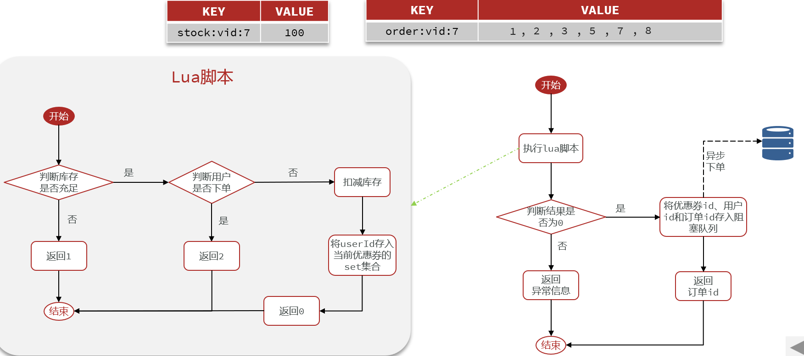

## 消息队列

### 基于 List 结构实现消息队列

基于BRPUSH 与 BLPOP 来实现阻塞效果

无法避免消息丢失

只支持单消费者

### 基于PubSub 的消息队列

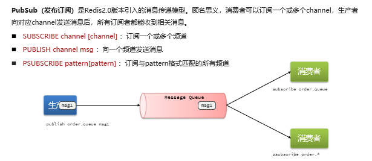

### 基于Steam 的消息队列

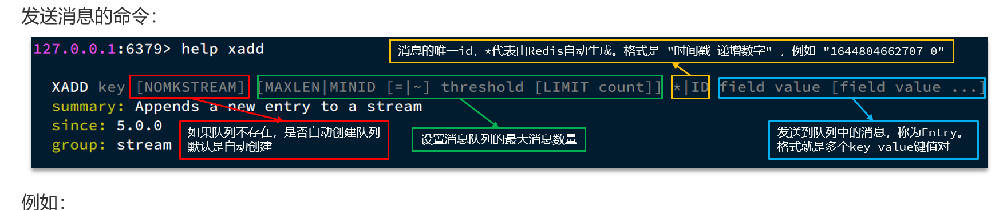

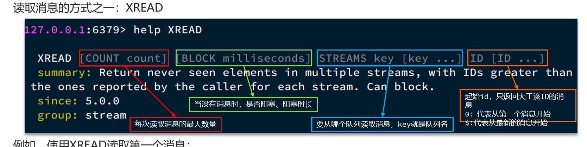

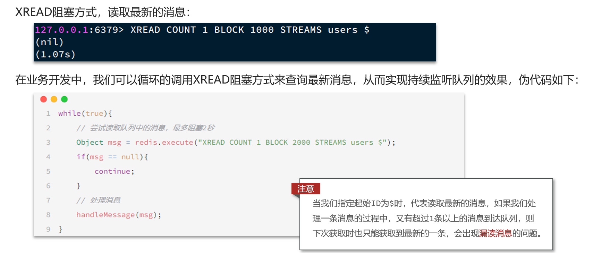

存在消息漏读的风险

## 基于Stream 的消息队列，消费者组

消息分流：队列中的消息会分流给组内的不同消费者，而不是重复消费，从而加快消息处理的速度

消息标识：消费者组会维护一个标识，记录最后一个被处理的消息，哪怕消费者掉线重启，还会从标识之后读取消息，确保每个消息都会被消费

消息确认：消费者读取消息后，消息处于pending状态，并存入pending-list，当处理完成通过XACK来确认消息，标记消息为已处理，才会从pending-list中移除

**创建消费者组**

```apl
XGROUP CREATE key groupName ID [MKSTREAM]
```

- key：队列名称
- groupName：消费者组名称
- lD：起始ID标示，$代表队列中最后一个消息，0则代表队列中第一个消息
- MKSTREAM：队列不存在时自动创建队列

**从消费者组读取消息：**

```apl
XREADGROUP GROUP group consumer [COUNT count] [BLOCK milliseconds] [NOACK] STREAMS key [key ...] ID [ID ...]
```

- group：消费组名称

- consumer：消费者名称，如果消费者不存在，会自动创建一个消费者

- count：本次查询的最大数量

- BLOCK milliseconds：当没有消息时最长等待时间

- NOACK：无需手动ACK，获取到消息后自动确认

- STREAMS key：指定队列名称

- ID：获取消息的起始ID：

  ​	">"：从下一个未消费的消息开始

  ​	其它：根据指定id从pending-list中获取已消费但未确认的消息，例如0，是从pending-list中的	第一个消息开始

## 代码实现

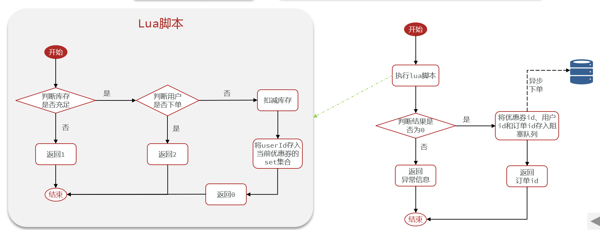

### **商铺上架秒杀优惠卷**

将库存保存在redis中 

```java
@Override
@Transactional
public void addSeckillVoucher(Voucher voucher) {
    // 保存优惠券
    save(voucher);
    // 保存秒杀信息
    SeckillVoucher seckillVoucher = new SeckillVoucher();
    seckillVoucher.setVoucherId(voucher.getId());
    seckillVoucher.setStock(voucher.getStock());
    seckillVoucher.setBeginTime(voucher.getBeginTime());
    seckillVoucher.setEndTime(voucher.getEndTime());
    seckillVoucherService.save(seckillVoucher);
    //保存库存到redis中
    stringRedisTemplate.opsForValue().set(SECKILL_STOCK_KEY + voucher.getId(),
            voucher.getStock().toString());
}
```

### 用户下单

暴露代理对象，方便获取

```java
在启动类添加注解
@EnableAspectJAutoProxy(exposeProxy = true) //暴露代理对象
```

```xml
<!--        代理-->
<dependency>
    <groupId>org.aspectj</groupId>
    <artifactId>aspectjweaver</artifactId>
</dependency>
```

编写lua脚本，确保一系列操作的原子性

```lua
-- 参数列表
-- 1.1 优惠卷id
local voucherId = ARGV[1]
-- 1.2 用户id
local userId = ARGV[2]
-- 1.3 订单id
local orderId = ARGV[3]

-- 2. 数据key
-- 2.1 库存key
local stockKey = 'seckill:stock:'..voucherId
-- 2.2
local orderKey = 'seckill:order:'..voucherId

--3 脚本业务
--3.1 判断库存是否充足

if(tonumber(redis.call('get',stockKey)) <= 0) then
    --3.1.2 库存不足
    return 1
end

--3.2 判断用户是否下单
if(redis.call('sismember',orderKey,userId) == 1) then
    -- 3.2.1 存在，不允许重复下单
    return 2
end
-- 3.3 扣库存
redis.call('incrby',stockKey,-1)
-- 3.4 给用户下单，添加到set里
redis.call('sadd',orderKey,userId)
-- 发送消息到队列 XADD stream.order * k1 v1 k1 v1
redis.call('xadd','stream.orders','*','userId',userId,'voucherId',voucherId,'id',orderId)
return 0
```

用户下单时调用此方法

```java
private static final DefaultRedisScript<Long> SECKILL_SCRIPT; //redis执行lua脚本
static {
    SECKILL_SCRIPT = new DefaultRedisScript<>(); //静态代码块初始化
    SECKILL_SCRIPT.setLocation(new ClassPathResource("seckill.lua")); //lua文件在Resource中的位置
    SECKILL_SCRIPT.setResultType(Long.class); //结果类型
}
private IVoucherOrderService proxy; //定义代理对象，作为类属性，方便子线程调用
public Result seckillVoucher(Long voucherId) {
    //1. 执行lua脚本，判断用户库存是否充足，有没有购买资格
    //1.1获取用户id
    Long userId = UserHolder.getUser().getId();
    long orderId = redisIDWorker.nextId("order");
    Long result = stringRedisTemplate.execute(
        SECKILL_SCRIPT,
        Collections.emptyList(),
        voucherId.toString(), userId.toString(), String.valueOf(orderId)
    );
    //2. 判断结果
    int r = result != null ? result.intValue() : 3;
    if(r != 0){
        //2.1 不为0，没有购买资格
        if(r == 1){
            return Result.fail("库存不足，购买失败");
        }else if (r == 2){
            return Result.fail("请勿重复下单");
        }else{
            return Result.fail("系统错误");
        }
    }
    //获取代理对象（事务）
    proxy = (IVoucherOrderService)AopContext.currentProxy();
    //3. 返回订单id
    return Result.ok(orderId);
}
```

**后端处理订单**

此时已经完成返回前端，后端监听到消息队列的变化，开始处理订单

在redis 中创建一个消息队列 stream.orders

```
XGROUP CREATE stream.orders g1 0 MKSTREAM
```

```java
//创建单线程线程池
private static ExecutorService SECKILL_ORDER_EXECUTOR = Executors.newSingleThreadExecutor();

@PostConstruct //在初始化时 提交监听订单消息队列任务
private void init(){
	SECKILL_ORDER_EXECUTOR.submit(new VoucherOrderHandler());
}

private class VoucherOrderHandler implements  Runnable{
    //订单队列名称
    String queueName = "stream.orders";
    @Override
    public void run() {
        while(true){
            try {
                //监听消息队列，获取消息 XREADGROUP GROUP g1 c1 COUNT 1 BLOCK 2000 STREAMS stream.order >
                List<MapRecord<String, Object, Object>> list = stringRedisTemplate.opsForStream().read(
                    Consumer.from("g1", "c1"),
                    StreamReadOptions.empty().count(1).block(Duration.ofSeconds(2)),
                    StreamOffset.create(queueName, ReadOffset.lastConsumed())
                );
                //判断消息是否获取成功
                if(list == null || list.isEmpty()){
                    //如果获取异常，说明没有消息，继续下一次循环
                    continue;
                }
                //解析消息信息
                MapRecord<String, Object, Object> record = list.get(0);
                Map<Object, Object> values = record.getValue();
                VoucherOrder voucherOrder = BeanUtil.fillBeanWithMap(values, new VoucherOrder(), true);
                //如果获取成功，可以下单
                handleVoucherOrder(voucherOrder);
                //ACK 确认 SACK stream.order
                stringRedisTemplate.opsForStream().acknowledge(queueName,"g1",record.getId());
            } catch (Exception e) {
                //抛出异常，消息就没有被ACK确认，那么消息就会进入Padding List
                handlePenddingList();
                log.error("处理订单异常");
            }
        }
    }

    private void handlePenddingList() {
        while(true){
            try {
                //获取pending-list中的消息 XREADGROUP GROUP g1 c1 COUNT 1  2000 STREAMS stream.order 0
                List<MapRecord<String, Object, Object>> list = stringRedisTemplate.opsForStream().read(
                    Consumer.from("g1", "c1"),
                    StreamReadOptions.empty().count(1),
                    StreamOffset.create(queueName, ReadOffset.from("0"))
                );
                //判断消息是否获取成功
                if(list == null || list.isEmpty()){
                    //如果获取异常，说明pending-list里面没有消息，结束下一次循环
                    break;
                }
                //解析消息信息
                MapRecord<String, Object, Object> record = list.get(0);
                Map<Object, Object> values = record.getValue();
                VoucherOrder voucherOrder = BeanUtil.fillBeanWithMap(values, new VoucherOrder(), true);
                //如果获取成功，可以下单
                handleVoucherOrder(voucherOrder);
                //ACK 确认 SACK stream.order
                stringRedisTemplate.opsForStream().acknowledge(queueName,"g1",record.getId());
            } catch (Exception e) {
                log.error("处理订单异常");
                //抛出异常，消息就没有被ACK确认，那么消息就会进入Padding List
                try {
                    Thread.sleep(20);
                } catch (InterruptedException ex) {
                    throw new RuntimeException(ex);
                }
            }
        }
    }
}

private void handleVoucherOrder(VoucherOrder voucherOrder) {
    Long userId = voucherOrder.getUserId();
    //创建锁对象
    RLock lock = redissonClient.getLock("lock:order:" + userId);
    //获取锁
    boolean isLock = lock.tryLock();
    if(!isLock){
        //获取锁失败, 返回错误或重试
        log.error("不允许重复下单");
    }
    //获取代理对象
    try {
        proxy.createVoucherOrder(voucherOrder);
    }finally {
        //释放锁
        lock.unlock();
    }
}


@Override
@Transactional
public void createVoucherOrder(VoucherOrder voucherOrder) {
    //异步执行，子线程不能使用主线程的 UserHolder.getUser().getId();
    Long userId = voucherOrder.getUserId();
    //查询当前用户是否已经购买过此订单
    int count = query().eq("user_id", userId).eq("voucher_id", voucherOrder.getVoucherId()).count();
    //判断
    if(count>0){
        //用户已经购买过了
        log.error("用户已购买");
        return ;
    }
    //5. 扣减库存
    boolean success = seckillVoucherService.update()
        .setSql("stock = stock-1")
        .eq("voucher_id", voucherOrder.getVoucherId())
        //乐观锁，只要在更新的时候发现与我查询到的不一致，那么说明在查询后与更新前这段时间里数据被做了修改
        //那么不执行，修改失败
        .gt("stock",0)
        .update();
    if(!success){
        log.error("扣减库存异常");
        return ;
    }
    save(voucherOrder);
}
```

# 基于SortedSet 实现的点赞排行榜

同一个用户只能点赞一次，再次点击则取消点赞

## 点赞/取消点赞

```java
   @Override
    public Result likeBlog(Long id) {
        // 1.获取登录用户
        Long userId = UserHolder.getUser().getId();
        // 2.判断当前登录用户是否已经点赞
        String key = BLOG_LIKED_KEY + id;
        Double score = stringRedisTemplate.opsForZSet().score(key, userId.toString());
        if (score == null) {
            // 3.如果未点赞，可以点赞
            // 3.1.数据库点赞数 + 1
            boolean isSuccess = update().setSql("liked = liked + 1").eq("id", id).update();
            // 3.2.保存用户到Redis的set集合  zadd key value score
            if (isSuccess) {
                stringRedisTemplate.opsForZSet().add(key, userId.toString(), System.currentTimeMillis());
            }
        } else {
            // 4.如果已点赞，取消点赞
            // 4.1.数据库点赞数 -1
            boolean isSuccess = update().setSql("liked = liked - 1").eq("id", id).update();
            // 4.2.把用户从Redis的set集合移除
            if (isSuccess) {
                stringRedisTemplate.opsForZSet().remove(key, userId.toString());
            }
        }
        return Result.ok();
    }


    private void isBlogLiked(Blog blog) {
        // 1.获取登录用户
        UserDTO user = UserHolder.getUser();
        if (user == null) {
            // 用户未登录，无需查询是否点赞
            return;
        }
        Long userId = user.getId();
        // 2.判断当前登录用户是否已经点赞
        String key = "blog:liked:" + blog.getId();
        Double score = stringRedisTemplate.opsForZSet().score(key, userId.toString());
        blog.setIsLike(score != null);
    }
```

## 查询点赞排行榜

```java
@Override
public Result queryBlogLikes(Long id) {
    String key = BLOG_LIKED_KEY + id;
    // 1.查询top5的点赞用户 zrange key 0 4
    Set<String> top5 = stringRedisTemplate.opsForZSet().range(key, 0, 4);
    if (top5 == null || top5.isEmpty()) {
        return Result.ok(Collections.emptyList());
    }
    // 2.解析出其中的用户id
    List<Long> ids = top5.stream().map(Long::valueOf).collect(Collectors.toList());
    String idStr = StrUtil.join(",", ids);
    // 3.根据用户id查询用户 WHERE id IN ( 5 , 1 ) ORDER BY FIELD(id, 5, 1)
    List<UserDTO> userDTOS = userService.query()
            .in("id", ids).last("ORDER BY FIELD(id," + idStr + ")").list()
            .stream()
            .map(user -> BeanUtil.copyProperties(user, UserDTO.class))
            .collect(Collectors.toList());
    // 4.返回
    return Result.ok(userDTOS);
}
```

# 内容推送Feed流

为用户持续的提供信息，通过无限下拉获取新的信息

两种模式

TimeLine： 不做内容筛选，简单的按照内容发布时间排序，常用于好友或关注

智能排序：利用智能算法屏蔽掉违规的、用户不感兴趣的内容。推送用户感兴趣信息来吸引用户

## Timeline模式

三种实现方式：

* 拉模式（读扩散）

  给每个创作者一个发件箱，保存新发送的信息；

  读取者要读取时，从所有关注的创作者的发件箱中拉取信息

* 推模式（写扩散）

  给每个用户一个收件箱，保存收到的信息

  创建者每次创建，向所有粉丝的收件箱中存入信息，按时间排序

* 推拉结合

  粉丝量少，采用推模式

  粉丝量大，采用拉模式

## Feed流的滚动分页

Feed流中的数据会不断更新，所以数据的角标也在变化，因此不能采用传统的分页模式。

假设在t1 时刻，我们去读取第一页，此时page = 1 ，size = 5 ，那么我们拿到的就是10~6 这几条记录，假设现在t2时候又发布了一条记录，此时t3 时刻，我们来读取第二页，读取第二页传入的参数是page=2 ，size=5 ，那么此时读取到的第二页实际上是从6 开始，然后是6~2 ，那么我们就读取到了重复的数据

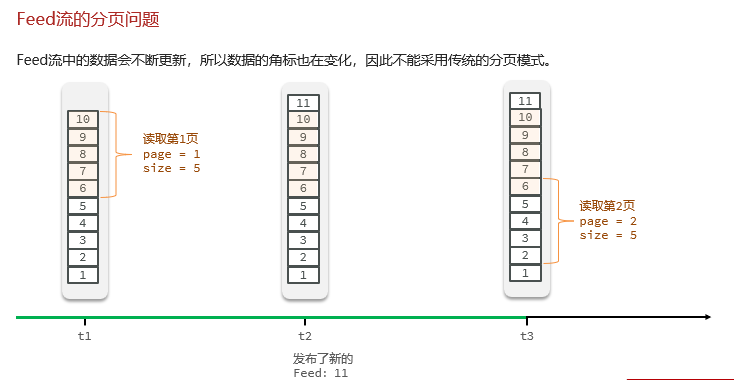

解决办法：

记录每次操作的最后一条，然后从这个位置开始去读取数据

举个例子：我们从t1时刻开始，拿第一页数据，拿到了10~6，然后记录下当前最后一次拿取的记录，就是6，t2时刻发布了新的记录，此时这个11放到最顶上，但是不会影响我们之前记录的6，此时t3时刻来拿第二页，第二页这个时候拿数据，还是从6后一点的5去拿，就拿到了5-1的记录。我们这个地方可以采用sortedSet来做，可以进行范围查询，并且还可以记录当前获取数据时间戳最小值

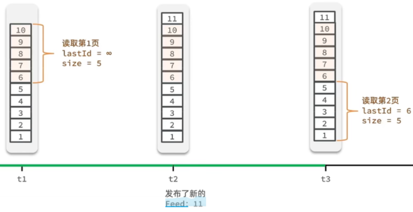

核心命令：`ZREVRANGEBYSCORE` 

用于**按 分数 从高到低（倒序）** 获取有序集合中**分数在指定范围内**的元素

```
ZREVRANGEBYSCORE key max min [WITHSCORES] LIMIT offset count
```

`WITHSCORES` ：用于在返回元素的同时，一并返回元素对应的**分数**

用于分页：`offset` 是起始偏移量，`count` 是返回的最大元素数

发布笔记时==> 给所有粉丝发送：保存 Feed:粉丝id   |   blogId : 时间戳

粉丝拉取时==>获取Feed: 用户id 

代码示例：

核心的意思：就是我们在保存完探店笔记后，获得到当前笔记的粉丝，然后把数据推送到粉丝的redis中去。

**发布**

```java
@Override
public Result saveBlog(Blog blog) {
    // 1.获取登录用户
    UserDTO user = UserHolder.getUser();
    blog.setUserId(user.getId());
    // 2.保存探店笔记
    boolean isSuccess = save(blog);
    if(!isSuccess){
        return Result.fail("新增笔记失败!");
    }
    // 3.查询笔记作者的所有粉丝 select * from tb_follow where follow_user_id = ?
    List<Follow> follows = followService.query().eq("follow_user_id", user.getId()).list();
    // 4.推送笔记id给所有粉丝
    for (Follow follow : follows) {
        // 4.1.获取粉丝id
        Long userId = follow.getUserId();
        // 4.2.推送
        String key = FEED_KEY + userId;
        stringRedisTemplate.opsForZSet().add(key, blog.getId().toString(), System.currentTimeMillis());
    }
    // 5.返回id
    return Result.ok(blog.getId());
}
```

**拉取**

在个人主页的“关注”卡片中，查询并展示推送的Blog信息：

具体操作如下：

1、每次查询完成后，我们要分析出查询出数据的最小时间戳，这个值会作为下一次查询的条件

2、我们需要找到与上一次查询相同的查询个数作为偏移量，下次查询时，跳过这些查询过的数据，拿到我们需要的数据

综上：我们的请求参数中就需要携带 lastId：上一次查询的最小时间戳 和偏移量这两个参数。

这两个参数第一次会由前端来指定，以后的查询就根据后台结果作为条件，再次传递到后台。

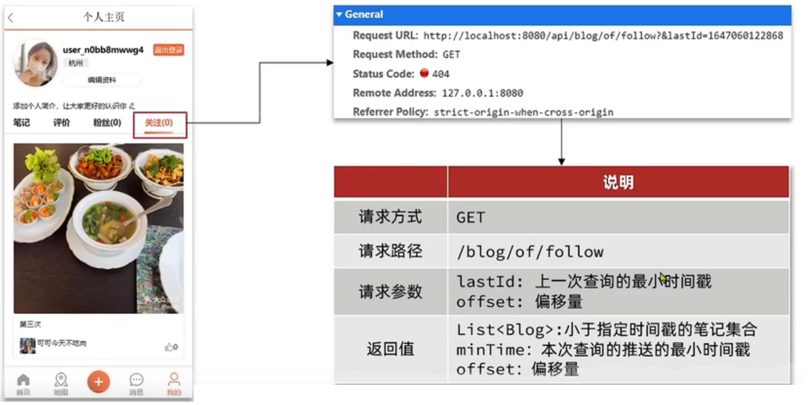

一、定义出来具体的返回值实体类

```java
@Data
public class ScrollResult {
    private List<?> list;
    private Long minTime;
    private Integer offset;
}
```

BlogController

注意：RequestParam 表示接受url地址栏传参的注解，当方法上参数的名称和url地址栏不相同时，可以通过RequestParam 来进行指定

```java
@GetMapping("/of/follow")
public Result queryBlogOfFollow(
    @RequestParam("lastId") Long max, @RequestParam(value = "offset", defaultValue = "0") Integer offset){
    return blogService.queryBlogOfFollow(max, offset);
}
```

BlogServiceImpl

```java
@Override
public Result queryBlogOfFollow(Long max, Integer offset) {
    // 1.获取当前用户
    Long userId = UserHolder.getUser().getId();
    // 2.查询收件箱 ZREVRANGEBYSCORE key Max Min LIMIT offset count
    String key = FEED_KEY + userId;
    Set<ZSetOperations.TypedTuple<String>> typedTuples = stringRedisTemplate.opsForZSet()
        .reverseRangeByScoreWithScores(key, 0, max, offset, 2);
    // 3.非空判断
    if (typedTuples == null || typedTuples.isEmpty()) {
        return Result.ok();
    }
    // 4.解析数据：blogId、minTime（时间戳）、offset
    List<Long> ids = new ArrayList<>(typedTuples.size());
    long minTime = 0; // 2
    int os = 1; // 2
    for (ZSetOperations.TypedTuple<String> tuple : typedTuples) { // 5 4 4 2 2
        // 4.1.获取id
        ids.add(Long.valueOf(tuple.getValue()));
        // 4.2.获取分数(时间戳）
        long time = tuple.getScore().longValue();
        if(time == minTime){
            os++;
        }else{
            minTime = time;
            os = 1;
        }
    }
	os = minTime == max ? os : os + offset;
    // 5.根据id查询blog
    String idStr = StrUtil.join(",", ids);
    List<Blog> blogs = query().in("id", ids).last("ORDER BY FIELD(id," + idStr + ")").list();

    for (Blog blog : blogs) {
        // 5.1.查询blog有关的用户
        queryBlogUser(blog);
        // 5.2.查询blog是否被点赞
        isBlogLiked(blog);
    }

    // 6.封装并返回
    ScrollResult r = new ScrollResult();
    r.setList(blogs);
    r.setOffset(os);
    r.setMinTime(minTime);

    return Result.ok(r);
}
```

```xml
<dependency>
            <groupId>org.springframework.boot</groupId>
            <artifactId>spring-boot-starter-freemarker</artifactId>
        </dependency>
        <dependency>
            <groupId>org.springframework.boot</groupId>
            <artifactId>spring-boot-starter-web</artifactId>
        </dependency>
<!--        AOP-->
        <dependency>
            <groupId>org.springframework.boot</groupId>
            <artifactId>spring-boot-starter-aop</artifactId>
        </dependency>
<!--        mybatis-puls-->
        <dependency>
            <groupId>com.baomidou</groupId>
            <artifactId>mybatis-plus-boot-starter</artifactId>
            <version>3.5.2</version>
        </dependency>
        <!-- redis -->
        <dependency>
            <groupId>org.springframework.boot</groupId>
            <artifactId>spring-boot-starter-data-redis</artifactId>
        </dependency>
        <!--连接池依赖-->
        <dependency>
            <groupId>org.apache.commons</groupId>
            <artifactId>commons-pool2</artifactId>
        </dependency>
        <!-- https://doc.xiaominfo.com/docs/quick-start#openapi2 -->
        <dependency>
            <groupId>com.github.xiaoymin</groupId>
            <artifactId>knife4j-openapi2-spring-boot-starter</artifactId>
            <version>4.4.0</version>
        </dependency>
        <!-- https://cloud.tencent.com/document/product/436/10199-->
        <dependency>
            <groupId>com.qcloud</groupId>
            <artifactId>cos_api</artifactId>
            <version>5.6.89</version>
        </dependency>
        <!-- https://mvnrepository.com/artifact/org.apache.commons/commons-lang3 -->
        <dependency>
            <groupId>org.apache.commons</groupId>
            <artifactId>commons-lang3</artifactId>
        </dependency>
        <!-- https://github.com/alibaba/easyexcel -->
        <dependency>
            <groupId>com.alibaba</groupId>
            <artifactId>easyexcel</artifactId>
            <version>3.1.1</version>
        </dependency>
        <!-- https://hutool.cn/docs/index.html#/-->
        <dependency>
            <groupId>cn.hutool</groupId>
            <artifactId>hutool-all</artifactId>
            <version>5.8.8</version>
        </dependency>
        <dependency>
            <groupId>org.springframework.boot</groupId>
            <artifactId>spring-boot-devtools</artifactId>
            <scope>runtime</scope>
            <optional>true</optional>
        </dependency>
<!--        mysql-->
        <dependency>
            <groupId>mysql</groupId>
            <artifactId>mysql-connector-java</artifactId>
            <scope>runtime</scope>
        </dependency>
        <dependency>
            <groupId>org.springframework.boot</groupId>
            <artifactId>spring-boot-configuration-processor</artifactId>
            <optional>true</optional>
        </dependency>
<!--        lombok-->
        <dependency>
            <groupId>org.projectlombok</groupId>
            <artifactId>lombok</artifactId>
            <optional>true</optional>
        </dependency>
<!--        test-->
        <dependency>
            <groupId>org.springframework.boot</groupId>
            <artifactId>spring-boot-starter-test</artifactId>
            <scope>test</scope>
        </dependency>
```


# 分布式缓存

## 单点Reids部署存在的问题

1. 数据丢失： Redis是内存存储，服务重启可能会丢失数据
2. 并发能力： 高量情况下无法满足
3. 故障修复：如果Redis宕机，服务不可用，需要一种自动故障修复手段
4. 存储能力：基于内存的存储方式，数据量可能不足

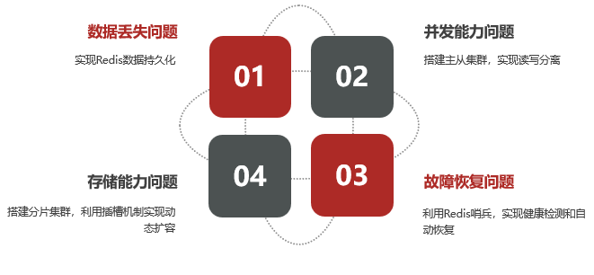

## Redis 持久化

### RDB持久化

Redis Data Backup file （Redis数据备份文件），也称Redis数据快照

把Redis所有数据记录到磁盘中，当Redis实例故障重启后，从磁盘读取，恢复数据

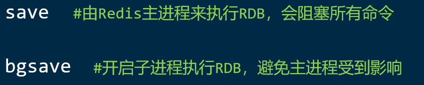

在redis.conf中

```mysql
#禁用RDB
save ""
#开启RDB，表示900秒内，至少有一个key被修改执行bgsave
save 900 1
```

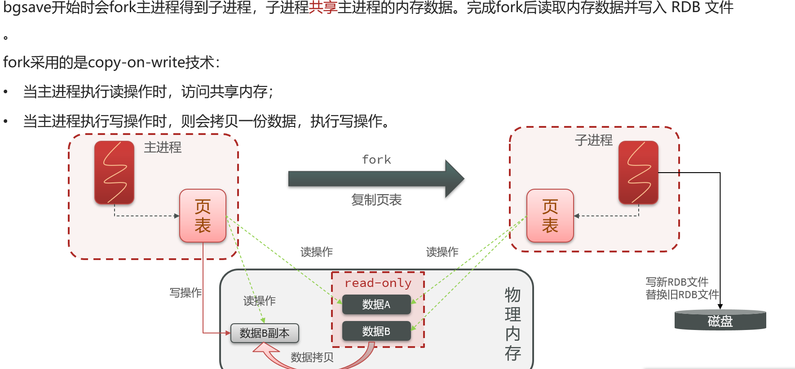

**RDB方式bgsave的基本流程**

- fork主进程得到一个子进程，共享内存空间
- 子进程读取内存数据并写入RDB文件
- 用新的RDB文件替代旧的RDB文件

**RDB什么时候执行**

- 默认服务停止时
- 修改并配置save xx xx，触发

**RDB缺点**

RDB执行间隔长，2次RDB写入数据有丢失风险

fork子进程，压缩，写出RDB文件比较耗时

### AOF持久化

Append Only File（追加文件）。Redis处理的每一个写命令都会记录在AOF文件，可以看做是命令日志文件。

AOF默认是关闭的，在redis.conf来指定配置

```mysql
# 是否开启AOF功能，默认是no
appendonly yes
# AOF文件的名称
appendfilename "appendonly.aof"
```

命令记录频率配置

```mysql
 # 表示每执行一次写命令，立即记录到AOF文件
appendfsync always 
# 写命令执行完先放入AOF缓冲区，然后表示每隔1秒将缓冲区数据写到AOF文件，是默认方案
appendfsync everysec 
# 写命令执行完先放入AOF缓冲区，由操作系统决定何时将缓冲区内容写回磁盘
appendfsync no
```

AOF会记录对同一个key的多次写操作，但只有最后一次写操作才有意义。通过执行bgrewriteaof命令，可以让AOF文件执行重写功能，用最少的命令达到相同效果。

```mysql
# AOF文件比上次文件 增长超过多少百分比则触发重写
auto-aof-rewrite-percentage 100
# AOF文件体积最小多大以上才触发重写 
auto-aof-rewrite-min-size 64mb 
```

搭建主从集群

```mysql
# 先关闭实例（若已启动，需输入密码）
sudo /usr/local/src/redis-6.2.6/src/redis-cli -p 7001 -a 你的密码 shutdown

# 重新启动实例（加载新配置）
sudo /usr/local/src/redis-6.2.6/src/redis-server /usr/local/src/7001/redis.conf
```

## Redis主从

### 搭建主从

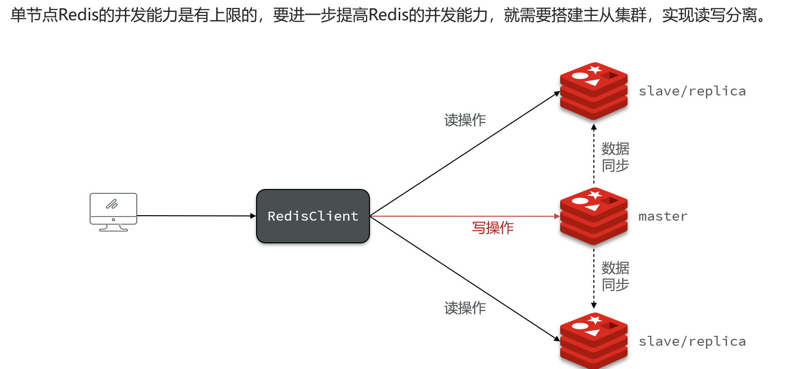

从机：

两种配置方法（这种配置方式前提是 主从之间不能存在密码!）

~~~sh
有临时和永久两种模式：

- 修改配置文件（永久生效）

  - 在redis.conf中添加一行配置：```slaveof <masterip> <masterport>```

- 使用redis-cli客户端连接到redis服务，执行slaveof命令（重启后失效）：

  ```sh
  slaveof <masterip> <masterport>
  ```


<strong><font color='red'>注意</font></strong>：在5.0以后新增命令replicaof，与salveof效果一致。 
~~~

主机：

```sh
# 查看状态
info replication
```

搭配主从后，从机不能执行写操作，只能执行读操作

### 全量同步

Replication Id : 每一个master（主机）都有一个自己的唯一ID，简称replid，是数据集的标记，slave（从机）会继承master节点的replid

offset：偏移量，随着记录在repl_baklog中的数据增多而逐渐增大，salve完成同步时会记录当前同步的offset，如果slave的offset小于master的offset，说明数据版本落后，需要更新。

因此salve做数据同步，必须向master声明自己的replicationId 和offset

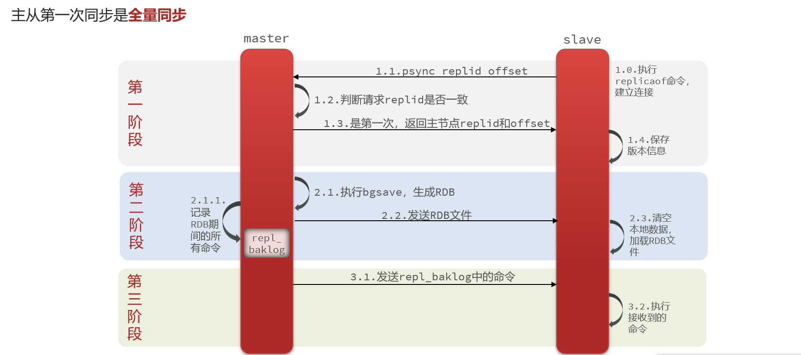

流程：

salve节点请求增量同步，master判断replid，发现不一致，那么是第一次连接，返回主节点的replid和offset给salve节点

salve清空本地数据，加载master的RDB文件

master将RDB期间的命令记录在repl_baklog，并持续将log中的命令发送给salve

salve节点执行命令，保持同步

### 增量同步

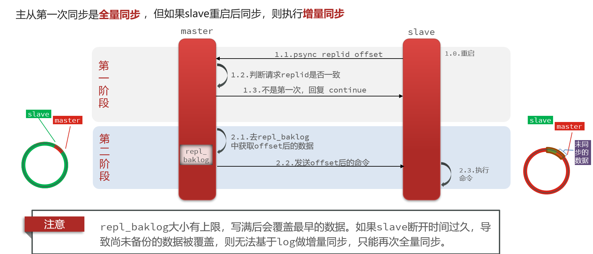

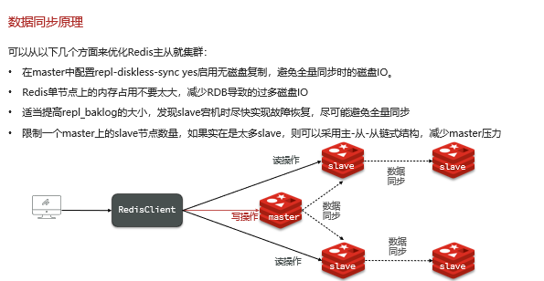

**简述全量同步和增量同步区别？**

全量同步：master将完整内存数据生成RDB，发送RDB到slave。后续命令则记录在repl_baklog，逐个发送给slave。

增量同步：slave提交自己的offset到master，master获取repl_baklog中从offset之后的命令给slave

**什么时候执行全量同步？**

slave节点第一次连接master节点时

slave节点断开时间太久，repl_baklog中的offset已经被覆盖时

**什么时候执行增量同步？**

slave节点断开又恢复，并且在repl_baklog中能找到offset时


相关命令

```
#开启服务端
redis-server 7001/redis.conf // 开启服务，并指定对应的conf文件
# 关闭服务端
redis-cli -p 7001     //连接7001端口的服务端
shutdown              //关闭7001服务端
exit				//退出
```

