# 微信小程序开发

## 一、测试号

### 1.1 申请微信小程序测试号

1. 访问申请网址：浏览器搜索“微信公众平台接口测试系统官网”

2. 扫码登录

3. 能够获取到

   **AppID (小程序微信号)**

   **AppSecret (小程序密钥)**

### 1.2 创建并运行小程序项目

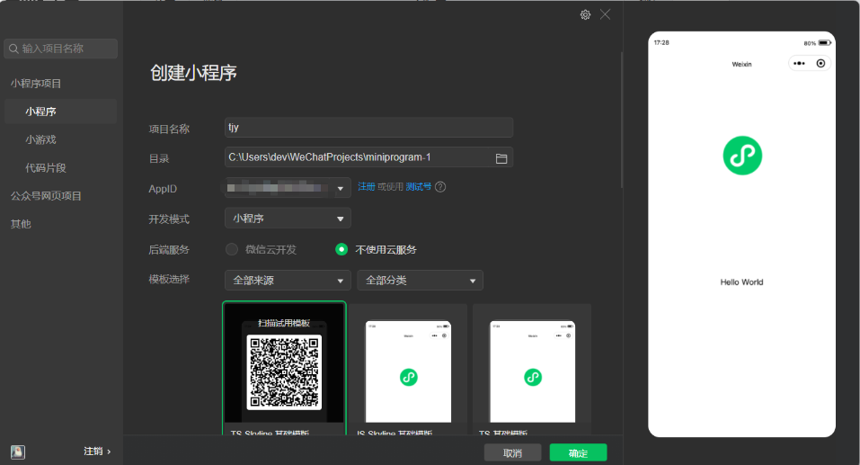

选择 JS 基础模板 / TS 基础模板 后确认

### 1.3 微信小程序结构说明

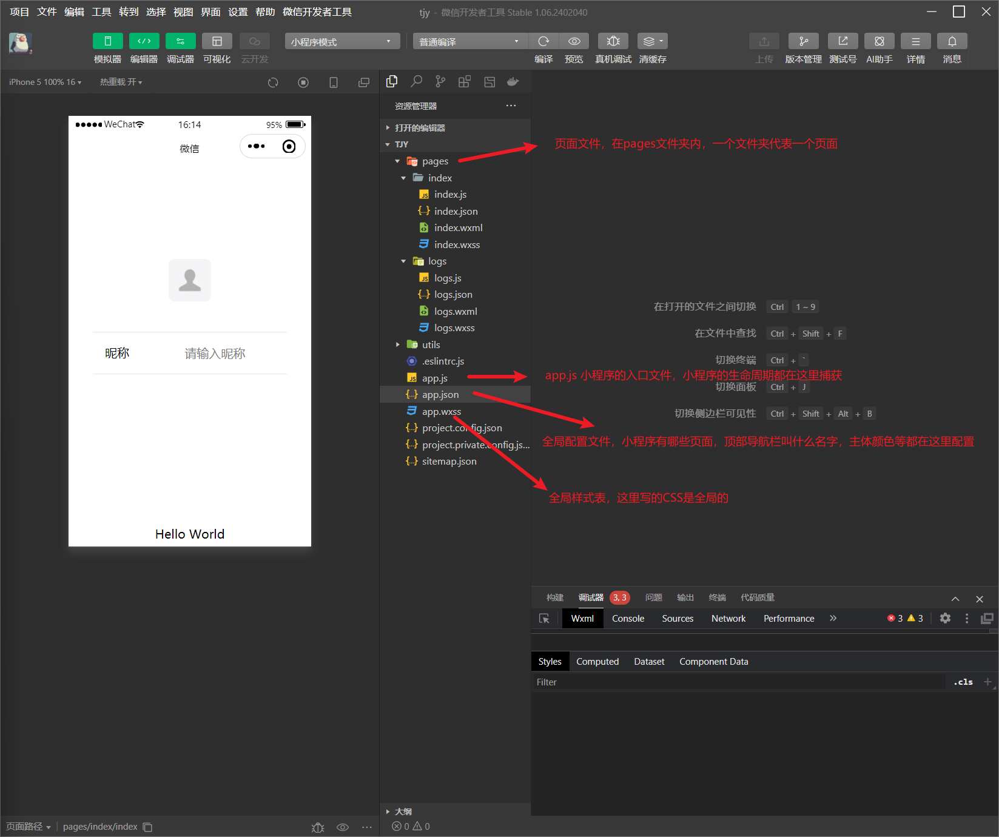

#### 1.3.1 pages文件夹

这是存放小程序所有**页面**的地方。你的每一个界面（如首页、登录页、错题库）都是这里的一个子文件夹。

- **结构特点**：微信官方规定，一个标准的页面通常由 4 个同名但不同后缀的文件组成：
  - `.wxml`：决定页面的**结构**（类似 HTML，写各类组件和文本）。
  - `.wxss`：决定页面的**样式**（类似 CSS，控制颜色、布局和大小）。
  - `.js`：决定页面的**逻辑**（处理数据绑定、网络请求、点击事件）。
  - `.json`：决定页面的**局部配置**（例如单独设置这个页面的顶部标题）。

#### 1.3.2 utils

这是一个**约定的工具函数文件夹**（非微信官方强制，但属于业界标准规范）。

- **作用**：用来存放一些项目中**通用的、可以复用的 JavaScript 代码片段**。
- **常见用途**：
  - 封装统一的常规网络请求（如统一加 Token 的 `request.js`）。
  - 时间格式化工具（将时间戳转为 `YYYY-MM-DD`）。
  - 各种加解密算法、数据校验（如手机号正则验证）等。
  - **使用方法**：在里面写完函数后通过 `module.exports` 导出，在其他页面的 `.js` 文件中用 `require()` 引入即可。

#### 1.3.3 app.json

**pages：页面配置路由**

- 是一个数组，注册项目中所有的页面，任何在小程序展示的页面，都必须在这里登记，否则小程序无法识别，也无法通过代码跳转过去
- 放在数组的第一位，就是小程序的首页
- 每个页面配置项都包含path（页面路径），style 页面样式

```JSON
"pages": [
  {
    "path": "pages/index/index", // 项目的首页
    "style": {
      "navigationBarTitleText": "首页" // 顶部的标题
    }
  },
    ...更多页面
]
```

 [更多页面配置](https://developers.weixin.qq.com/miniprogram/dev/reference/configuration/page.html) 

**globalStyle：全局默认样式**

用来设置小程序的全局外观，如果在pages里的某个页面没有单独设置style，那么这个页面就会使用这里配置的样式

**tabBar： 底部导航栏**

- 如果你的应用底部有那种点击切换的菜单，比如常见的首页，我的等，就是通过这个属性来配置的
- 微信官方限制：底部tab最少2个，最多5个
- 可以配置每个tab选中的颜色、未选中的颜色、文字以及对应的图标

```JSON
"tabBar": {
  "color": "#7A7E83",          // 未选中时的文字颜色
  "selectedColor": "#007AFF",  // 选中时的文字颜色
  "list": [
    {
      "pagePath": "pages/index/index",
      "text": "首页"
    },
    {
      "pagePath": "pages/my/my",
      "text": "我的"
    }
  ]
}
```

subPackages：分包加载

微信官方对小程序的体积有严格限制（单包代码不能超过2MB），如果你的项目越做越大，页面太多，就需要用到分包

可以把不常用的模块单独打包。用户打开小程序时值下载主包，点击进入相关模块才下载对应的分包，从而优化小程序的启动速度

#### 1.3.4 app.wxss

这是小程序的**全局公共样式表**。

- **作用**：写在这里的样式规则会**自动作用于小程序的所有页面**。
- **常见用途**：
  - 定义全局的背景色（如 `#F8F8F8`）。
  - 引入全局字体图标（IconFont）。
  - 定义项目中通用的 CSS 类（例如统一的按钮样式 `.btn-primary`、通用的弹性布局 `.flex-center`）。
  - *注：页面自身的 `.wxss` 会覆盖 `app.wxss` 中的同名样式。*

#### 1.3.5 project.config.json

这是针对微信开发者工具（IDE）的配置文件，跟代码业务逻辑无关，只跟开发环境有关。

- **作用**：它记录了你对微信开发者工具所做的个性化设置。这样即使你换了一台电脑，或者团队协同开发时，大家打开同一个项目，开发者工具的设置也能保持绝对一致。
- **核心内容**：
  - 你的小程序 `appid`。
  - 项目的编译设置：是否开启 ES6 转 ES5、是否自动压缩代码、是否禁用域名合法检查（开发本地后端接口时经常需要勾选）。
  - 你的微信开发者工具界面样式、本地环境版本等。


### 1.4 前后端联调测试

在index.js 测试是否能够调用本地后端接口

```js
onLoad() {
    // 页面一加载，就去请求后端的测试接口
    wx.request({
        url: 'http://localhost:8092/api/exam/sync/examinee', // 换成你本地本地 Spring Boot 的接口地址
        method: 'POST',
        success: (res) => {
            // 请求成功后的回调
            console.log("从Java后端拿到的数据：", res.data);
            // 你可以用 this.setData 把数据存到 data 里展示在界面上
        },
        fail: (err) => {
            console.error("请求失败了，检查后端是否启动或跨域：", err);
        }
    })
},
```

报错如下：

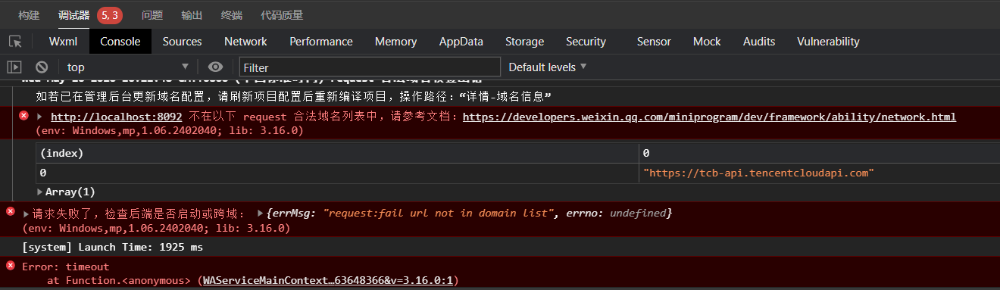

修改配置

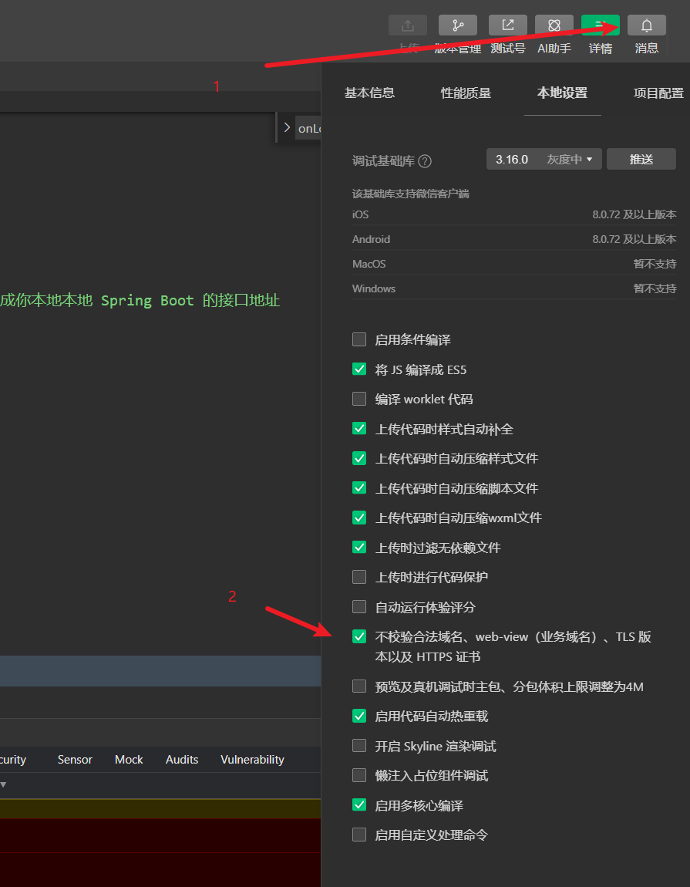

ctrl + R 刷新页面可以看到调试成功

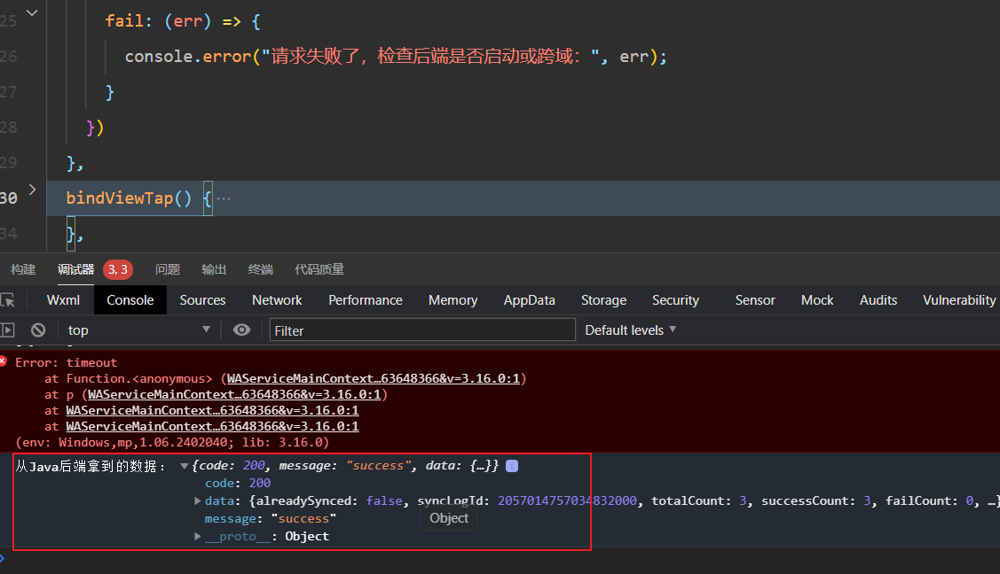

## 二、项目迭代开发

### 2.1 运行流程

1. 执行 npm install 
2. 打开根目录下的 **`package.json`** 文件，找到 `"scripts"` 模块。 执行 `"dev:mp-weixin"` 命令。
3. 如果没有。那么就是传统的项目

**传统项目：**

使用 HBuilderX

1. 在 HBuilderX 中配置路径

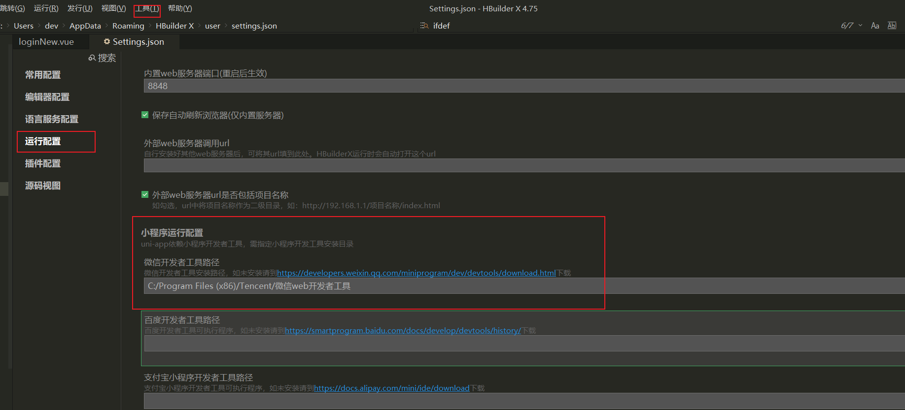

2. 为了 HBuilderX 以后能直接一键帮你把小程序唤醒并刷新，必须去微信工具里开一个安全端口

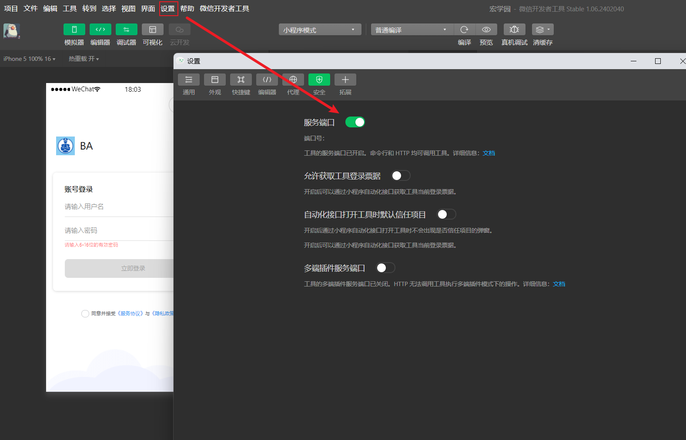

3. 点击即可自行编译并且运行到微信开发者工具，并支持热重载

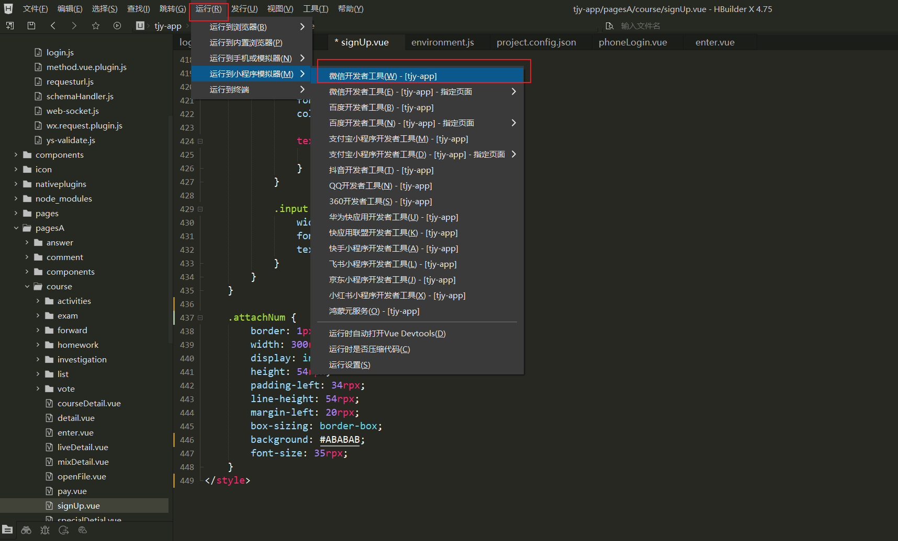

## 三、微信登录

### 3.1 微信登录的基本流程

小程序调用wx.login() 获取到code

小程序把code发送到后端

后端使用appid + secret + code 调用微信接口

微信返回openid + session_key 

后端生成 token 返回给小程序 -------> 登录完成

### 3.2 环境准备

1. **注册小程序**：前往 [微信公众平台](https://mp.weixin.qq.com/) 注册一个新账号，类型选择 **“小程序”**。

- **注意**：个人身份即可注册，完全免费，不需要提交营业执照。

2. **获取小程序的凭证**：微信公众号 -->开发管理--> 开发设置

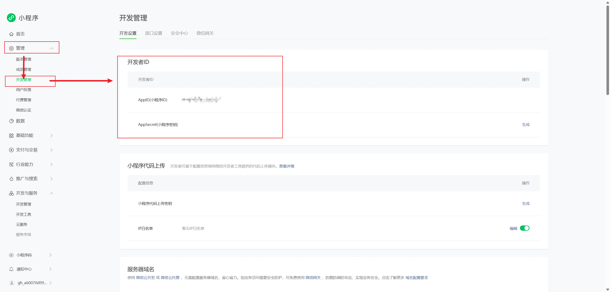

3. **配置服务器域名**：在同一个页面找到【服务器域名】，把你的后端 API 域名填到 `request合法域名` 中（必须是 `https`，且不能带特殊端口，必须是标准的 443 端口）。

### 3.3 真机调试

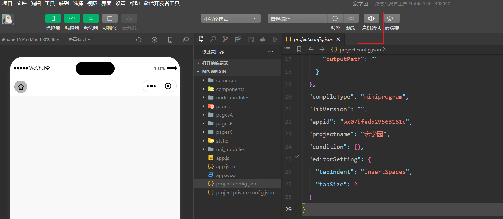

1. 局域网调试：

   手机和电脑连接在同一个WiFi，电脑端需要关闭防火墙

   请求的BaseURL不能为Localhost 和 127.0.0.1，需要改为电脑的局域网IP + 端口

2. 内网穿透

注意：

1. 一些依赖于微信原生能力的，模拟器是无法正常触发的，所以需要使用到真机调试

2. 微信小程序的权限控制非常严格：**只有小程序后台添加的开发者 / 体验者账号，才能在开发者工具里调试这个 AppID 的项目**，即微信开发者登录的微信账号，必须是当前小程序的开发者

   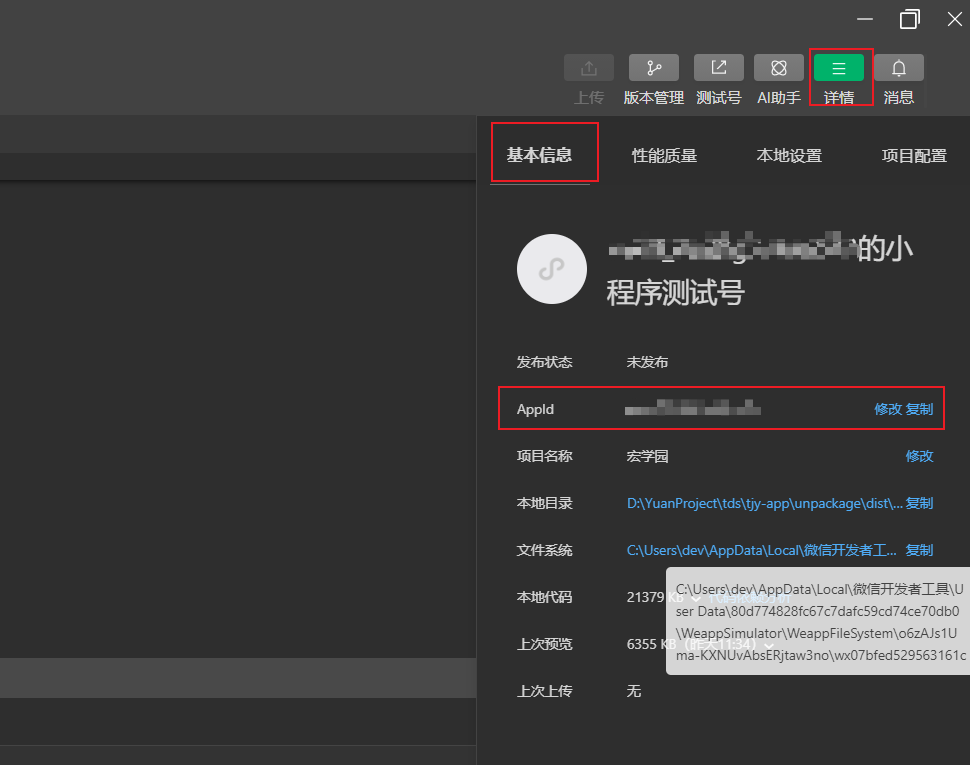

   具体流程：登录小程序后台，成员管理-> 开发者/体验者，输入微信号，发送邀请同意后才能获得调试权限

   临时的处理方案，**使用测试号，只能调试页面和接口，但是测试号无法使用wx.login 、getPhoneNumber等需要真实 AppID的接口**


