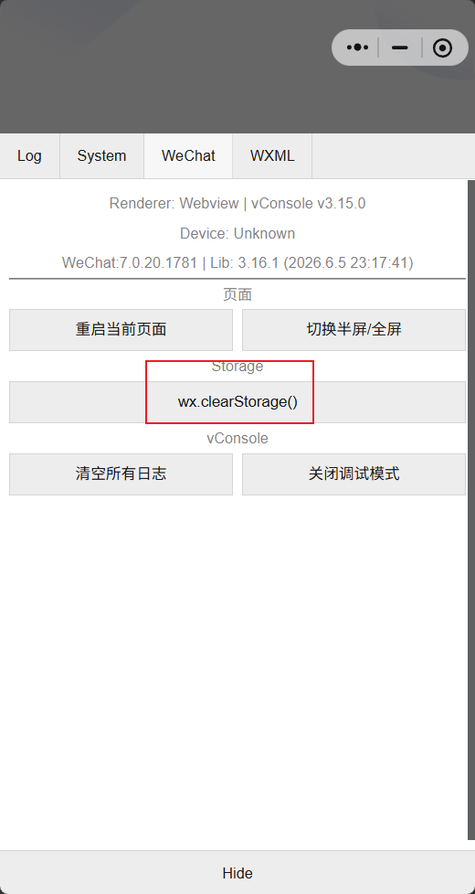
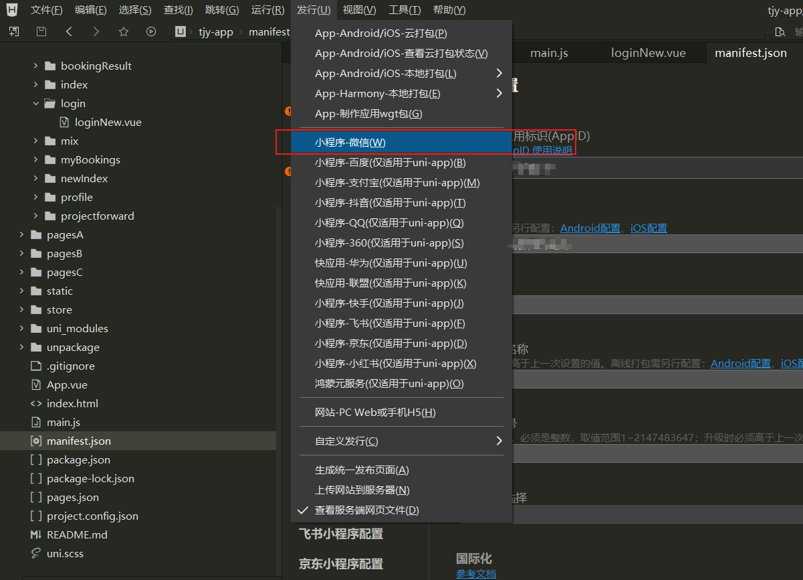
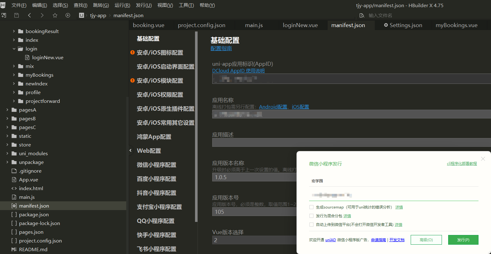
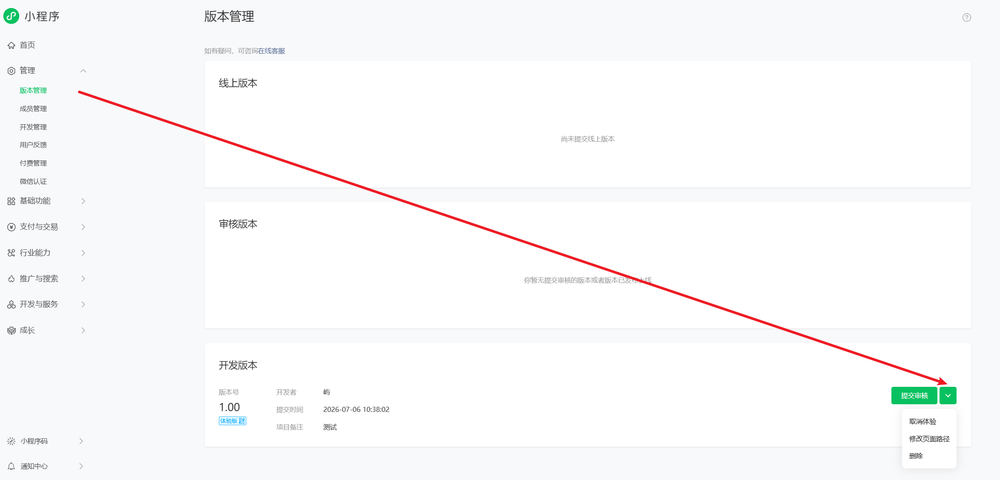
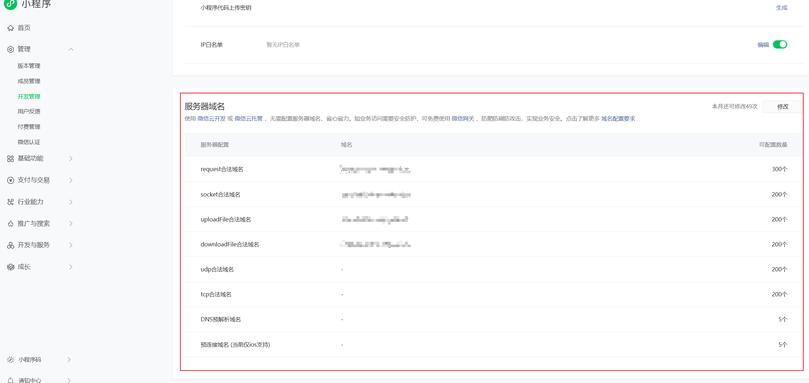

# 微信小程序开发

## 一、测试号

### 1.1 申请微信小程序测试号

1. 访问申请网址：浏览器搜索“微信公众平台接口测试系统官网”

2. 扫码登录

3. 能够获取到

   **AppID (小程序微信号)**

   **AppSecret (小程序密钥)**

### 1.2 创建并运行小程序项目


选择 JS 基础模板 / TS 基础模板 后确认

### 1.3 微信小程序结构说明


#### 1.3.1 pages文件夹

这是存放小程序所有**页面**的地方。你的每一个界面（如首页、登录页、错题库）都是这里的一个子文件夹。

- **结构特点**：微信官方规定，一个标准的页面通常由 4 个同名但不同后缀的文件组成：
  - `.wxml`：决定页面的**结构**（类似 HTML，写各类组件和文本）。
  - `.wxss`：决定页面的**样式**（类似 CSS，控制颜色、布局和大小）。
  - `.js`：决定页面的**逻辑**（处理数据绑定、网络请求、点击事件）。
  - `.json`：决定页面的**局部配置**（例如单独设置这个页面的顶部标题）。

#### 1.3.2 utils

这是一个**约定的工具函数文件夹**（非微信官方强制，但属于业界标准规范）。

- **作用**：用来存放一些项目中**通用的、可以复用的 JavaScript 代码片段**。
- **常见用途**：
  - 封装统一的常规网络请求（如统一加 Token 的 `request.js`）。
  - 时间格式化工具（将时间戳转为 `YYYY-MM-DD`）。
  - 各种加解密算法、数据校验（如手机号正则验证）等。
  - **使用方法**：在里面写完函数后通过 `module.exports` 导出，在其他页面的 `.js` 文件中用 `require()` 引入即可。

#### 1.3.3 app.json

**pages：页面配置路由**

- 是一个数组，注册项目中所有的页面，任何在小程序展示的页面，都必须在这里登记，否则小程序无法识别，也无法通过代码跳转过去
- 放在数组的第一位，就是小程序的首页
- 每个页面配置项都包含path（页面路径），style 页面样式

```JSON
"pages": [
  {
    "path": "pages/index/index", // 项目的首页
    "style": {
      "navigationBarTitleText": "首页" // 顶部的标题
    }
  },
    ...更多页面
]
```

 [更多页面配置](https://developers.weixin.qq.com/miniprogram/dev/reference/configuration/page.html) 

**globalStyle：全局默认样式**

用来设置小程序的全局外观，如果在pages里的某个页面没有单独设置style，那么这个页面就会使用这里配置的样式

**tabBar： 底部导航栏**

- 如果你的应用底部有那种点击切换的菜单，比如常见的首页，我的等，就是通过这个属性来配置的
- 微信官方限制：底部tab最少2个，最多5个
- 可以配置每个tab选中的颜色、未选中的颜色、文字以及对应的图标

```JSON
"tabBar": {
  "color": "#7A7E83",          // 未选中时的文字颜色
  "selectedColor": "#007AFF",  // 选中时的文字颜色
  "list": [
    {
      "pagePath": "pages/index/index",
      "text": "首页"
    },
    {
      "pagePath": "pages/my/my",
      "text": "我的"
    }
  ]
}
```

subPackages：分包加载

微信官方对小程序的体积有严格限制（单包代码不能超过2MB），如果你的项目越做越大，页面太多，就需要用到分包

可以把不常用的模块单独打包。用户打开小程序时值下载主包，点击进入相关模块才下载对应的分包，从而优化小程序的启动速度

#### 1.3.4 app.wxss

这是小程序的**全局公共样式表**。

- **作用**：写在这里的样式规则会**自动作用于小程序的所有页面**。
- **常见用途**：
  - 定义全局的背景色（如 `#F8F8F8`）。
  - 引入全局字体图标（IconFont）。
  - 定义项目中通用的 CSS 类（例如统一的按钮样式 `.btn-primary`、通用的弹性布局 `.flex-center`）。
  - *注：页面自身的 `.wxss` 会覆盖 `app.wxss` 中的同名样式。*

#### 1.3.5 project.config.json

这是针对微信开发者工具（IDE）的配置文件，跟代码业务逻辑无关，只跟开发环境有关。

- **作用**：它记录了你对微信开发者工具所做的个性化设置。这样即使你换了一台电脑，或者团队协同开发时，大家打开同一个项目，开发者工具的设置也能保持绝对一致。
- **核心内容**：
  - 你的小程序 `appid`。
  - 项目的编译设置：是否开启 ES6 转 ES5、是否自动压缩代码、是否禁用域名合法检查（开发本地后端接口时经常需要勾选）。
  - 你的微信开发者工具界面样式、本地环境版本等。


### 1.4 前后端联调测试

在index.js 测试是否能够调用本地后端接口

```js
onLoad() {
    // 页面一加载，就去请求后端的测试接口
    wx.request({
        url: 'http://localhost:8092/api/exam/sync/examinee', // 换成你本地本地 Spring Boot 的接口地址
        method: 'POST',
        success: (res) => {
            // 请求成功后的回调
            console.log("从Java后端拿到的数据：", res.data);
            // 你可以用 this.setData 把数据存到 data 里展示在界面上
        },
        fail: (err) => {
            console.error("请求失败了，检查后端是否启动或跨域：", err);
        }
    })
},
```

报错如下：


修改配置


ctrl + R 刷新页面可以看到调试成功


## 二、项目迭代开发

### 2.1 运行流程

1. 执行 npm install 
2. 打开根目录下的 **`package.json`** 文件，找到 `"scripts"` 模块。 执行 `"dev:mp-weixin"` 命令。
3. 如果没有。那么就是传统的项目

**传统项目：**

使用 HBuilderX

1. 在 HBuilderX 中配置路径


2. 为了 HBuilderX 以后能直接一键帮你把小程序唤醒并刷新，必须去微信工具里开一个安全端口


3. 点击即可自行编译并且运行到微信开发者工具，并支持热重载


## 三、微信登录

### 3.1 微信登录的基本流程

小程序调用wx.login() 获取到code

小程序把code发送到后端

后端使用appid + secret + code 调用微信接口

微信返回openid + session_key 

后端生成 token 返回给小程序 -------> 登录完成

### 3.2 环境准备

1. **注册小程序**：前往 [微信公众平台](https://mp.weixin.qq.com/) 注册一个新账号，类型选择 **“小程序”**。

- **注意**：个人身份即可注册，完全免费，不需要提交营业执照。

2. **获取小程序的凭证**：微信公众号 -->开发管理--> 开发设置


3. **配置服务器域名**：在同一个页面找到【服务器域名】，把你的后端 API 域名填到 `request合法域名` 中（必须是 `https`，且不能带特殊端口，必须是标准的 443 端口）。

### 3.3 真机调试


1. 局域网调试：

   手机和电脑连接在同一个WiFi，电脑端需要关闭防火墙

   请求的BaseURL不能为Localhost 和 127.0.0.1，需要改为电脑的局域网IP + 端口

2. 内网穿透

注意：

1. 一些依赖于微信原生能力的，模拟器是无法正常触发的，所以需要使用到真机调试

2. 微信小程序的权限控制非常严格：**只有小程序后台添加的开发者 / 体验者账号，才能在开发者工具里调试这个 AppID 的项目**，即微信开发者登录的微信账号，必须是当前小程序的开发者

   

   具体流程：登录小程序后台，成员管理-> 开发者/体验者，输入微信号，发送邀请同意后才能获得调试权限

   临时的处理方案，**使用测试号，只能调试页面和接口，但是测试号无法使用wx.login 、getPhoneNumber等需要真实 AppID的接口**

### 3.4 真机微信端清除



执行后，小程序里所有 `Storage` 里的登录态、token 都会被清空，和 “第一次打开” 效果一致

## 四、小程序的版本状态

小程序一般有四个版本状态，它们的流转关系如下：

| **版本类型**         | **谁能看/谁能用**                          | **是否需要审核**      | **产生方式**               |
| -------------------- | ------------------------------------------ | --------------------- | -------------------------- |
| **开发版**           | 仅限开发者自己，或者扫特定开发码的人       | 否                    | 开发者工具直接预览/上传    |
| **体验版（测试版）** | 团队内的测试人员、业务方（需加入体验成员） | **否**                | 从开发版本中“选为体验版本” |
| **审核中版本**       | 微信官方审核人员                           | 是（需要1-7个工作日） | 从体验版/开发版提交审核    |
| **线上版（正式版）** | 全网所有微信用户                           | 已经通过审核          | 审核通过后，手动点击“发布” |

### 4.1 体验版

**体验版只能有一个：** 每次你把某一个开发包“选为体验版本”后，**之前的体验版就会被覆盖**。也就是说，同一时间全网只能有一个有效的体验版二维码。

**接口域名问题：** 体验版默认会校验合法域名。如果测试时发现获取不到数据，可以在手机小程序右上角点击 `...` -> **“开发调试”** -> **“打开调试”**（打开VConsole），这样可以跳过域名校验。

### 4.2 上传体验版

#### 4.2.1 注意

需要注意的是，不能直接在原本开发环境直接上传，因为那是HBuilder在开发模式下打的包（`npm run dev` 模式下包含大量的调试信息和未压缩的代码，所以体积会非常膨胀）

使用HBuilder的发行





点击即可发行。

可能遇到的问题：

```
HBuilder] 10:18:13.253 此应用 DCloud appid 为xxxx ，您不是这个应用的项目成员。1、联系这个应用的所有者，请求加入项目成员（https://dev.dcloud.net.cn "成员管理"-"添加项目成员"）；2、重新在manifest.json中生成自己的APPID；3、联系应用所有者将此 DCloud appid 转让给当前账号。
```

快捷解决方法：重新生成你自己的 DCloud APPID（推荐）

如果你是独立开发，或者这个项目是你自己从网上下载的、别人发给你的，你直接生成一个属于你自己的 ID 即可。

1. 在 HBuilderX 中，双击打开项目根目录下的 **`manifest.json`** 文件。
2. 默认会打开可视化界面，在 **「基础配置」** 这一栏中，找到 **「AppID (DCloud)」**。
3. 点击它右侧的 **「重新生成」**（或者「获取」）按钮。
4. 提示生成成功后，按下 **Ctrl + S** 保存文件。
5. 重新点击顶部菜单的 **「发行」->「小程序 - 微信」**。

**发行和npm run dev 编译得到的产物不是在同一个路径，它们是完全隔离开的。**

这是 HBuilderX 非常贴心的一个设计，为了防止你开发调试的代码（Dev）和准备上线的代码（Build）互相覆盖，它们会被生成到两个**不同的文件夹**中：

- **开发模式 (`npm run dev`) 的路径：** `项目根目录/unpackage/dist/dev/mp-weixin`
- **发行模式 (`npm run build` / 点击发行) 的路径：**`项目根目录/unpackage/dist/build/mp-weixin`

#### 4.2.2 实际开发流程

- **调 Bug / 写代码：** 继续在 HBuilderX 运行 `dev` 模式。如果因为体积超限导致微信工具报错不让真机调试，可以在微信开发者工具的 **「详情」->「本地设置」** 里，临时勾选 **「不校验合法域名、业务域名、TLS版本以及HTTPS证书」** 和 **「不校验代码包体积及页面路径」**。这样在开发阶段就能绕过 2MB 的限制，顺利进行真机调试。

- **上线前检查 / 提审：** 彻底写完代码后，在 HBuilderX 点击「发行」，然后去微信开发者工具里切换到 `build` 目录。此时点击「预览」**在手机上做最终测试，确认无误后直接点击**「上传」。

- 上传成功后，需要

  - 首先设置为体验版

    

  - 微信小程序进行域名配置

    

    在电脑上能请求成功，是因为 **微信开发者工具** 里勾选了"不校验合法域名"这个选项。但在手机上真机运行时，微信会强制校验域名白名单——`xxx域名` 不在你们小程序 `appid` 的合法域名列表里，所以请求直接被微信拦截了，返回 200001 错误。`manifest.json` 第233行的 `"urlCheck": false` 只对开发工具有效，手机上的真机校验绕不过去。
