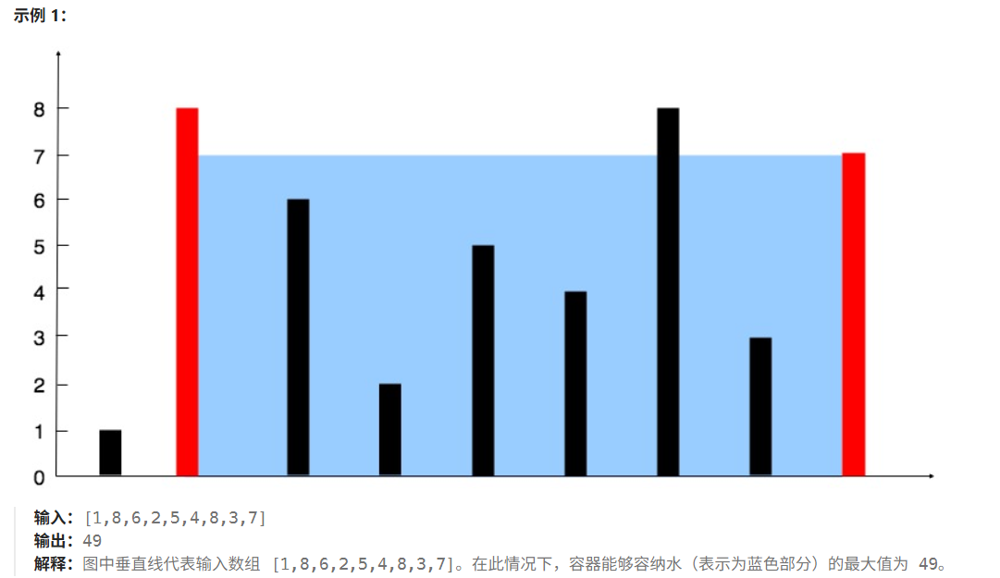

# LeetCode 热题 100 道

## 一、哈希

### 1.1 [两数之和](https://leetcode.cn/problems/two-sum/description/?envType=study-plan-v2&amp;envId=top-100-liked)

给定一个整数数组 `nums` 和一个整数目标值 `target`，请你在该数组中找出 **和为目标值** *`target`* 的那 **两个** 整数，并返回它们的数组下标。

你可以假设每种输入只会对应一个答案，并且你不能使用两次相同的元素。

你可以按任意顺序返回答案。

**示例 ：**

```
输入：nums = [2,7,11,15], target = 9
输出：[0,1]
解释：因为 nums[0] + nums[1] == 9 ，返回 [0, 1] 。
```

**答案：**

```java
class Solution {
    public int[] twoSum(int[] nums, int target) {
        //保存（值，下标）
        Map<Integer,Integer> map = new HashMap<Integer,Integer>();
        //遍历数组
        for(int i = 0; i < nums.length; i++){
            //如果包含差值，那么找到该对子
            if(map.containsKey(target - nums[i])){
                return new int[]{map.get(target - nums[i]), i};
            }
            //不包含，插入（值，下标）
            map.put(nums[i],i);
        }
        return new int[0];
    }
}
```

**收获：**

1. 利用HashMap的kv特性解决问题的思路
2. map.containsKey()：查找map中是否存在该key
3. map.get(key): 通过key获取到value
4. 返回值构建数组：return new int[]{a,b,c,....} / 返回空数组 return int[0]

### 1.2 [字母异位词分组](https://leetcode.cn/problems/group-anagrams/description/?envType=study-plan-v2&envId=top-100-liked)

给你一个字符串数组，请你将 字母异位词 组合在一起。可以按任意顺序返回结果列表。

**示例 1:**

```
输入: strs = ["eat", "tea", "tan", "ate", "nat", "bat"]
输出: [["bat"],["nat","tan"],["ate","eat","tea"]]

解释：

- 在 strs 中没有字符串可以通过重新排列来形成 `"bat"`。
- 字符串 `"nat"` 和 `"tan"` 是字母异位词，因为它们可以重新排列以形成彼此。
- 字符串 `"ate"` ，`"eat"` 和 `"tea"` 是字母异位词，因为它们可以重新排列以形成彼此。
```

**答案：**

```java
class Solution {
    public List<List<String>> groupAnagrams(String[] strs) {
        HashMap<String,List<String>> map = new HashMap<>();
        for(String str : strs){
            char[] charArray = str.toCharArray();
            //如果两个字符串是异位词，排序后作为相同的key
            Arrays.sort(charArray);
            String key = new String(charArray);
            List<String> ls = map.getOrDefault(key,new ArrayList<String>());
            ls.add(str);
            map.put(key,ls);
        }
        return new ArrayList<List<String>>(map.values());
    }
}
```

**收获：**

1. String字符串类可以使用str.toCharArray()转换为字符数组，再**排序**
2. 字符数组转换为字符串：String str = new String(charArray);
3. map的getOrDefault方法 map.getOrDefault(key, defaultValue);
4. 返回值构建：return new ArrayList<>();

### 1.3 [最长连续序列](https://leetcode.cn/problems/longest-consecutive-sequence/description/?envType=study-plan-v2&envId=top-100-liked)

```
给定一个未排序的整数数组 nums ，找出数字连续的最长序列（不要求序列元素在原数组中连续）的长度。

请你设计并实现时间复杂度为 O(n) 的算法解决此问题。
```

**示例 1：**

```
输入：nums = [100,4,200,1,3,2]
输出：4
解释：最长数字连续序列是 [1, 2, 3, 4]。它的长度为 4。
```

**答案：**

```java
class Solution {
    public int longestConsecutive(int[] nums) {
        HashSet<Integer> set = new HashSet<>();
        for(int num : nums){
            set.add(num);
        }
        //记录最长连续序列长度
        int longestStreak = 0;
        for(int num : set){
            //如果不包含当前数-1的数字，说明当前数是序列中可以作为开头的数
            if(!set.contains(num-1)){
                int currentNum = num;
                int currentStreak = 1;
                while(set.contains(currentNum+1)){ //如果存在当前数加1，长度增加
                    currentNum += 1;
                    currentStreak += 1;
                }
                longestStreak = Math.max(longestStreak,currentStreak);
            }
        }
        return longestStreak;
    }
}
```

**收获：**

1. 考虑去重的问题，使用HashSet去重
2. set.contains(value):查找set中是否存在该值
3. Math.max(v1,v2):常见的取最大值方式。同样的有Math.min(v1,v2)

## 二、双指针

### 2.1 [移动零](https://leetcode.cn/problems/move-zeroes/description/?envType=study-plan-v2&envId=top-100-liked)

给定一个数组 `nums`，编写一个函数将所有 `0` 移动到数组的末尾，同时保持非零元素的相对顺序。

**请注意** ，必须在不复制数组的情况下原地对数组进行操作。

**示例 1:**

```
输入: nums = [0,1,0,3,12]
输出: [1,3,12,0,0]
```

**答案：**

```java
class Solution {
    public void moveZeroes(int[] nums) {
        int left = 0, right = 0;
        int len = nums.length;
        while(right < len){
            if(nums[right] != 0){
                swap(nums,left,right);
                left ++ ;
            }
            right++;
        }
    }

    //交换函数
    private void swap(int[] nums ,int i, int j){
        int temp = nums[i];
        nums[i] = nums[j];
        nums[j] = temp;
    }
}
```

**收获：**

1. 右指针找非 0，找到就和左指针交换，左指针跟着走，最后 0 全在右边
2. 快慢指针的思路

### 2.2 [盛水最多的容器](https://leetcode.cn/problems/container-with-most-water/description/?envType=study-plan-v2&envId=top-100-liked)

给定一个长度为 `n` 的整数数组 `height` 。有 `n` 条垂线，第 `i` 条线的两个端点是 `(i, 0)` 和 `(i, height[i])` 

找出其中的两条线，使得它们与 `x` 轴共同构成的容器可以容纳最多的水。

返回容器可以储存的最大水量。

**说明：**你不能倾斜容器。



**答案：**

```java
class Solution {
    public int maxArea(int[] height) {
        int max  = 0;
        int L = 0,R = height.length - 1;
        while(L < R){
            max = Math.max(Math.min(height[L],height[R]) * (R - L),max);
            if(height[L] <= height[R]){
                L++;
            }else{
                R--;
            }
        }
        return max;
    }
}
```

### 2.3 [三数之和](https://leetcode.cn/problems/3sum/?envType=study-plan-v2&envId=top-100-liked)

给你一个整数数组 `nums` ，判断是否存在三元组 `[nums[i], nums[j], nums[k]]` 满足 `i != j`、`i != k` 且 `j != k` ，同时还满足 `nums[i] + nums[j] + nums[k] == 0` 。请你返回所有和为 `0` 且不重复的三元组。

**注意：**答案中不可以包含重复的三元组。

**示例 1：**

```
输入：nums = [-1,0,1,2,-1,-4]
输出：[[-1,-1,2],[-1,0,1]]
解释：
nums[0] + nums[1] + nums[2] = (-1) + 0 + 1 = 0 。
nums[1] + nums[2] + nums[4] = 0 + 1 + (-1) = 0 。
nums[0] + nums[3] + nums[4] = (-1) + 2 + (-1) = 0 。
不同的三元组是 [-1,0,1] 和 [-1,-1,2] 。
注意，输出的顺序和三元组的顺序并不重要。
```

**答案：**

```java
class Solution {
    public List<List<Integer>> threeSum(int[] nums) {
        int len = nums.length;
        Arrays.sort(nums);//从小到大排序，方便双指针从两头往中间找数，方便跳过重复数字，避免重复答案
        List<List<Integer>> ans = new ArrayList<List<Integer>>();
        //枚举第一个数
        for(int first = 0 ; first < len ; first ++){
            //如果与上一个数相同，跳过，避免相同的第一个数
            if(first > 0 && nums[first] == nums[first - 1]){
                continue;
            }
            //固定第一个数， 确定second + third = - first
            int target = -nums[first];
            //枚举第二个数
            for(int second = first + 1 ; second < len ; second ++){
                //如果与上一个数相同，跳过，避免相同的第二个数
                if(second > first + 1 && nums[second] == nums[second - 1]){
                    continue;
                }
                //第一个数和第二个数确定了，枚举第三个数,且保证第三个数在第二个数的右侧区域
                int third = len -1;
                while(second < third && nums[third] + nums[second] > target){
                    third--;
                }
                //second 和 third 重合，说明没找到对应的target
                if(second == third){
                    break;
                }
                //找到，添加到答案中
                if(nums[third] + nums[second] == target){
                    ans.add(Arrays.asList(nums[first],nums[second],nums[third]));
                }
            }
        }
        return ans;
    }
}

```

